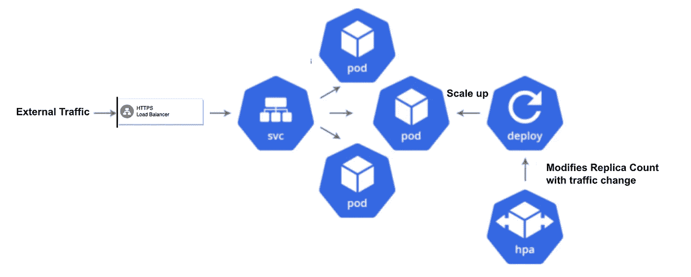
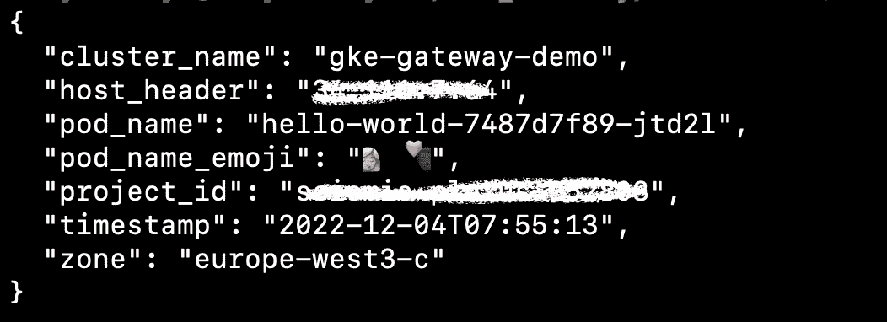
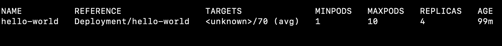

# GKE 集群基于流量的水平 Pod 自动缩放

> 原文：<https://medium.com/google-cloud/traffic-based-horizontal-pod-autoscaler-for-gke-clusters-efaff0d8cecc?source=collection_archive---------0----------------------->



水平吊舱自动定标器

HPA 或水平机架自动缩放是指自动增加或减少服务于工作负载的机架数量。

但是，当我们谈论水平 Pod 自动缩放时，CPU 和内存指标是每个人首先想到的指标。但是某些应用程序受限于容量限制，这并没有反映在它们的 CPU 或内存使用中。因此，将流量利用率指标/每秒请求数(RPS)指标也添加到 HPA 中，可以在这些情况下提供一种全面的自动扩展方法，因为它与应用程序使用情况更加一致。

因此，我们可以使用 GCP [网关控制器 API](https://cloud.google.com/kubernetes-engine/docs/concepts/gateway-api) 来展示具有当前处于[预览](https://cloud.google.com/products#product-launch-stages)模式的特性的应用程序，该特性在本地提供从负载平衡器到 Kubernetes API 服务器到自动缩放 pod 的流量信号的集成。

在这篇博客中，我们将为一个 hello-world 示例应用程序演示如何使用 Gateway Controller 和 Horizontal Pod Autoscaler 进行基于流量的自动缩放。

让我们从演示开始。

# 先决条件

1.  我们需要一个版本为 1.24 或更高版本的 GKE 集群。
2.  应该为您的 GKE 集群安装和配置 kubectl CLI。
3.  gcloud CLI 应与 GCP 项目一起安装和配置。

> 请参考 GKE 网关控制器[要求](https://cloud.google.com/kubernetes-engine/docs/how-to/deploying-gateways#requirements)。

# 启用网关控制器 API

在现有集群 gke-gateway-demo 上启用网关 API。

```
gcloud container clusters update gke-gateway-demo \
 - gateway-api=standard \
 - zone=europe-west3-c
```

# 使用 ClusterIP 服务部署应用程序

在 GKE 集群上部署 hello world 应用程序，并使用 ClusterIP 服务在内部公开它。

```
apiVersion: apps/v1
kind: Deployment
metadata:
  name: hello-world
spec:
  replicas: 2
  selector:
    matchLabels:
      app: hello-world
  template:
    metadata:
      labels:
        app: hello-world
    spec:
      containers:
      - name: whereami
        image: us-docker.pkg.dev/google-samples/containers/gke/whereami:v1.2.11
        ports:
          - containerPort: 8080
---
apiVersion: v1
kind: Service
metadata:
  name: hello-world
  annotations:
    networking.gke.io/max-rate-per-endpoint: "10"
```

上述 YAML 将创建:

*   有两个副本的部署。
*   通过`**max-rate-per-endpoint**` 注释将服务容量设置为`**10**`的 ClusterIP 服务。

> [服务容量](https://cloud.google.com/kubernetes-engine/docs/concepts/traffic-management#service_capacity)在使用基于流量的自动扩展时是一个关键元素，因为它定义了服务在每个 Pod 上每秒应接收的最大请求流量。它是使用服务注释`networking.gke.io/max-rate-per-endpoint`配置的。

# 创建网关资源

使用 GKE 网关向外界公开应用程序。

```
kind: Gateway
apiVersion: gateway.networking.k8s.io/v1beta1
metadata:
  name: hello-world
spec:
  gatewayClassName: gke-l7-gxlb
  listeners:
  - name: http
    protocol: HTTP
    port: 80
```

上述 YAML 将为 GKE 集群创建全局 HTTP 负载平衡器:

*   `gatewayClassName: gke-l7-gxlb`:指定网关类。`gke-l7-rilb`对应全局外部 HTTP(S)负载均衡器。
*   `port: 80`:指定网关仅公开端口 80 来监听 HTTP 流量。

> 仅单 GKE 集群的全局和内部负载平衡器支持基于流量的自动扩展。有关网关类功能的更多信息，请参考官方[文档](https://cloud.google.com/kubernetes-engine/docs/how-to/gatewayclass-capabilities)。

# 创建 HTTPRoute

创建一个 [HTTPRoute](https://cloud.google.com/kubernetes-engine/docs/concepts/gateway-api#httproute) 资源，它定义了特定于协议的规则，用于将流量从网关映射到 Kubernetes 后端服务。

```
kind: HTTPRoute
apiVersion: gateway.networking.k8s.io/v1beta1
metadata:
  name: hello-world
  labels:
    gateway: hello-world
spec:
  parentRefs:
  - name: hello-world
  rules:
  - backendRefs:
    - name: hello-world
      port: 8080
```

上述 YAML 将以下列方式创建路由规则:

*   去往网关 IP 的所有流量都去往服务`hello-world`。

这是一个非常简单的 HTTPRoute，但我们可以基于主机、路径甚至基于报头的路由来生成更复杂的流量路由。

# 测试应用程序

获取网关创建的 HTTP 负载平衡器的 IP 地址，并访问应用程序。

```
export GATEWAY_IP_ADDRESS=`kubectl get gateway -o=jsonpath='{.items[?(@.metadata.name=="hello-world")].status.addresses[0].value}'`
curl http://$GATEWAY_IP_ADDRESS/
```

您应该会得到如下回应:



现在，我们已经设置好了应用程序，并准备好部署 HPA。

# 部署 HPA

部署基于流量的 HPA。

```
apiVersion: autoscaling/v2
kind: HorizontalPodAutoscaler
metadata:
  name: hello-world
spec:
  scaleTargetRef:
    apiVersion: apps/v1
    kind: Deployment
    name: hello-world
  minReplicas: 1
  maxReplicas: 10
  metrics:
  - type: Object
    object:
      describedObject:
        kind: Service
        name: hello-world
      metric:
        name: "autoscaling.googleapis.com|gclb-capacity-utilization"
      target:
        averageValue: 70
        type: AverageValue
```

上面的 YAML 描述了一个具有以下属性的`HorizontalPodAutoscaler`:

*   `scaleTargetRef.name: hello-world`:对`hello-world`部署的引用，该部署定义了由水平 Pod 自动缩放器缩放的资源。
*   `metric.name: "autoscaling.googleapis.com|gclb-capacity-utilization"`:引用负载平衡器容量利用率度量进行自动扩展。
*   `averageValue: 70`:HPA 的产能利用率目标平均值。

# 查看 HPA 的运行情况

现在让我们[部署一个具有 20 个 RPS 的流量生成器](https://cloud.google.com/kubernetes-engine/docs/how-to/deploying-multi-cluster-gateways#verify_traffic_using_load_testing)来验证基于流量的自动伸缩行为。用您的网关 IP 地址更新`GATEWAY_IP_ADDRESS`。

```
kubectl run --context=gke-gateway-demo -i --tty --rm loadgen  \
    --image=cyrilbkr/httperf  \
    --restart=Never  \
    -- /bin/sh -c 'httperf  \
    --server=GATEWAY_IP_ADDRESS \
    --hog --uri="/zone" --port 80  --wsess=100000,1,1 --rate 20'
```

部署扩展到大约 4 个副本，因此每个副本理想情况下接收 5 RPS 的流量，即每个 Pod 50%的利用率。这低于 70%的目标利用率，因此可以适当扩展机架。



高功率放大器（high-power amplifier 的缩写）

根据流量波动，自动缩放副本的数量也可能会波动。

自动缩放器尝试缩放副本以实现以下等式:

> 副本数=上限[当前流量/(平均利用率*每个端点的最大速率)]

# 结论

我们已经在实践中了解了如何利用本地网关功能在 GKE 集群中实现基于流量的工作负载自动扩展。在 Istio、Prometheus 和 Prometheus adapter 等服务网格的帮助下，我们也可以做到这一点。但是通过 GKE 网关，这是内置的，不需要任何服务网格和适配器。

请记住，基于 GKE 网关控制器流量的自动缩放仍处于[预览模式](https://cloud.google.com/kubernetes-engine/docs/how-to/gatewayclass-capabilities#gatewayclass_capabilities)，随着正式上市，您可以期待一些变化。

请参考官方文档以了解更多关于 [GKE 门户](https://cloud.google.com/kubernetes-engine/docs/concepts/gateway-api)的信息。希望你觉得有用。快乐学习。