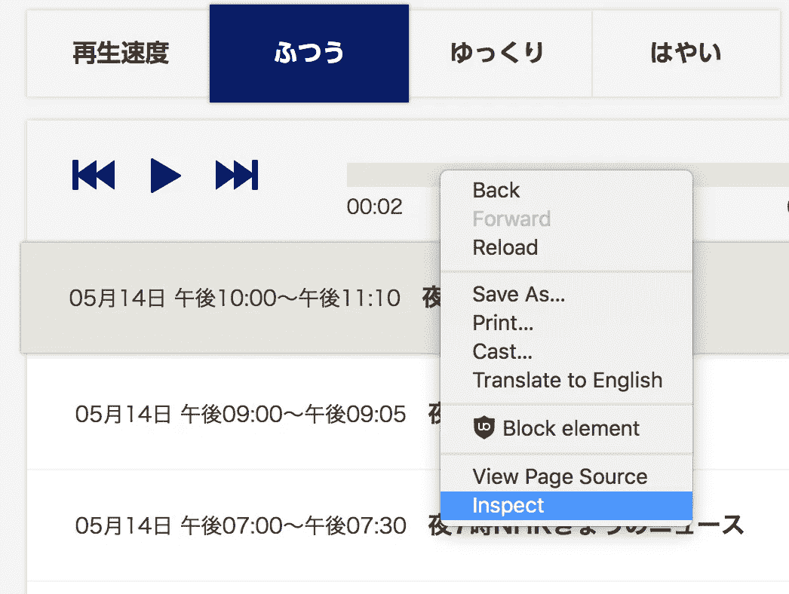
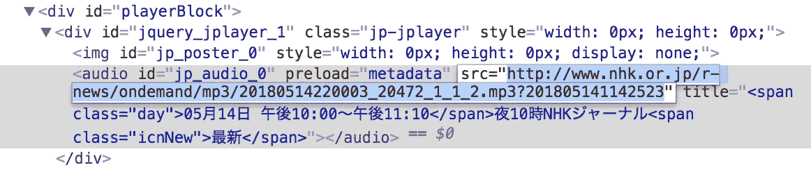

# 使用 Go 和机器学习 API 转录日语

> 原文：<https://medium.com/google-cloud/transcribe-japanese-using-go-and-machine-learning-apis-3ccc74f6c800?source=collection_archive---------0----------------------->

学习日语时最难培养的技能之一是扎实的听力理解。一个很好的练习方法是听日语新闻。对于这一点，没有什么比 NHK 广播新闻，或[*rajio nyūsu*ラジオニュース](http://www.nhk.or.jp/radionews/)更好的了。这个节目中的日本人坚持 NHK 的清晰标准，该网站允许听众在常规、慢速和快速之间调整音频速度。

尽管调整播放速度可能会有所帮助，但语言学习者肯定会遇到不熟悉的单词。虽然识别未知单词以便自己查找也是一项同样重要的技能，但是音频的转录在学习速度上有很大的不同。唯一的问题是 NHK 不提供转录。所以，让我们自己去创造吧！

为此，我们将使用谷歌云平台的[语音转文本 API](https://cloud.google.com/speech-to-text/) 及其 [Go API 客户端](https://github.com/googlecloudplatform/google-cloud-go)。有三个步骤。

# 下载音频样本

语音转文本 API 区分运行时间低于或高于一分钟的短音频文件和长音频文件。如果音频文件长于一分钟，我们需要使用异步 API 进行[长时间运行识别](https://godoc.org/cloud.google.com/go/speech/apiv1#Client.LongRunningRecognize)。对于这个例子，我们将使用[同步 API](https://godoc.org/cloud.google.com/go/speech/apiv1#Client.Recognize) 。API 客户端也[支持远程 URIs](https://godoc.org/google.golang.org/genproto/googleapis/cloud/speech/v1#RecognitionAudio_Uri) ，但是为了简单起见，我们将自己上传一个音频样本。

获取音频文件副本的最简单方法是直接从[广播节目的主页](http://www.nhk.or.jp/radionews/)下载。请注意，页面上看不到下载该集的链接。相反，您需要在开始播放某一集后，使用浏览器的开发工具来检查音频播放器的 HTML。



然后，找到对应的`audio`元素，其`src`属性指向该集的一个 MP3 文件。下载那个文件。



# 处理样品以获得最佳结果

现在我们有了一个日本音频样本，我们需要做一些小的处理以确保最佳效果。正如关于最佳实践的[文档](https://cloud.google.com/speech-to-text/docs/best-practices)指出的，为了获得最佳结果，我们需要使用 FLAC 编码和 16，000 Hz 的采样率。此外，我发现它有助于提交样本混合到单声道，而不是立体声。ffmpeg CLI 对于这类工作来说是无价的。

首先，我们可以使用以下命令查看文件的各种元数据:

```
ffprobe -v error -show_format -show_streams input.mp3
```

接下来，我们需要从 MP3 转换到 FLAC:

```
ffmpeg -i input.mp3 output.flac
```

为了保持我们的样本不超过一分钟，我们将把音频样本调整到 30 秒的运行时间。对于您的特定剪辑，您需要找到一个好的开始时间和一个好的停止时间。在我正在使用的剪辑中，我想在 10 秒后开始，30 秒后停止:

```
ffmpeg -ss 10 -t 30 input.flac output.flac
```

播出的剧集已经是单声道的了，但是如果您想将立体声样本重新混合到单声道中，命令也很简单:

```
ffmpeg -i input.flac -ac 1 output-mono.flac
```

现在，处理完成后，我们准备编写一些代码，并将示例提交给语音到文本 API。

# 将示例发送到语音转文本 API

让我们写一些[围棋](https://golang.org)。

首先，我们将为 Go 下载一份客户端库:

```
go get -u cloud.google.com/go/...
```

然后，在我们的`GOPATH`内的一个目录中，我们用下面的代码创建一个`main.go`。我们首先创建一个新的语音客户端。

注意，在下面的代码中，我们没有明确引用 API 凭证。相反，客户端将从环境中读取`GOOGLE_APPLICATION_CREDENTIALS`变量来定位提供认证信息的`service-account.json`文件。有关设置认证的各种方式的更多详细信息，请参见[文档](https://cloud.google.com/docs/authentication/production)。此外，GoDoc 中有许多有用的例子。

```
// ~/go/src/github.com/gobuildit/gobuildit/transcribe/main.gopackage mainimport ( "fmt" "io/ioutil" "log" "golang.org/x/net/context" speech "cloud.google.com/go/speech/apiv1" speechpb "google.golang.org/genproto/googleapis/cloud/speech/v1")func main() { ctx := context.Background() client, err := speech.NewClient(ctx) if err != nil { log.Fatalf("failed to create client: %v", err) } // ...}
```

接下来，我们将音频样本读入内存:

```
// ...data, err := ioutil.ReadFile("nhk-radio-news.flac")if err != nil { log.Fatalf("failed to read file: %v", err)}// ...
```

现在，我们准备创建 API 请求并发送它:

```
// ...resp, err := client.Recognize(ctx, &speechpb.RecognizeRequest{ Config: &speechpb.RecognitionConfig{ Encoding:        speechpb.RecognitionConfig_FLAC, SampleRateHertz: int32(16000), LanguageCode:    "ja-JP", },    Audio: &speechpb.RecognitionAudio{ AudioSource: &speechpb.RecognitionAudio_Content{
            Content: data,
        }, },})if err != nil { log.Fatalf("failed to recognize: %v", err)}// ...
```

在上面的代码中，我们用音频样本的细节配置了`RecognizeRequest`。有许多额外的属性值得了解，但我们在这里没有用到。

最后，如果我们的请求成功，我们打印出结果:

```
// ...for _, result := range resp.Results { for _, alt := range result.Alternatives { fmt.Printf("\"%v\" (confidence=%3f)\n", alt.Transcript, alt.Confidence) }}// end of main
```

有可能结果会包含一些`Alternatives`，所以我们会将它们和`Confidence`值一起打印出来，T1 值表示 API 对抄本正确可能性的估计。注意，`Alternatives`是按照准确性排序的，最有信心的排在最前面。更多信息，请点击查看[文档。](https://cloud.google.com/speech-to-text/docs/reference/rest/v1/speech/recognize)

现在，我们准备转录我们的音频样本。请注意，以下命令可能需要一些时间才能完成。

```
$ GOOGLE_APPLICATION_CREDENTIALS=service-account.json go run main.goではニュースです # “And now for the news.” (full transcription result omitted)
```

看看那个！我们有音频样本的副本！

# 可能的后续步骤

考虑到获取音频并将其转换成文字稿是多么容易，人们可以很容易地想象将这段代码扩展成一个实时字幕服务[。给定一个稳定的音频输入，也许可以分成几分钟，我们可以将这些样本提交给自动处理步骤。从那里，经过处理的音频可以被发送到语音转文本 API 以产生字幕。](https://github.com/GoogleCloudPlatform/golang-samples/tree/master/speech/livecaption)

当然，它几乎肯定不是现有系统的对手，但随着机器学习在准确性和速度上的不断提高，不难看出像直播字幕这样的系统变得更加容易创建。不过现在，我们有一个强大的工具来帮助语言学习过程。

## 进一步阅读

*   [云语音转文本文档](https://cloud.google.com/speech-to-text/docs/)
*   [Go 中的示例应用](https://github.com/GoogleCloudPlatform/golang-samples/tree/master/speech)
*   [谷歌云平台上的机器学习简介](https://www.youtube.com/watch?v=gVz9jKE_9iU)