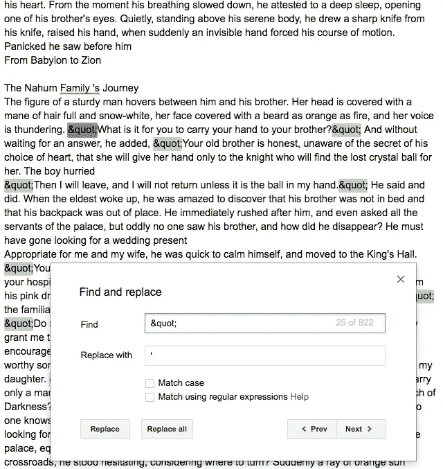

# 用谷歌云翻译 API 翻译一本书

> 原文：<https://medium.com/google-cloud/translate-a-book-with-google-cloud-translate-api-938d16396911?source=collection_archive---------0----------------------->

我有一本来自一个家庭成员的另一种语言的自传，我想翻译一段时间。你知道，你清单上的那些项目中的一个，很长一段时间，你似乎不能完成。终于有一天到了，是时候完成这项工作并着手翻译 API 了。

在最初的测试中，我注意到使用翻译 API 时，每个请求有一个字符限制(5000 个字符)。我的书刚好有超过 500，000 个字符和超过 1000 行文本。

```
$ wc -c book.txt
513632 book.txt
$ wc -l book.txt
1029 book.txt
```

我知道我必须逐行拆分文本，并向翻译 API 发送多个请求。起初，我认为我应该分割文件，然后将 5000 个字符发送给翻译 API，但后来我意识到通过新行或“.”分割请求更有意义，然后调用翻译 API，存储响应，并进行循环。这就是我们所做的。它只有大约 30 行 python 代码，没有进度条和注释，非常容易理解。在我的 github 上找到代码。

[](https://github.com/mkahn5/translate-book) [## mkahn 5/翻译-图书

### 在 GitHub 上创建一个帐户，为翻译书籍的开发做出贡献。

github.com](https://github.com/mkahn5/translate-book) 

这个脚本只测试了西班牙语和希伯来语，效果很好。

> 你谷歌了吗[做翻译服务已经超过 10 年了](https://research.googleblog.com/2006/04/statistical-machine-translation-live.html)？

*   我的 500，000 字符/ 1029 行文本文件花了大约 5 分钟翻译(希伯来语)
*   “La mentira en el Quijote /唐吉诃德中的谎言”35，000 字符/ 46 行耗时 5 秒(西班牙语)

翻译 API 的成本是每 1，000，000 个字符 20 美元。对于我本周的测试，我的成本如下:

*   *翻译 NMT 字符 352，354.00 计 7.05 美元*

只要通过翻译 API 按新行发送文本，并按句点分隔文本，就应该能够保留源文本文件中的大多数格式。可能需要一些后处理手动校正(见下文)。输出语言设置为英语，但可以通过在脚本中修改 target_language 来更改。



翻译后清理

感谢阅读，并享受谷歌云翻译 API 带来的乐趣！