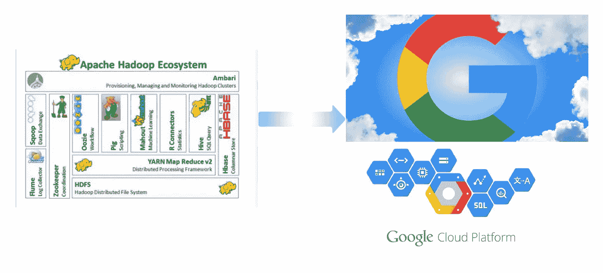
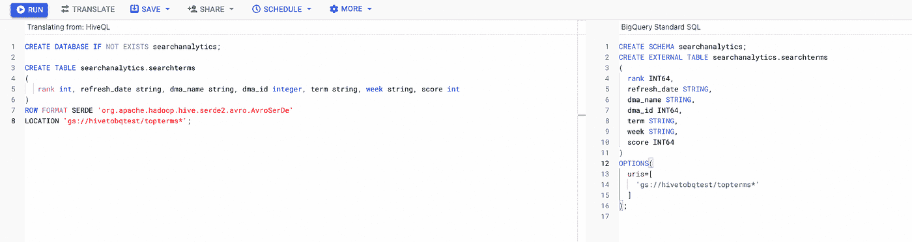
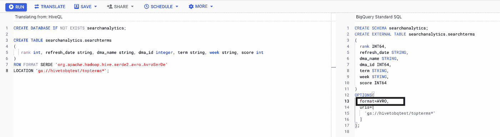

# 使用 Interactive SQL translator 将 Hive 查询转换为 BigQuery

> 原文：<https://medium.com/google-cloud/translating-hive-queries-to-bigquery-using-interactive-sql-translator-21fe46ad3fc7?source=collection_archive---------1----------------------->

Interactive SQL translator 是 BigQuery 控制台的一部分，您可以使用交互式界面翻译各种 SQL 方言，并实时执行翻译后的查询。这个特性对于开发人员在数据仓库迁移到 BigQuery 期间测试他们的脚本非常有用。

这篇博客特别关注使用 translator 服务将 Hive 查询翻译成 BigQuery SQL。

组织使用 Apache Hive 作为分布式数据仓库。Apache Hive 是一个建立在 Apache Hadoop 之上的项目，它旨在对大型数据集执行分析。

BigQuery 是 Google 完全托管的、Pb 级的低成本分析数据仓库。BigQuery 是 NoOps，因此您可以专注于分析数据以找到有意义的见解，使用熟悉的 SQL，并利用我们的现收现付模型。

客户出于各种原因从 Hive 迁移到 BigQuery，例如更好的性能、NoOps serverless 消除了管理开销，例如 namenode 容量问题、自动重新集群等。

BigQuery SQL translator 服务可以将各种 SQL 方言(Amazon Redshift、Teradata、HiveQL、Spark SQL、Azure Synapse T-SQL 等多种方言)翻译成 BigQuery SQL。

当将 Apache Hive 迁移到 BigQuery 时，您可以利用这个翻译服务。

这个截屏显示了如何在 BigQuery 控制台中翻译配置单元 DDL(例如，创建外部表)来创建表。您可以单击 Translate 来翻译 HiveQLs，然后运行来执行查询。

您可以添加创建外部表的强制参数格式的外部文件，并单击运行来执行 DDL 查询。

> 在将外部配置单元表迁移到 BigQuery 时，您可以使用像[https://github.com/GoogleCloudPlatform/hdfs-to-gcs](https://github.com/GoogleCloudPlatform/hdfs-to-gcs)这样的最佳解决方案在 GCS 中暂存外部配置单元表 HDFS 文件，并在 BigQuery 中使用 Google 云存储(GCS)暂存位置创建 BigLake 表([https://cloud.google.com/bigquery/docs/biglake-quickstart](https://cloud.google.com/bigquery/docs/biglake-quickstart))。通过这种方式，您可以利用基于 gRPC 的 BigQuery 存储读取 API，它可以更快、更有效地查询外部表数据。

在像 Hive 这样的其他数据仓库服务中，有许多参数需要控制和配置集群，以优化各种查询和数据处理需求。BigQuery 会为您处理所有必要的查询规划和优化，因此您不必担心管理基础设施或配置设置。BigQuery 经过自动优化，可以高效地处理大型数据集。即使数据流入 BigQuery，您也可以实时查询它。