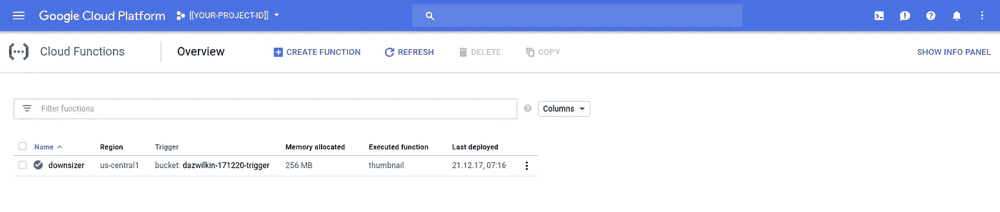

# 触发云功能部署

> 原文：<https://medium.com/google-cloud/triggering-cloud-functions-deployments-97691f9b5416?source=collection_archive---------2----------------------->

## 云功能的进一步探索

**2018–08–23 更新**

感谢 Marcus 为这篇文章指出了一个突破性的改变，也感谢我的同事为我指出了文档的改变([链接](https://cloud.google.com/functions/docs/reference/iam/roles#adding_the_iam_service_account_user_role_to_the_runtime_service_account))。现在，您还必须授予云(née 容器)构建服务帐户在`appspot`服务帐户上的`serviceAccountUser`角色:

```
gcloud iam service-accounts add-iam-policy-binding **${PROJECT_ID**}[@appspot](http://twitter.com/appspot).gserviceaccount.com \
--member=serviceAccount:**${NUM}**[@cloudbuild](http://twitter.com/cloudbuild).gserviceaccount.com \
--role=roles/**iam.serviceAccountUser** \
--project=${PROJECT}
```

> **注意**参见下面的原文，但是`${PROJECT_ID}`对应于你的项目 ID，而`${NUM}`对应于项目编号。

此外，`gcloud beta functions deploy`的一个新的有用特性是它将从当前目录部署。因为构建触发器将 repo 复制到云构建`/workspace`目录中，所以您可以从`cloudbuild.yaml`中的命令中删除`--source=...`标志。

## 原始帖子

当我签入 Google 云源代码库的变更时，我可以不使用 [Google Container Builder](https://cloud.google.com/container-builder) 来触发云功能部署吗？我想我可以。让我们试试…

延续昨天[裁员](/@DazWilkin/google-cloud-storage-downsizer-af0048591e40)的帖子。

## 集装箱建造商

启用容器生成器:

```
gcloud services enable cloudbuild.googleapis.com --project=$PROJECT
```

> **注意**端点是“cloudbuild ”,但是服务被称为容器构建器

然后，确定 Container Builder 的服务帐户，并赋予其允许云功能部署的额外角色:

```
NUM=$(gcloud projects describe $PROJECT \
--format='value(projectNumber)')gcloud projects add-iam-policy-binding ${PROJECT} \
--member=serviceAccount:${NUM}[@cloudbuild](http://twitter.com/cloudbuild).gserviceaccount.com \
--role=roles/cloudfunctions.developer
```

我们需要向云源存储库添加容器构建器规范(`cloudbuild.yaml`)来创建触发器。我们将使用添加它的提交来测试它是否工作。

当我们对我们的云资源存储库进行更改时，包括向其中添加 cloudbuild.yaml 文件，我们希望触发云功能部署。您还记得部署是通过 gcloud 命令实现的，我们可以使用容器构建器“gcloud”步骤来实现这一目的。虽然已经 YAMLized，但这对于昨天的部署命令来说应该非常熟悉。

cloudbuild.yaml:

```
steps:
- name: gcr.io/cloud-builders/gcloud
  args: [
      'beta',
      'functions',
      'deploy','${_NAME}',
      '--source=[https://source.developers.google.com/projects/${PROJECT_ID}/repos/default/moveable-aliases/master/paths/'](https://source.developers.google.com/projects/${PROJECT_ID}/repos/default/moveable-aliases/master/paths/'),
      '--trigger-bucket=${_ROOT}-trigger',
      '--entry-point=thumbnail',
      '--project=${PROJECT_ID}'
  ]
```

规范引用了容器构建器的环境变量的“友好”变体，我们过去用云函数构建这些变量，但是容器构建器要求用户定义的变量以“_”为前缀，所以我们在这里有`_NAME`和`_ROOT`，当我们定义 tigger 时，我们将这些映射到我们的 bash 变量。集装箱建造商为我们提供了`PROJECT_ID`。

让我们这样做

```
[https://console.cloud.google.com/](https://console.cloud.google.com/)[gcr/builds?project=$](https://pantheon.corp.google.com/gcr/builds?project=dazwilkin-171219-multi-domain){PROJECT}
```


容器注册表:触发源

选择“云资源存储库”，然后保留“默认”:


容器注册表:触发器存储库

然后根据这里的示例完成细节，您需要为“构建配置”选择“cloudbuild.yaml”:


容器注册表:创建触发器

> **NB** 我们正在将部署名称“downsizer”的现有部署值映射到云构建者的名称，将＄ROOT 映射到 _ROOT。不要忘记在这一步中用它的值替换$ROOT。

然后“创建触发器”:


好的。剩下要做的就是触发部署，因为我们需要将“cloudbuild.yaml”添加到我们的存储库中，所以让我们同时做这两件事:

```
git add cloudbuild.yaml
git commit --message "Add cloudbuild.yaml and trigger deployment"
git push -u origin master
```


看到推送触发了新的构建，并检查我们是否有部署:

```
[https://console.cloud.google.com/functions/list?project=$](https://pantheon.corp.google.com/functions/list?project=dazwilkin-171219-multi-domain){PROJECT}
```



云功能:已部署！

现在…如果我们能够在部署完成后对云功能进行测试，那该多好啊…请关注这个领域！

## 结论

我认为昨天缺失的一个特性是在签入云资源存储库时触发云功能部署的能力。它没有丢失:-)