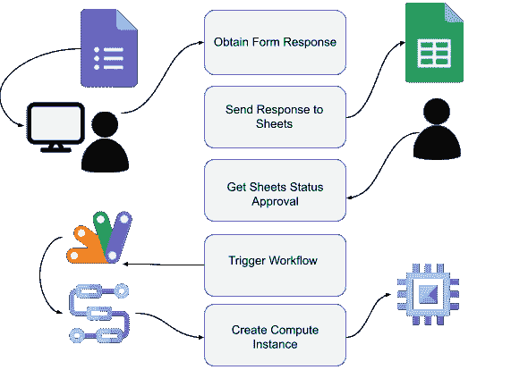
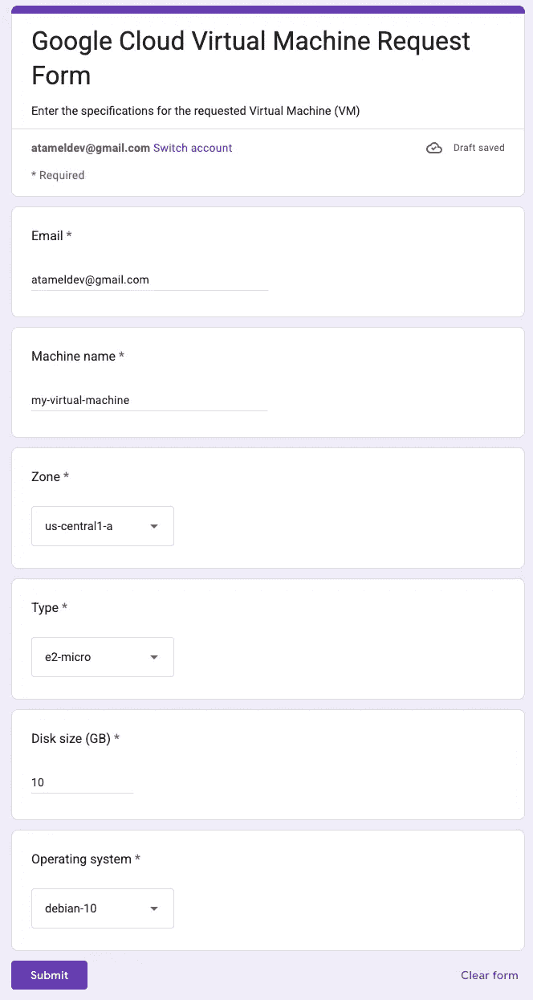
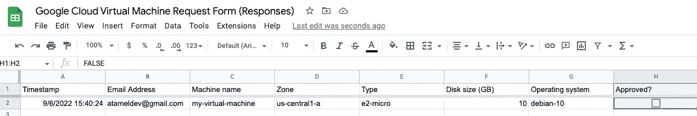
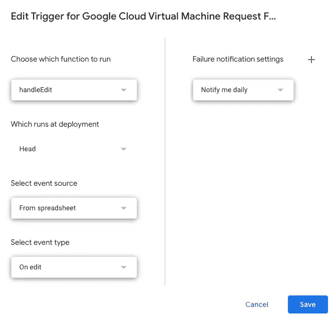
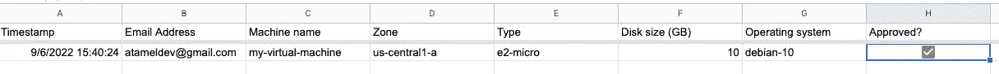
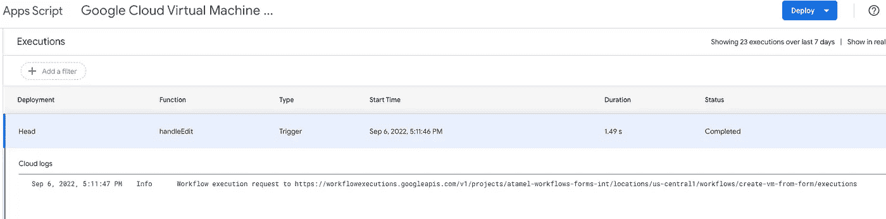
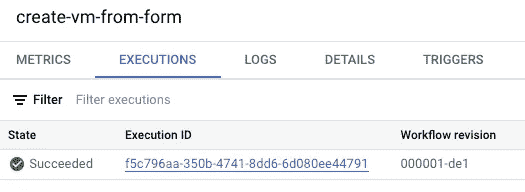
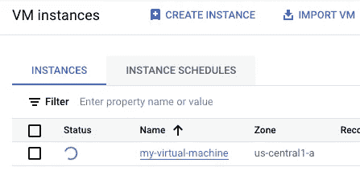

# 从 Google Sheets 触发工作流

> 原文：<https://medium.com/google-cloud/triggering-workflows-from-google-sheets-1d0205a91ed8?source=collection_archive---------0----------------------->

有没有可能将 [Google Workspace](https://workspace.google.com/) 工具，如日历、表格和表单与[工作流](https://cloud.google.com/workflows)集成？例如，可以从 Google 表单或工作表中触发工作流吗？事实证明，这不仅是可能的，而且比你想象的要容易。让我用一个样例用例向您展示如何操作。

# 用例

假设您是一名管理员，负责将云基础架构中的虚拟机(VM)分配给用户。您希望捕获具有虚拟机规范的用户请求，对请求进行批准，然后通过自动化流程创建虚拟机。

您可以实施如下流程:

1.  Google 表单捕获虚拟机创建请求。
2.  Google Sheet 保存来自 Google 表单的响应，并带有一个已批准的复选框。
3.  当人们选择 Approved 复选框时，一个[应用程序脚本](https://developers.google.com/apps-script)调用 Google Cloud 中的一个工作流，其中包含表单中的虚拟机详细信息。
4.  工作流调用计算引擎 API 在 Google Cloud 中为用户创建虚拟机。



让我们更详细地看一下每个步骤。

# 创建一个谷歌表单

创建一个 Google 表单来捕获用户的 VM 创建请求。

转到 [Google Forms](https://docs.google.com/forms) ，在之后创建一个类似于[的新表单:](https://docs.google.com/forms/d/e/1FAIpQLSercSIn9KxVwCCADAC3vI6zNMBI42Zh7Nzba1_K6m24P_opqA/viewform?usp=sf_link)



确保在设置下选择了`Collect email addresses`选项。稍后创建虚拟机时，您将需要一个电子邮件地址。

# 创建一个 Google 表单

创建一个 Google 表单来捕获表单中的响应。在`Responses`选项卡下，点击`Create Spreadsheet`按钮。

这将带您进入带有回答的电子表格。在该电子表格中，添加一个带有复选框的`Approved`列:



此复选框将用于触发创建虚拟机的工作流。

# 创建应用程序脚本

创建一个应用程序脚本来监视`Approved`复选框。

转到电子表格中的`Extensions`和`Apps Script`。这将打开应用程序脚本编辑器。用 [Code.gs](https://github.com/GoogleCloudPlatform/workflows-demos/blob/master/workspace-integration/sheets-to-workflows/Code.gs) 中的代码替换`Code.gs`中的默认代码。确保用您自己的项目 id 替换`PROJECT_ID`。这段代码监视`Approved`列中复选框的变化。选中该复选框后，它会调用一个工作流来创建虚拟机。

在应用程序脚本编辑器中，转到`Settings`并选中编辑器中的`Show appsscript.json manifest file`。用 [appscript.json](https://github.com/GoogleCloudPlatform/workflows-demos/blob/master/workspace-integration/sheets-to-workflows/appscript.json) 替换`appscript.json`的内容。这确保了 Apps 脚本具有所需的权限。

转到`Triggers`部分，在编辑工作表时创建一个从工作表到 Apps 脚本的触发器:



# 创建工作流

确保您有一个 Google Cloud 项目，并且在`gcloud`中设置了项目 id:

```
PROJECT_ID =your-project-id
gcloud config set project $PROJECT_ID
```

运行 [setup.sh](https://github.com/GoogleCloudPlatform/workflows-demos/blob/master/workspace-integration/sheets-to-workflows/setup.sh) 启用所需服务，授予必要角色，部署 [workflow.yaml](https://github.com/GoogleCloudPlatform/workflows-demos/blob/master/workspace-integration/sheets-to-workflows/workflow.yaml) 中定义的工作流。此工作流使用提供的规范创建计算引擎虚拟机。

# 尝试一下

您现在已经准备好测试端到端流程了。

返回到工作表，为之前创建的条目选择`Approved`复选框:



在应用程序脚本控制台中，您可以看到一个新的执行:



在工作流控制台中，您还可以看到一个新的执行:



最后，在计算引擎控制台中，您可以看到正在创建一个新的虚拟机:



从现在开始，每当用户填写表单时，您都会看到 Google Sheet 的一个新条目。当您通过选中“已批准”复选框批准它时，虚拟机将由工作流自动创建！

这只是如何将 Google Workspace 与工作流集成的一个例子。如果您有任何问题或反馈，请随时通过 Twitter [@meteatamel](https://twitter.com/meteatamel) 联系我。感谢我们的暑期实习生 Cheran Mahalingam 和 Michael Yang，他们验证了该模式并创建了初始样本。

*最初发布于*[*https://atamel . dev*](https://atamel.dev/posts/2022/09-09_trigger_workflows_from_sheets/)*。*