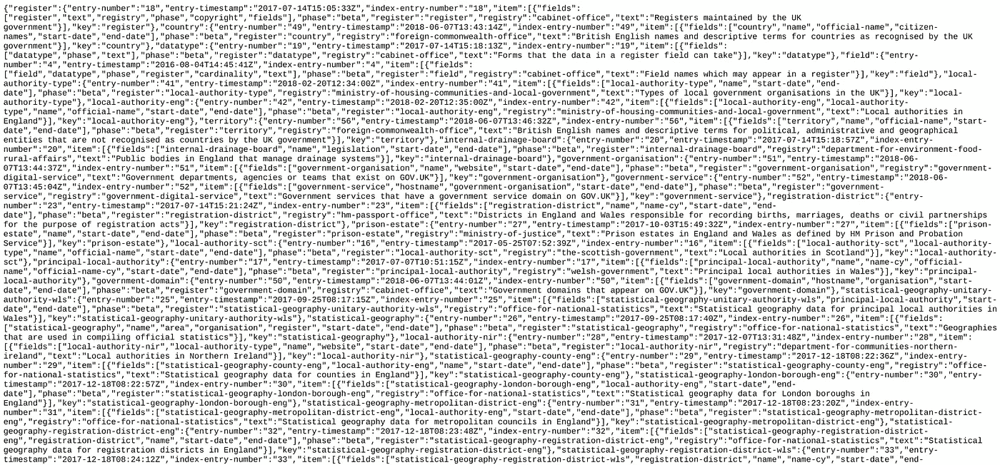

# 特里安:本·劳里的“寄存器”例子

> 原文：<https://medium.com/google-cloud/trillian-ben-lauries-registers-example-8bf19e297e80?source=collection_archive---------0----------------------->

> **2019–05–08 更新**:Ben 的 repo for Registers 中的代码过期。请在[https://github.com/google/trillian-examples](https://github.com/google/trillian-examples)使用他的解决方案的副本
> 
> **2018–12–11 更新**:感谢我的同事 Paul 对这篇文章的有益反馈，这篇文章现已收录。

我最近写了一篇文章解释如何在 GCP 部署谷歌的万亿项目。当时，我说我也会为特里安写一个例子。谷歌的本·劳里利用英国政府的[注册处](https://www.registers.service.gov.uk/)和 Trillian 联合开发了一个优雅的[例子](https://github.com/benlaurie/trillian-examples)。

这个故事是本回购协议中代码的预演，向您展示如何处理它。这是本许可写的。虽然本教程使用 Google Cloud SQL，但是任何 MySQL 实例都可以。Trillian 和 Ben 的示例代码运行在您的本地工作站上，没有部署到 GCP。

## 设置

环境:

```
BILLING=[[YOUR-BILLING]]
PROJECT=[[YOUR-PROJECT]]
REGION=[[YOUR-REGION]]
INSTANCE=[[YOUR-INSTANCE]]
```

然后，如果需要，创建一个 GCP 项目并启用开单。您需要启用计费，因为我们将使用云 SQL:

```
gcloud projects create ${PROJECT}
gcloud beta billing projects link ${PROJECT} \
--billing-account=${BILLING}
```

创建一个 SQL 实例(`${INSTANCE}`)并确保其 root 密码未设置。别担心，我们将使用云 SQL 代理来访问实例，因此您的实例仍然是安全的:

```
gcloud sql instances create ${INSTANCE} \
--database-version=MYSQL_5_7 \
--tier=db-g1-small \
--region=${REGION} \
--project=${PROJECT}gcloud sql users set-password root \
--instance=${INSTANCE} \
--host=% \
--password='' \
--project=${PROJECT}
```

> **更新 2018–11–19**:为所有主机(`%`)复制`Test`用户，避免使用云 SQL 时出现本地主机问题

```
gcloud sql users create test \
--instance=${INSTANCE} \
--host=% \
--password='zaphod' \
--project=${PROJECT}
```

下载云 SQL 代理，并让它在单独的 shell 中运行:

```
wget [https://dl.google.com/cloudsql/cloud_sql_proxy.linux.amd64](https://dl.google.com/cloudsql/cloud_sql_proxy.linux.amd64) -O cloud_sql_proxychmod +x cloud_sql_proxy./cloud_sql_proxy \
-instances=${PROJECT}:${REGION}:${INSTANCE}=tcp:3306
```

您可以通过从另一个终端会话连接代理来测试代理:

```
mysql \
--host=127.0.0.1 \
--port=3306 \
--user=root \
--password=''
```

> 要实现这一点，请使用`127.0.0.1`而不是`localhost`。

## 崔莉安

建立一个 Golang 工作区并获取 Trillian:

```
mkdir go
export GOPATH=$PWD/go
export PATH=$PATH:$GOPATH/bingo get github.com/google/trilliancd ${GOPATH}/src/github.com/google/trillian/
go get -t -u -v ./...
```

重置云 SQL 数据库:

```
MYSQL_HOST=127.0.0.1 ./scripts/resetdb.sh
```

> **更新 2018–11–19:**`DB_HOST`现为`MYSQL_HOST`。

可选:如果您愿意，您可以运行 Trillian 的集成测试:

```
MYSQL_HOST=127.0.0.1 ./integration/integration_test.sh
```

## 例子

然后克隆本的例子:

```
mkdir -p ${GOPATH}/src/github.com/benlaurie && \
cd ${GOPATH}/src/github.com/benlaurie
git clone [https://github.com/benlaurie/trillian-examples](https://github.com/benlaurie/trillian-examples)
cd trillian-examples
tree.
├── AUTHORS
├── CONTRIBUTING.md
├── CONTRIBUTORS
├── etherslurp
├── LICENSE
└── README.md
```

本的例子有 7 个步骤，每个步骤都在他的回购协议的不同分支中有所体现。

## 1.获取数据

```
git checkout register-1
go get ./...git branchmaster
*** register-1**tree
.
├── AUTHORS
├── CONTRIBUTING.md
├── CONTRIBUTORS
├── etherslurp
├── LICENSE
├── README.md
├── **registers**
└── **scripts**
```

注意分支包括`registers`和`scripts`。

然后，您应该能够成功地:

```
cd registers
go run dump/main.go
```

您将开始看到 Registers 站点数据被转储为 JSON:

```
2018/07/04 11:28:12 &register.Register{baseURL:"[https://register.register.gov.uk/](https://register.register.gov.uk/)", info:map[string]interface {}{"total-records":44, "total-entries":66, "register-record":map[string]interface {}{"phase":"beta", "register":"register", "fields":[]interface {}{"register", "text", "registry", "phase", "copyright", "fields"}, "registry":"cabinet-office", "text":"Registers maintained by the UK government"}, "custodian":"Arnau Siches", "last-updated":"2018-07-03T09:56:50Z", "domain":"register.gov.uk"}}
2018/07/04 11:28:13 map[string]interface {}{"index-entry-number":"1", "entry-number":"1", "entry-timestamp":"2016-08-04T14:45:41Z", "key":"register", "item-hash":[]interface {}{"sha-256:5fa9c4b569a71542c9c791203d54b6b94c125f189a9c529c63466a0b34cbe38c"}} sha-256:5fa9c4b569a71542c9c791203d54b6b94c125f189a9c529c63466a0b34cbe38c map[string]interface {}{"fields":[]interface {}{"register", "text", "registry", "phase", "copyright", "fields"}, "register":"register", "phase":"beta", "registry":"cabinet-office", "text":"Registers maintained by HM Government"}
...
```

你可以中断转储。

> 如果你想知道哪个寄存器被使用了，那就是寄存器中的寄存器。您可以在[https://www.registers.service.gov.uk/registers/register](https://www.registers.service.gov.uk/registers/register)预览这些数据

每个分支都有一个修改过的`TUTORIAL.md`文件，总结了正在做的事情。我不想重复本的内容，但为了避免你来回移动，我会在我们进行的过程中添加摘要。

## 2.向日志中添加数据

```
git checkout register-2
go get ./...git branch master
  register-1
*** register-2**
```

此步骤将注册数据添加到万亿日志中。

> **NB** 在接下来的步骤中，您将希望能够同时运行多个 shells 来监控各个进程的输出。

确保您的云 SQL 代理正在运行。

让我们也启动一个万亿日志服务器:

```
$GOPATH/bin/trillian_log_server --logtostderr
```

您应该输出类似如下的内容:

```
Using MySQL QuotaManager
RPC server starting on localhost:8090
HTTP server starting on localhost:8091
Deleted tree GC started
```

下一步生成一个新的日志，并返回日志的 ID。因此，我们可以在同一个(！)会话:

```
LOGID=$($GOPATH/bin/createtree --admin_server=localhost:8090) && \
echo ${LOGID}
```

它将输出日志的唯一 ID，格式如下:

```
1234567890123456789
```

然后运行以下命令:

```
go run dump/main.go -log_id=${LOGID}
```

当每个记录从寄存器中取出并添加到 Trillian 日志中时，您应该会看到类似于步骤 1 的输出。

这一次，请让命令运行完成。它应该以类似于以下内容的输出结束:

```
2018/07/04 15:49:04 New entries: 66
2018/07/04 15:49:04 Duplicate entries: 0
```

## 3.提取日志条目

```
git checkout register-3
Switched to a new branch 'register-3'git branch
  master
  register-1
  register-2
*** register-3**
```

我们将从运行 Trillian 日志签名程序开始。打开另一个外壳，然后:

```
$GOPATH/bin/trillian_log_signer \
--logtostderr \
--force_master \
--http_endpoint=localhost:8092 \
--rpc_endpoint=localhost:8093 \
--batch_size=1000 \
--sequencer_guard_window=0 \
--sequencer_interval=200ms 
```

> **注意**我已经为`rpc_endpoint`添加了一个不同的端口(`8093`，以避免与日志服务器的`rpc_endpoint`发生冲突。

您应该会看到以下形式的输出:

```
**** Log Signer Starting ****
**** Acting as master for all logs ****
Using MySQL QuotaManager
Creating HTTP server starting on localhost:8092
Log operation manager starting
HTTP server starting
creating mastership tracker for [3558678532662980721 5598166607403133250]
create master election goroutine for 3558678532662980721
create master election goroutine for 5598166607403133250
now acting as master for 0 / 2, master for:
...
Group run completed in 0.20 seconds: 2 succeeded, 0 failed, 0 items processed
...
```

然后我们可以运行 Ben 的日志提取器:

```
go run extract/main.go --log_id=${LOGID}
```

是的，到目前为止，我们已经提取了寄存器的条目，将它们添加到万亿日志中，然后再将它们提取出来。

但是这里的目的是提供一种添加和获取万亿级日志数据的模式。而且，因为这是一个万亿级的日志，所以数据保存在 Merkle 树中(本身由云 SQL 支持)。Merkle 树为我们添加的数据的完整性提供了保证。

## 4.创建一个万亿地图

Trillian 支持两种模式。首先，我们使用的是它的仅附加日志。第二个是键值映射。在这一步中，我们将迭代现在万亿级日志中的寄存器数据，并将每个记录添加到万亿级映射中。

```
git checkout register-4
Switched to a new branch 'register-4'
git branch
  master
  register-1
  register-2
  register-3
*** register-4**
```

我们需要一个万亿地图服务器(我们将继续使用日志服务器)。因此，打开另一个外壳:

```
$GOPATH/bin/trillian_map_server \
--logtostderr \
--rpc_endpoint=localhost:8095 \
--http_endpoint=localhost:8096
```

> **NB** 您不需要指定`— http-endpoint`标志，但是这样做可以避免当地图服务器试图在日志服务器使用的相同默认端口(8091)上打开 HTTP 端点时出现错误。

输出类似于日志服务器的输出:

```
Using MySQL QuotaManager
RPC server starting on localhost:8095
HTTP server starting on localhost:8096
Deleted tree GC started
```

与我们在步骤 2 中为日志服务器创建日志的方式类似，我们将为地图服务器创建一个地图:

```
MAPID=$(\
  $GOPATH/bin/createtree \
  --admin_server=localhost:8095 \
  --tree_type=MAP \
  --hash_strategy=TEST_MAP_HASHER) && \
echo ${MAPID}
```

您将获得另一个唯一的 ID。这张是为了地图。

然后，我们将运行遍历日志、提取条目并创建映射条目的代码:

```
go run mapper/main.go \
--log_id=${LOGID} \
--map_id=${MAPID}
```

您应该看到所有的 66 个条目(步骤#2 结束)都添加到了映射中，即:

```
2018/07/04 16:35:40 k: country ts: 2016-08-04 14:45:41 +0000 UTC
2018/07/04 16:35:40 key=country leaf=
evicting country -> &{map[index-entry-number:2 item-hash:[sha-256:610bde42d3ae2ed3dd829263fe461542742a10ca33865d96d31ae043b242c300] key:country entry-number:2 entry-timestamp:2016-08-04T14:45:41Z] [map[fields:[country name official-name citizen-names start-date end-date] phase:beta register:country registry:foreign-commonwealth-office text:British English-language names and descriptive terms for countries]]}
```

## 5.提取地图条目

```
git checkout register-5
Switched to a new branch 'register-5'
git branch
  master
  register-1
  register-2
  register-3
  register-4
*** register-5**
```

然后，通过仔细查看在上述步骤#4 中通过摄取创建的键(例如，如图所示的“T1”)，您可以运行特定键的提取映射:

```
go run extractmap/main.go \
--map_id=${MAPID} \
countrycountry
{"Entry":{"entry-number":"49","entry-timestamp":"2018-06-07T13:43:14Z","index-entry-number":"49","item-hash":["sha-256:7a0afa860ea3fd1f92c9c3d96a5df26cd9345360adaf6fc8d6ac1e0a282d372f"],"key":"country"},"Items":[{"fields":["country","name","official-name","citizen-names","start-date","end-date"],"phase":"beta","register":"country","registry":"foreign-commonwealth-office","text":"British English names and descriptive terms for countries as recognised by the UK government"}]}go run extractmap/main.go \
--map_id=${MAPID} \
territoryterritory
{"Entry":{"entry-number":"56","entry-timestamp":"2018-06-07T13:46:32Z","index-entry-number":"56","item-hash":["sha-256:e5a90c513739ee7636987485e3b69ec721b3860868a3c6487367930299c6593d"],"key":"territory"},"Items":[{"fields":["territory","name","official-name","start-date","end-date"],"phase":"beta","register":"territory","registry":"foreign-commonwealth-office","text":"British English names and descriptive terms for political, administrative and geographical entities that are not recognised as countries by the UK government"}]}
```

## 6.重构

在第 7 步中，我们将在万亿地图服务器前放置一个 web 服务器。web 服务器需要能够获取键的范围，因此这一步重构了第 5 步中的`extractmap`来实现这一点:

```
git checkout register-3
Switched to a new branch 'register-3'
git branch
  master
  register-1
  register-2
  register-3
  register-4
  register-5
*** register-6**
```

为简单起见，我将偏离 Ben 的指示，不删除并创建一个新树，而是创建一个新树:

```
MAPID=$(\
  $GOPATH/bin/createtree \
  --admin_server=localhost:8095 \
  --tree_type=MAP \
  --hash_strategy=TEST_MAP_HASHER) && \
echo ${MAPID}
```

> **NB** 如果您希望保留对第一棵树的访问，请在覆盖${MAPID}的值或使用不同的变量之前保留其副本。

然后重新运行日志→映射器:

```
go run mapper/main.go \
--log_id=${LOGID} \
--map_id=${MAPID}
```

然后我们可以提取整个地图:

```
go run extractmap/main.go --map_id=${MAPID}
```

最后…

## 7.网络服务器

```
git checkout register-7
git branch
  master
  register-1
  register-2
  register-3
  register-4
  register-5
  register-6
*** register-7**
```

然后:

```
go run webserver/main.go --map_id=${MAPID}
```

您应该能够在主机的端口`8080`上浏览`/records.json`:



本地主机:8080/records.json

## 结论

希望这个快速成功的故事向您展示了如何导航一个优秀的示例 Trillian 应用程序，并通过这个过程更好地了解 Trillian。

下一步…打造我们自己的 app！

## 拆毁

假设您想要恢复所有内容，请终止注销到您创建的各个会话的每个进程。

您也可以终止云 SQL 代理。

您只能删除云 SQL 数据库。如果要删除云 SQL 实例，数据库也会随之删除。

**注意**这些操作**是不可撤销的**:

```
gcloud sql databases delete test \
--instance=${INSTANCE} \
--project=${PROJECT}gcloud sql instances delete ${INSTANCE} \
--project=${PROJECT}
```

如果您希望删除 GCP 项目:

```
gcloud projects delete ${PROJECT}
```

仅此而已！