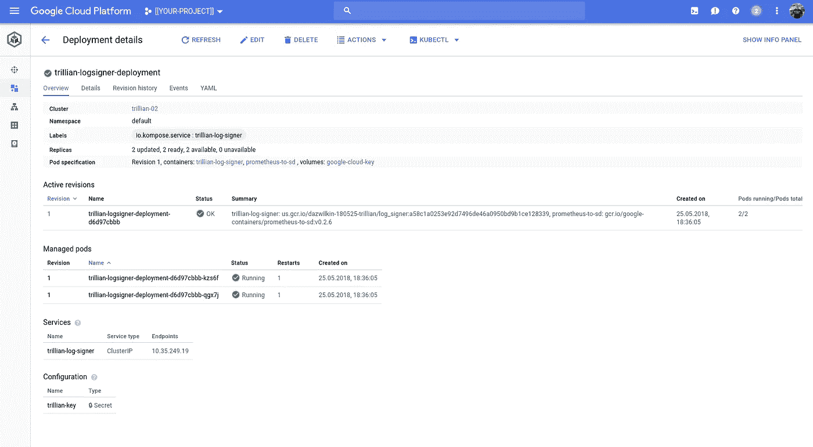

# 谷歌云平台上的 Trillian

> 原文：<https://medium.com/google-cloud/trillian-on-google-cloud-platform-621a37f2431c?source=collection_archive---------2----------------------->

正如我受过良好教育的同事安妮昨天指出的那样，“[崔莉恩](http://hitchhikers.wikia.com/wiki/Trillian)是以《银河系漫游指南》中的一个角色命名的，这很好；(b)不是希腊，这是一个令人耳目一新的变化已经淹没在 Kubernetes。同名项目是谷歌 OSS 的贡献:[万亿](https://github.com/google/trillian)。

这篇文章快速浏览了这个团队在开发 Trillian 和使其直接部署到 Kubernetes 中所做的所有艰苦工作。

请参见 Trillian GitHub 上的[自述文件](https://github.com/google/trillian/tree/master/examples/deployment/kubernetes)获取这些指令的来源。

## 设置

1.  创建一个谷歌云平台项目。
2.  启用“容器”和“扳手”API
3.  为您的首选区域中的 IP 申请额外配额(您需要≥12)
4.  创建一个单区(目前)Kubernetes 集群。
5.  下载 Trillian

```
PROJECT=[[YOUR-PROJECT]]
BILLING=[[YOUR-BILLING]]gcloud projects create ${PROJECT}gcloud beta billing projects link $PROJECT \
--billing-account=$BILLINGfor SERVICE in container spanner
do
  gcloud services enable ${SERVICE}.googleapis.com \
  --project=${PROJECT}
done
```

对于这个项目(`${PROJECT}`)，您将需要≥12 个 IP 地址，因为 Kubernetes 集群创建了 12 台机器(4+2+4+2)。默认配额为 8，因此您可能需要请求更多配额。您可以通过云控制台执行此操作:

[https://console.cloud.corp.google.com/iam-admin/quotas?PROJECT = $ { PROJECT }&service = compute . Google APIs . com&metric = In-use % 20IP % 20 addresses&location = $](https://pantheon.corp.google.com/iam-admin/quotas?project=dazwilkin-180525-trillian&folder&organizationId=433637338589&service=compute.googleapis.com&metric=In-use%20IP%20addresses&location=us-west1){ ZONE }


云控制台:默认区域 IP 配额为 8

选择代表您希望使用的区域的“正在使用的 IP 地址”的配额，单击“编辑配额”并请求≥12 个 IP。等待确认配额已获批准的电子邮件。

> **注意**在您收到配额增加的确认之前，请不要继续操作，因为没有足够的配额，脚本将会失败。

这是配额获得批准*后*的屏幕截图，在*后*我将运行`./create.sh`，如下一节所示:


云控制台:增加区域 IP 配额现在 11

## 崔莉安

您将需要 Trillian 的一个本地副本，以便部署脚本构建将在 Kubernetes 部署中使用的容器:

```
WORKING_DIR=[[YOUR-WORKING-DIRECTORY]]cd ${WORKING_DIR}
mkdir go
export GOPATH=$PWD/go
export PATH=$PATH:$GOPATH/bin
go get github.com/google/trilliancd go/src/github.com/google/trillian/examples/deployment/kubernetes
```

请编辑`config.sh`文件以正确反映您的偏好:

```
export PROJECT_NAME=[[YOUR-PROJECT]]
export CLUSTER_NAME=trillian-01
export REGION=[[YOUR-PREFERRED-ZONE]]       # This needs suff Quota
export ZONE=${REGION}-b
export CONFIGMAP=trillian-cloudspanner.yaml
```

我们准备开始 2 阶段部署。

首先，运行:

```
./create.sh
```

这提供了 Google 云平台资源:Kubernetes 集群和一个云扳手实例。

这是 Kubernetes 集群:


带有 4 个节点池的 Kubernetes 引擎集群

如果群集没有如上所示配置 4 个节点池，您应该重新阅读说明。没有此配置，部署将不会成功。

云扳手的一个小孔:

[https://console . cloud . Google . com/spanner/instances/trillian-spanner/databases？project=$](https://pantheon.corp.google.com/spanner/instances/trillian-spanner/databases?project=dazwilkin-180525-trillian&organizationId=433637338589) {PROJECT}


云扳手

还有几张容器图片:

[https://console.cloud.google.com/gcr/images/${PROJECT}/](https://pantheon.corp.google.com/gcr/images/dazwilkin-180525-trillian/US?project=dazwilkin-180525-trillian&folder&organizationId=433637338589)


集装箱登记处

如果一切似乎都已成功完成，您可以继续进行部署阶段，包括:

```
./deploy.sh
```

这个脚本构建容器图像并将它们推送到 Google 容器注册中心。然后，它创建利用这些映像的 Kubernetes 部署。

如果该脚本成功，您将在命令行上看到所有 Kubernetes 资源的枚举(此处不复制)，您可以使用云控制台确认部署(正在进行|已经完成):


所有工作负载:etcd 和 Trillian 的日志服务器和日志签名者

并且:


工作负载:trillian-logserver-deployment

并且:



工作负载:trillian-logsigner-deployment

这将带您进入 GitHub 自述文件“后续步骤”中的步骤。我们希望对 Kubernetes 的 Trillian 部署做一些有用的事情(由 Cloud Spanner 支持)。

您可能还没有使用 Trillian 的最小容器映像，但希望您很快会使用它们。当你在的时候，你不能进入一个`trillian-log-server`容器并运行`curl`命令，因为容器没有外壳并且不包含`curl`。相反，您可以通过移植来测试 Trillian API

## Trillian API

假设你已经部署了 Trillian，你应该有 4 个`trillian-log-server`和 2 个`trillian-log-signer`吊舱在运行。以下命令将为我们获取第 0 个`trillian-log-server` Pod 名称，并将其放入`${LOG_POD}`:

```
LOG_POD=$(\
  kubectl get pods \
  --selector=io.kompose.service=trillian-log \
  --output=jsonpath='{.items[0].metadata.name}')
```

知道这些 Pod 都将端口 8091 作为 HTTP 端点，我们就可以设置从您的本地机器到 Pod 的端口转发。为了方便起见，我们将在两端使用相同的端口:

```
kubectl port-forward ${LOG_POD} 8091:8091Forwarding from 127.0.0.1:8091 -> 8091
Forwarding from [::1]:8091 -> 8091
Handling connection for 8091
Handling connection for 8091
Handling connection for 8091
```

在另一个 shell 中，您应该能够发出 Trillian 教程中引用的命令:

```
HOST=localhost
PORT=8091RESPONSE=$(curl \
--silent \
--request POST \
http://${HOST}:${PORT}/v1beta1/trees \
--data '{ "tree":{ "tree_state":"ACTIVE", "tree_type":"LOG", "hash_strategy":"RFC6962_SHA256", "signature_algorithm":"ECDSA", "max_root_duration":"0", "hash_algorithm":"SHA256" }, "key_spec":{ "ecdsa_params":{ "curve":"P256" } } }')TREE_ID=$(echo ${RESPONSE} | jq --raw-output .tree_id)echo ${RESPONSE} \
| jq .
```

如果一切正常，您应该会收到以下形式的内容:

```
{
 "tree_id": "1234567890123456789",
 "tree_state": "ACTIVE",
 "tree_type": "LOG",
 "hash_strategy": "RFC6962_SHA256",
 "hash_algorithm": "SHA256",
 "signature_algorithm": "ECDSA",
 "storage_settings": {
  "[@type](http://twitter.com/type)": "type.googleapis.com/spannerpb.LogStorageConfig",
  "num_unseq_buckets": "4",
  "num_merkle_buckets": "16"
 },
 "public_key": {
  "der": "**[[REDACTED]]**"
 },
 "max_root_duration": "0s",
 "create_time": "2018-00-00T00:00:00.000000000Z",
 "update_time": "2018-00-00T00:00:00.000000000Z"
}
```

然后，您可以:

```
curl \
--silent \
--request POST \
[http://${HOST}:${PORT}/v1beta1/logs/${TREE_ID}:init](http://localhost:8091/v1beta1/logs/4004530902950552124:init) \
| jq .
```

您应该会收到以下形式的内容:

```
{
 "created": {
  "timestamp_nanos": "1527642133340965256",
  "root_hash": "**[[REDACTED]]**",
  "key_hint": "**[[REDACTED]]**",
  "log_root": "**[[REDACTED]]**",
  "log_root_signature": "**[[REDACTED]]**"
 }
}
```

下周我会更新这个帖子，给我们一些有用的东西。Trillian 团队的一名成员举了一个有趣的例子:-)

## 2018–06–01:更新

本周我专注于其他地方，没有在 Trillian 上开发应用程序。然而，我确实研究了 API，发现了下一个有用的方法。

从上方…跟随`${TREE_ID}`并呼叫`${TREE_ID}:init`:

```
VALUE="[[SOME-STRING]]"
EXTRA="[[SOME-STRING]]"EVALUE=$(echo ${VALUE} | base64)
EEXTRA=$(echo ${EXTRA} | base64)curl \
  --silent \
  --request POST \
  [http://${HOST}:${PORT}/v1beta1/logs/${TREE_ID}/leaves](http://${HOST}:${PORT}/v1beta1/logs/${TREE_ID}/leaves) \
  --data "{ \"leaf\": { \"leaf_value\": \"${EVALUE}\", \"extra_data\": \"${EEXTRA}\" } }" \
  | jq .
```

或者某个混蛋得到一个 256 个字符的随机字符串...

```
**E**VALUE=$(\
  cat /dev/urandom \
  | tr --complement --delete 'a-zA-Z0-9 ' \
  | fold --width=256 \
  | head --lines=1 \
  | base64 --wrap=0\
)
```

更快！

## 结论

Trillian 是谷歌的一个有趣的解决方案。本文(到目前为止)展示了如何轻松地将 Trillian 部署到 Kubernetes 集群。现在我们只需要一个示例应用程序！