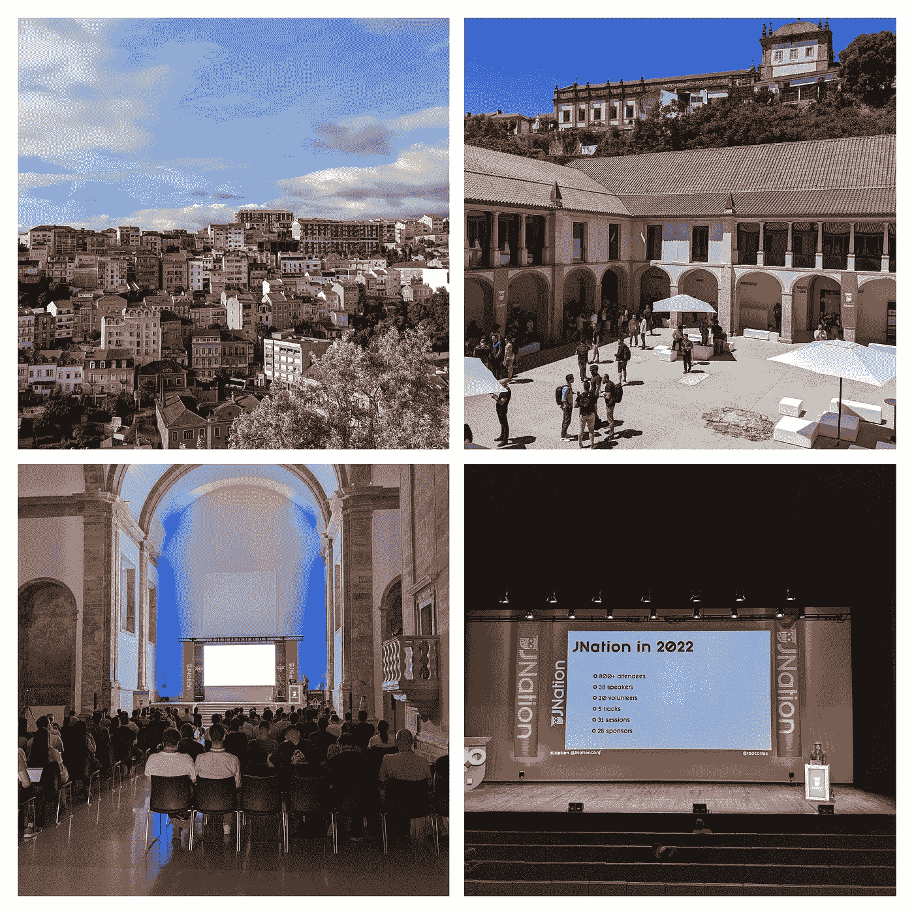

# 旅行报告—八周内的八次面对面会议

> 原文：<https://medium.com/google-cloud/trip-report-eight-in-person-conferences-in-eight-weeks-424efdb1b03a?source=collection_archive---------2----------------------->

# 小心你的愿望

我在疫情之前的最后一次面对面会议是在 2020 年 1 月的 NDC 伦敦。我清楚地记得在 2020 年初的时候我很累。对我来说，2019 年是漫长的一年，在世界各地的各种会议上有 50 多次演讲。我只是想在 2020 年初短暂休息一下。

我一点也不知道，由于全球疫情，短暂的休息会变成长达 2.5 年的休息。我非常感激我能够在疫情期间继续工作并在许多在线会议上发言。然而，随着疫情一拖再拖，我对网上活动的热情逐渐减退。我非常怀念和其他演讲者、与会者交流，探索我演讲的城市。

2022 年初，一些会议终于有望回归面对面的活动。尽管我接种了三种疫苗，并在今年早些时候出现了轻微的 Covid 病例，但我仍然不确定亲自参加会议的感受。然而，我确信我必须从某个地方开始。我的第一次面对面会议本应在 2022 年 3 月举行，但我有一点似曾相识的感觉，因为它在最后一刻被切换到了网上。

下一次面对面会议定于 2022 年 5 月举行。我做好了充分的准备，它会变成一个在线会议，被推迟，甚至被取消。在预订行程的同时，我既兴奋又紧张。

在我旅行的前两天，英国航空公司取消了我的航班。由于人员短缺，也可能由于英国退出欧盟，机场和离开英国的航班最近一直是一场噩梦，取消和延误。我很幸运地找到了同一天早些时候的另一趟航班，并坚持了我最初的计划。

# 两年多后重新上路！

# JFokus

[瑞典**斯德哥尔摩的 JFokus**](https://www.jfokus.se/)(5 月 2 日至 4 日)这是继疫情之后，我第一次能够参加的会议，也是在两年多没有亲自参加活动之后。巧合的是，JFokus 也是我在 2016 年作为谷歌人与我的好朋友和前同事 Ray Tsang 参加的第一次会议。这是一个专注于 Java 的技术会议，也是瑞典最大和最完善的会议之一。

我不知道会发生什么。会是一个完整的会议吗？人们会戴口罩吗？人们会互动还是会保持社交距离？会有庆功宴吗？它会像疫情之前一样吗？还是会有一种新的大流行后会议形式？

我一走进会场，就感觉回到了过去的美好时光。这是一个完整的会议(约 1600 人)，有许多会议，活跃的展位，以及你可以从疫情之前的技术会议中期待的一切。我有点紧张，几乎没有人戴口罩，但在这一点上，我接受了与现场活动相关的风险，所以我同意了。

我向大约 80 名观众发表了我的[编舞与配器](https://www.jfokus.se/talks/751)演讲。

能够与现场观众交谈，获得反馈，回答问题，这太棒了。我还见到了我的同事[阿卜杜勒](https://twitter.com/boredabdel)和[詹姆斯](https://twitter.com/_JamesWard)，观看了詹姆斯关于[现代 Java 之旅](https://www.jfokus.se/talks/943)和[分布式和非集中式数据架构模式](https://www.jfokus.se/talks/944)的两个精彩演讲。我观看了其他主要与 Java 相关主题的精彩会议，如 GraalVM、Micronaut、Spring Native 和 Quarkus。对我来说，最难忘的演讲是 Henrik Kniberg 关于重塑《我的世界》世界一代的演讲。尽管我从未玩过《我的世界》，但了解《我的世界》世界是如何产生的细节还是很有趣的。这是一次有趣且内容丰富的谈话。

当 JFokus 接近尾声时，我惊喜地发现一切感觉都很正常。我仍然无法相信面对面的会议会像在疫情会议开始时消失的那样快地回来了。

# 技术革新

我的第二次面对面会议是在荷兰乌得勒支的技术研讨会(T14)(T15)(5 月 12 日)(T17)。2017 年，我曾在这里演讲过一次，我很高兴回到荷兰。这是一个大约有 1000 人参加的一般性技术会议。

与 JFokus 类似，TEQnation 感觉就像一个普通的会议，有许多与会者、展位和演示。在这一点上，我确信面对面的活动又回来了，他们在疫情期间没有失去任何东西。得知我的同事李·布恩斯特拉是主题演讲人，真是一个惊喜！我又给大约 90 名开发人员讲了我的编排和编排。

# 苏黎世沃克斯戴斯

有几个原因让我对在瑞士苏黎世**(5 月 17 日)**举办的[voxed Days](https://voxxeddays.com/zurich/)感到兴奋。首先，这次会议在疫情期间被推迟了三次。感觉这是一个小小的胜利，它终于发生了。其次，我很高兴参观了苏黎世的谷歌园区，并在那里见到了我的同事。

大约有 700 名与会者参加了三场平行的讨论。我为大约 120 名开发人员再次重复了我的[编排与编排](https://voxxeddays.com/zurich/schedule/talk/?id=1448)演讲。

我还见到了我在 GDE 的一些朋友和同事——包括会议上的[马顿](https://twitter.com/MartonKodok)、办公室的[里卡多](https://twitter.com/palladius)和[凯西](https://twitter.com/caseywest)。当我开始在没有预先计划的情况下，在随机的办公室会见随机的同事时，我真的开始觉得疫情时代已经结束了:-)我不知道

# 伊斯坦布尔爪哇日

我的下一次旅行是去土耳其伊斯坦布尔的[爪哇日](https://www.javaday.istanbul/)(5 月 27-28 日)。伊斯坦布尔是我最喜欢去的城市之一(令人惊叹的食物和历史！).伊斯坦布尔 Java 日是土耳其主要的科技会议之一。我以前在那里讲过几次，也在 2020 年疫情期间在网上讲过。

今年，大会吸引了大约 350 名开发人员。我给大约 150 名开发者做了一个关于[无服务器超越功能](https://www.javaday.istanbul/mete-atamel-speaker)的新演讲。用土耳其语做技术报告非常有挑战性，但我认为我做得很好:-)

我谈到了无服务器是如何发展的，以及现在有哪些工具和服务。除了出色的技术内容和令人惊叹的演讲者晚宴，伊斯坦布尔 Java Day 还提供了我很长时间以来吃过的最好的会议食物，考虑到伊斯坦布尔的美食，这一点也不奇怪！

# NDC 哥本哈根

NDC 是在欧洲、澳洲和美国举行的一系列会议。NDC 是疫情之前我在伦敦参加的最后一次会议，回到丹麦哥本哈根**(6 月 1-2 日)**感觉真的很特别。一如既往，一切都井井有条。大约有 500 人出席，其中 80 人和我一起做了关于[无服务器超越功能](https://ndccopenhagen.com/agenda/serverless-landscape-beyond-functions-02ko/0gsy7ysbjdc)的报告。

# JNation

此时，我对面对面的活动变得相当放松。我对接下来的活动非常兴奋，在葡萄牙科英布拉的**JNation(6 月 7 日)**因为这是在阳光明媚的葡萄牙(我喜欢阳光明媚的地方！)这是一个我从未参加过的会议。

我向大约 200 名开发人员发表了我的无服务器超越功能演讲。

从城市、场地、组织者、技术内容、演讲人到会后派对的一切都给 JNation 留下了深刻的印象。我很高兴重新联系到像 Rustam 这样的 GDE 老朋友，也认识了像 Roberto 这样的新朋友，他是这次伟大会议的组织者之一。

# 磨损的显影剂

下一站是[柏林**WeAreDevelopers**](https://www.wearedevelopers.com/world-congress)大会(6 月 14-15 日)。这是欧洲最大的科技会议之一。他们通常有著名的主题演讲人。我曾在 2017/2018 年在那里演讲，当时史蒂夫·沃兹尼亚克是主题演讲人之一。今年，他们吸引了 8000 多名开发人员和其他著名的主题演讲人，如乔尔·斯波尔斯基(GitHub 的创始人)和比雅尼·斯特劳斯特鲁普(C++的发明者)。

我为大约 160 名开发人员做了我通常的无服务器超越功能演讲。

# 塞萨洛尼基

我的第一次 2022 会议马拉松在 [Voxxed Days](https://voxxeddays.com/thessaloniki/) 希腊**塞萨洛尼基【6 月 24 日至 25 日】**落下帷幕。我在 2017 年参观了这个可爱的海滨小镇。Patroklos 和他的团队做了很好的工作，组织了第一次大流行后的活动，有大约 750 人参加。

房间里坐满了大约 250 名与会者，他们在进行色彩与编排的对话。

过了一会儿，很高兴见到 GDE 的朋友伊莱扎。

# 反光

两年半后，我第一次参加面对面的会议马拉松，我不知道会发生什么。我不知道自己是否喜欢在面对面的活动中发言。我不知道我是否还想像以前一样旅行。我对抓住 Covid 感到紧张。

最后，一切都比我想象的要好。会议比以前更大更好。人们渴望学习和互动，大多数会议都爆满。能够与现场观众交谈，获得问题，并在休息时间进行交流，这感觉棒极了。见到所有其他的演讲者，参加晚宴、乘船游览和城市漫步，这真是太棒了。每次活动结束后，我都要接受 Covid 测试，谢天谢地，尽管有那么多社交活动，我还是避免了。

在所有这些面对面的活动之后，我再次感到充满活力，这是我从未在网上会议中感受到的。我期待着今年晚些时候说更多的话，并去其他有趣的地方旅行。

*最初发布于*[*https://atamel . dev*](https://atamel.dev/posts/2022/07-15_trip_report_eight_conferences_eight_weeks/)*。*