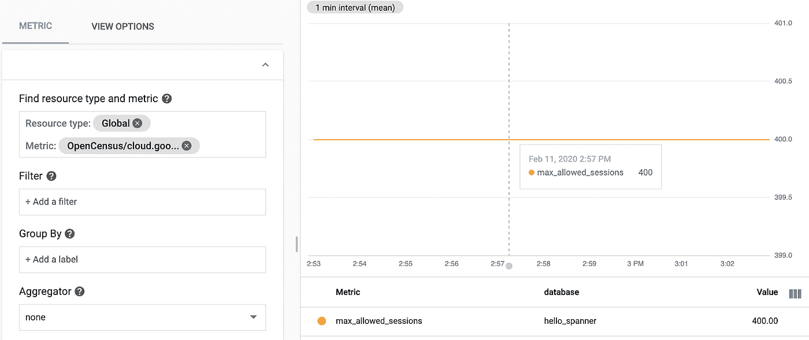
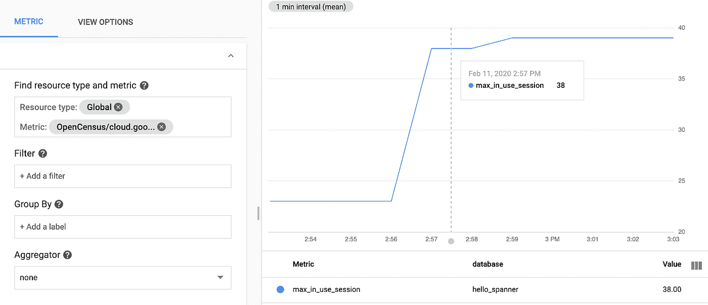
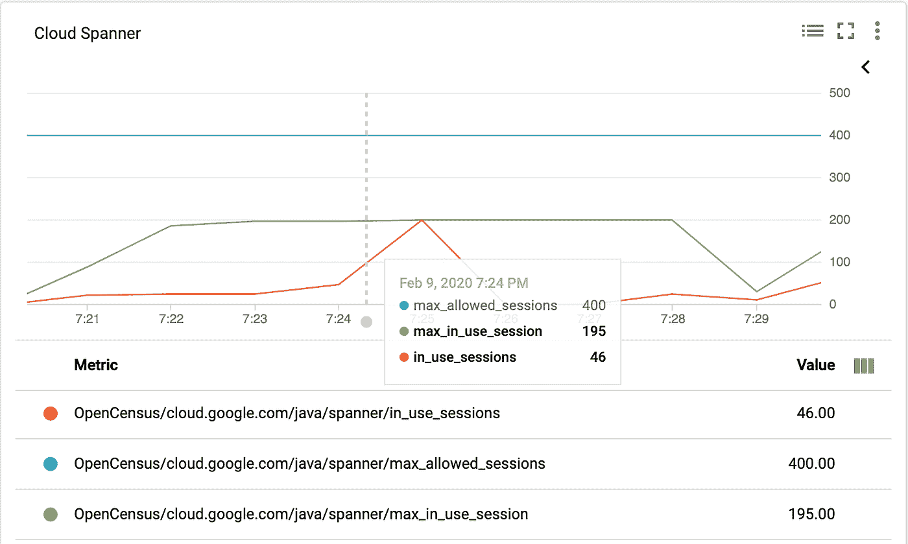
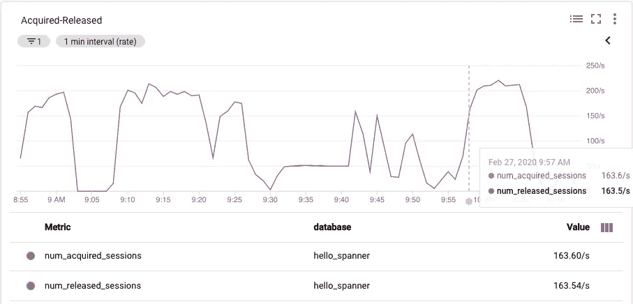
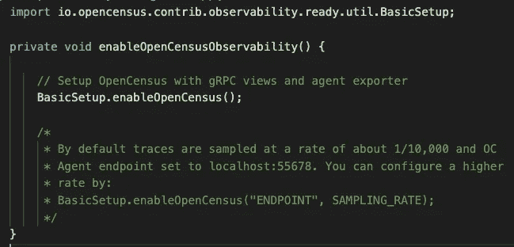

# 使用 OpenCensus 排除云扳手应用故障

> 原文：<https://medium.com/google-cloud/troubleshooting-cloud-spanner-applications-with-opencensus-2cf424c4c590?source=collection_archive---------1----------------------->


本教程展示了如何使用 OpenCensus 在 Cloud Spanner 工作负载中配置客户端指标记录。虽然 Cloud Spanner 提供了许多有用的服务器端指标，但应用程序可以实现收集 Cloud Spanner 客户端库发出的指标的额外好处。例如，只有客户端度量包括会话和事务相关的信息。这些 Spanner + OpenCensus 指标将为您提供足够的数据，使您能够发现并调查任何异常行为的原因。

在深入细节之前，让我简单介绍一下 OpenCensus。

[OpenCensus](https://opencensus.io/) 提供 C++、Java、Go、Python、Javascript、.Net、Ruby 和 PHP，它们从应用程序中捕获分布式跟踪和指标，并将这些遥测数据发送到后端，如 Cloud Monitoring、Cloud Trace、Prometheus、Jaeger、Datadog 等。更多信息和用户手册可在 [opencensus.io](https://opencensus.io/) 上获得。

*****重要提示:OpenCensus 正在被 OpenTelemetry(目前正在进入测试版)所取代，但是迁移应该不需要太多改变就可以使用 API。更多阅读*** [***此处***](/opentracing/a-roadmap-to-convergence-b074e5815289) ***。*****

# 开始之前

*   确保您使用的是 Java 8 或更高版本以及 [Apache Maven](https://maven.apache.org/install.html) 。
*   我们的示例将在 Google Cloud 上运行，并将指标发送到云监控，将跟踪发送到云跟踪，但是您可以在任何地方运行您的代码，并且可以使用 OpenCensus 支持的任何导出器。

# 用于调查会话池使用和滥用情况的客户端指标

这些简单的指标应该允许您诊断一系列不同的问题，从更改最小/最大会话配置的影响到检测会话泄漏。

> [会话](https://cloud.google.com/spanner/docs/sessions)是 Cloud Spanner API 中的核心概念。所有 Spanner 读取和写入都是通过会话执行的。一个会话在任何时候都只能有一个活动事务。

**1。跟踪最大允许会话数，可由用户配置**

`*cloud.google.com/java/spanner/max_allowed_sessions*` **:** 显示允许的最大会话数。如果池中的当前会话数小于此数，并且它们都在使用中，则将为任何新操作创建一个新会话。如果**正在使用的会话**的当前数量与该数量相同，并且新的请求到来，则池可能阻塞或失败。此度量由数据库名称、实例名称和库版本标记。



图 1:可视化最大允许会话数

**2。** **跟踪最大使用会话数**

`*cloud.google.com/java/spanner/max_in_use_sessions*`:返回上一个维护窗口间隔内使用的会话的最大数量，以便指示数据库中当前的活动量。它特定于运行它的数据库和实例名。维护窗口是设定的 10 分钟间隔。经过一个完整的维护窗口后，该值将重置为零(然后再次开始增加)。每次会话从池中签出时，该值都会更新。



图 2:可视化最大使用中会话

**3。跟踪最近使用的会话数量**

`*cloud.google.com/java/spanner/in_use_sessions*`:该指标允许用户查看当前正在使用(或从池中签出)的会话总数的实例级和数据库级数据。在这个指标的帮助下，我们可以判断正在使用的会话数量是由于某种原因而增加还是突然下降到零。根据探测间隔和平均事务持续时间，对于低负载的系统，这个数字可能经常被测量为零。例如，如果系统每秒执行 1 个事务，平均事务持续时间为 300 毫秒，并且每 10 秒探测一次该值，那么您可能经常会测量两个事务之间的值并得到零。在负载较高的系统上，测量这个值可以让用户更好地了解事务在一段时间内的分布情况。如果这个值在大部分时间里相对稳定，但是突然出现一个与用户请求中类似的突发峰值不相关的峰值，这可能表明某处存在并发问题(数据库中的锁、应用程序本身的并发问题等)。).



图 3:可视化使用会话中最大使用会话数最大允许会话数操作

**4。跟踪获取会话超时的请求数(累计)**

`*cloud.google.com/java/spanner/get_session_timeouts*`:这表示自服务器进程启动以来，由于池耗尽而超时而未被授权的 get 会话总数(请求会话的线程被置于等待队列中，等待另一个线程将会话释放到池中)。结合当前`**in_use_sessions**`的值来考虑该值，以了解数据库上的负载。此度量由数据库名称、实例名称和库版本标记。在这种情况下，您应该观察当前`**in_use_sessions**`的值，该值始终等于(或几乎等于)`**max_allowed_sessions**`。虽然这表明有些地方不太好，但也可能是应用程序和会话池正在最大限度地运行，但实际上并没有耗尽。

以下是解决此问题的步骤:

1.  检查您的应用程序日志，查看关闭您的扳手实例时发生的`LeakedSessionExceptions`。(关闭一个 Spanner 实例，将关闭会话池，并且关闭会话池将触发这些`LeakedSessionExceptions`，用于在关闭池之前尚未签入会话池的所有会话。)
2.  如果您有`LeakedSessionExceptions`:调查这些的堆栈跟踪，并修复检出会话但不检入它们的代码，例如不关闭所有`ResultSets`或不关闭只读事务。
3.  如果没有`LeakedSessionExceptions`:增加`SessionPool.maxSessions`。

**5。** **跟踪已获取和已释放会话的数量**

`*cloud.google.com/java/spanner/num_acquired_sessions*`:此指标允许用户查看获取的会话总数。

`*cloud.google.com/java/spanner/num_released_sessions*`:此指标允许用户查看已释放(已销毁)会话的总数。

在理想情况下，获取的会话数应该等于(或几乎等于)释放的会话数。如果两者之间的差异稳步增加，这肯定表明存在会话泄漏。该指标也是系统负载的一个指标，因此如果您将它表示为一个时间线，您将能够识别峰值和低负载时刻。



图 4:可视化获取和释放会话操作的数量

# 要设置和启用指标，请按照下列步骤操作:

## 步骤 1 —设置和启用增强的指标

为了从 Cloud Spanner 客户端捕获客户端指标和分布式跟踪，我们需要使用 open census[Observability Ready Util](https://github.com/census-instrumentation/opencensus-java/tree/master/contrib/observability_ready_util)for Java。这个包提供了一个方便的包装器，以便开发人员可以轻松地使用 OpenCensus。

默认情况下，OpenCensus 可观察性就绪实用程序执行以下操作:

*   支持基本 RPC(针对 gRPC 服务的单个调用，流或一元)视图，以显示下面提到的服务器端指标:

此表通过 gRPC 指标列出了 OpenCensus 中可用的基本 RPC 指标。

*   将概率采样率设置为 0.0001(万分之一)
*   创建并注册 [OCAgent 跟踪导出器](https://github.com/census-instrumentation/opencensus-java/tree/master/exporters/trace/ocagent)来收集跟踪
*   创建并注册 [OCAgent 指标导出器](https://github.com/census-instrumentation/opencensus-java/tree/master/exporters/metrics/ocagent)来收集指标

如果您使用的是 Maven，请将其添加到 pom.xml 文件中

如果您正在使用 Gradle，请将它添加到您的依赖项中

```
**compile** 'io.opencensus:opencensus-impl:0.25.0'
**compile** 'io.opencensus:opencensus-contrib-observability-ready-util:0.25.0'
```

在应用程序启动时，配置 OpenCensus:



Cloud Spanner 客户端支持 [OpenCensus Metrics](https://opencensus.io/stats/) ，可洞察客户端内部情况，帮助调试/解决生产问题。以`cloud.google.com/java/spanner/`为前缀的度量关注操作级度量。RPC 级别的度量可以从 gRPC 的度量中收集，gRPC 的度量以`grpc.io/client/`为前缀。

## 步骤 2-部署 OpenCensus 代理

OpenCensus 代理是一个组件，它可以从 OpenCensus 或其他监控/跟踪库(Jaeger、Prometheus 等)检测的进程中收集跟踪和指标。)，进行聚合和智能采样，并将跟踪和指标导出到一个或多个监控/跟踪后端。该组件是可选的(度量和跟踪可以直接从任何 OpenCensus 库中导出)，但是该代理使得选择导出器更加容易，而无需重新构建和重新部署您的应用程序。

以下是将指标导出到云监控的代理配置:

oc-agent 可以直接从源代码、二进制文件或 Docker 映像运行。

克隆源代码:打开一个新的 shell 来获得 OpenCensus 代理

```
$ git clone [https://github.com/census-instrumentation/opencensus-service.git](https://github.com/census-instrumentation/opencensus-service.git)
$ cd opencensus-service
```

构建它:`$ make agent`

这将把二进制文件放在当前工作目录的 bin 文件夹中。

运行它:`$ ./bin/ocagent_darwin — config=/config.yaml`

## 步骤 3 —使用 Stackdriver Metrics Explorer 查看捕获的指标

为 spanner 客户端启用指标后，可以使用 Stackdriver 指标导出器查看指标。

1.  导航到[指标浏览器](https://app.google.stackdriver.com/metrics-explorer)。
2.  在“查找”资源类型和指标字段中，输入以下内容:`*cloud.google.com/java/spanner/in_use_sessions*`
3.  从列表中选择此指标。
4.  在右窗格中，显示正在使用的会话数。

## 第四步——清理时间到了

由于本教程使用多个 GCP 组件，请确保在完成后删除相关资源。

## 示例 Java 应用程序

克隆本教程的源存储库:`$ git clone [https://github.com/mayurkale22/spanner-oc.git](https://github.com/mayurkale22/spanner-oc.git)`

使用特定于您的项目的一些配置来更新 Java 应用程序。导航到包含 Java 源代码的文件夹:`$ cd src/main/java/com/example/spanner`

在应用程序代码中配置环境变量，以使用云扳手实例和数据库。

构建示例:`$ mvn clean package`

运行以下 Maven 命令来构建并运行程序:`$ mvn exec:java -Dexec.mainClass=com.example.spanner.App`

进入[http://localhost:8080/spanner/](http://localhost:8080/spanner/)，开始发送读取请求。

# 总结一下…

OpenCensus 与 Cloud Spanner 的集成能够检测一个或多个指标中任何不寻常的偏离正常的情况。最近使用的会话数是一个很好的例子，它需要一个基线来告诉你一个度量是合理的还是一个问题的迹象。建立了度量的基线后，您将能够发现并调查任何与正常行为的意外偏差的原因。

我希望这份简单的入门指南能让你开始工作。如果你觉得这有帮助，或者有任何建议或问题，请在下面的评论区告诉我们。