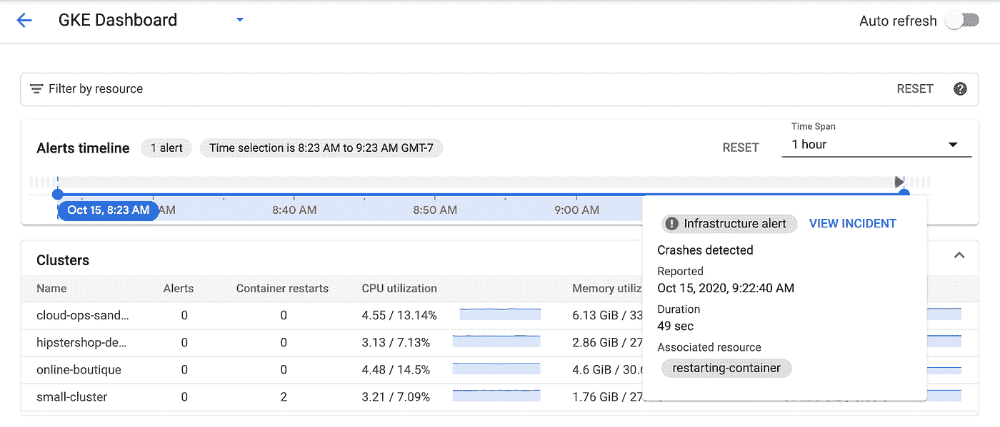

# GKE 的故障排除服务

> 原文：<https://medium.com/google-cloud/troubleshooting-services-on-gke-872470e60d51?source=collection_archive---------1----------------------->

在我的上一篇[帖子](/google-cloud/setting-up-cloud-operations-for-gke-a21b49979693)中，我回顾了新的 GKE 监控仪表板，并使用它快速找到了感兴趣的 GKE 实体。在那里，我使用实体细节窗格中上下文相关的“创建警报策略”链接设置了一个关于容器重启的警报。这一次，我想尝试使用这个设置来解决一个事件。

# 设置

## 该应用程序

你可以在这里看到我为测试这个[而创建的简单演示应用的完整代码。基本思想是它公开了两个端点——一个是/ endpoint，它只是一个“hello world”，一个是/crashme 端点，它使用 Go 的 os。退出(1)以终止该过程。然后，我使用云构建创建了一个容器映像，并将它部署到 GKE。最后，我用负载平衡器公开了服务。](https://github.com/yuriatgoogle/stack-doctor/blob/master/crashing-pod-demo/main.go)

部署服务后，我检查了正在运行的 pod:

```
✗ kubectl get podsNAME READY STATUS RESTARTS AGErestarting-deployment-54c8678f79-gjh2v 1/1 Running 0 6m38srestarting-deployment-54c8678f79-l8tsm 1/1 Running 0 6m38srestarting-deployment-54c8678f79-qjrcb 1/1 Running 0 6m38s
```

请注意，最初每个 pod 的重新启动次数为零。当我点击/crashme 端点时，我看到了一个重启:

```
✗ kubectl get podsNAME READY STATUS RESTARTS AGErestarting-deployment-54c8678f79-gjh2v 1/1 Running 1 9m28srestarting-deployment-54c8678f79-l8tsm 1/1 Running 0 9m28srestarting-deployment-54c8678f79-qjrcb 1/1 Running 0 9m28s
```

我能够确认对端点的每个请求都会导致重启。然而，我必须小心不要太频繁地这样做——否则，容器会进入 CrashLoopBackOff，并且服务再次可用需要时间。我最终在我的 shell (zsh)中使用了这个简单的循环来在需要的时候触发重启:

```
while true; do curl [http://$IP_ADDRESS:8080/crashme;](/$IP_ADDRESS/crashme;) sleep 45;done
```

# 警报

下一步是设置警报策略。我是这样配置的:


我使用了`kubernetes.io/container/restart_count`指标，过滤到特定的容器名称(如部署 yaml [文件](https://github.com/yuriatgoogle/stack-doctor/blob/master/crashing-pod-demo/deployment.yaml)中所指定的)，并配置了如果任何时间序列超过 0 就触发警报——这意味着如果观察到任何容器重启。

设置完成了——我现在准备测试，看看会发生什么！

# 测试警报

当我准备好了，我开始循环脚本，每 45 秒到达/crashme 端点。`restart_count`指标每 60 秒采样一次，所以仪表板上很快就出现了一个警报:


我将鼠标移至事件上方，以获取更多相关信息:



这已经比以前版本的 UI 有所改进，在以前的版本中，我不能与事件卡片进行交互。

然后，我点击“查看事件”。这将我带到事件详细信息屏幕，在那里我可以看到触发它的特定资源。在我的例子中，它指向容器:


然后我点击查看日志来查看日志(在新的日志查看器中！)—果然，很明显，警报是由容器重启触发的:


所有这些都很好地结合在一起，使事故期间的故障排除更加容易！

# 总之…

我是新的 GKE 仪表板的忠实粉丝，我真的很喜欢新的警报时间线，我喜欢事件被清楚地标记出来，并且我可以实际上与它们进行交互，以获得所发生事情的完整细节，一直到告诉我实际问题的容器日志。

感谢您的阅读，欢迎再次光临。像往常一样，请让我知道你还想看到我做什么 SRE 或可观察性的话题。现在比以往任何时候都更需要保持健康！