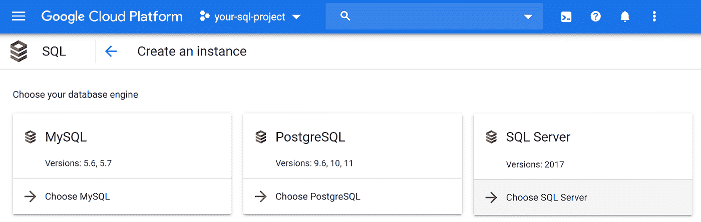
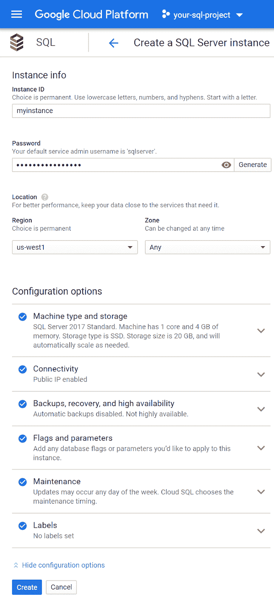
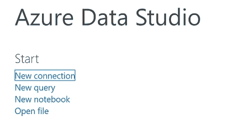
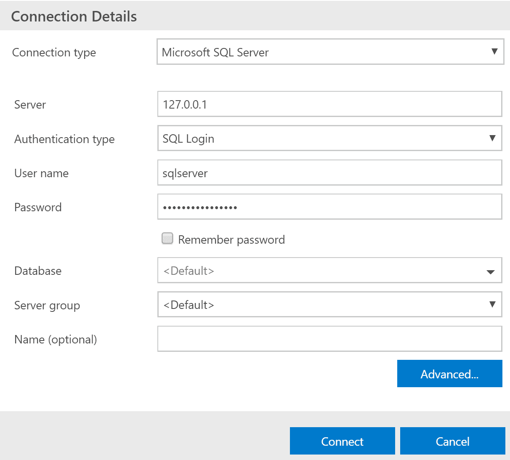
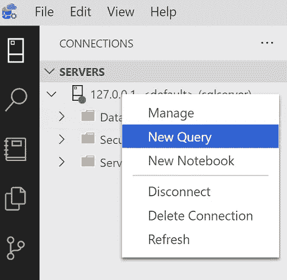
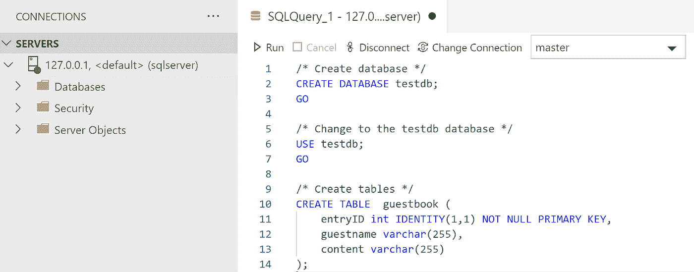
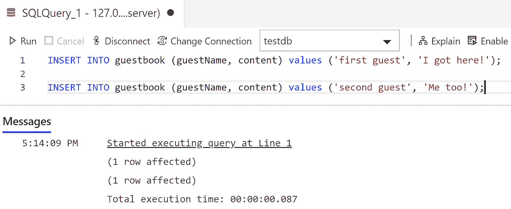
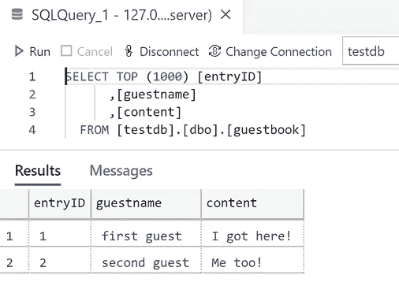

# 以您自己的速度在 Google Cloud 上试用 SQL Server

> 原文：<https://medium.com/google-cloud/try-out-sql-server-on-google-cloud-at-your-own-pace-ba3888622c0a?source=collection_archive---------1----------------------->

这里有一种经济实惠的方法，可以让您按照自己的节奏在 Google Cloud 上试用 SQL Server。

我们将介绍创建 Google 云平台项目和启动 Cloud SQL for SQL Server 实例所需的步骤。接下来，我们将使用 Azure Data Studio 创建一个包含单个表的数据库，向表中插入一些示例数据，然后确认我们可以从新表中查询数据。最后，我们将关闭 SQL Server 以停止收费，直到我们准备好再次使用它。

**创建谷歌云平台项目**

要开始，我们需要一个谷歌云平台项目。如果您已经有一个项目，可以跳过这一步。按照创建和管理项目的[文档](https://cloud.google.com/resource-manager/docs/creating-managing-projects)创建一个新项目。

**创建一个 SQL Server 实例**

创建好项目后，点击[云控制台](https://console.cloud.google.com/)的左侧菜单，选择“SQL”打开云 SQL 视图。现在我们可以创建实例了。

单击“创建实例”按钮，并选择“选择 SQL Server”选项。



输入“myinstance”作为实例 ID。

输入“sqlserver”用户的密码，或者单击“生成”按钮。

对其他字段使用默认值。

点击“创建”按钮。



创建 SQL Server 实例

您将返回到实例列表；您可以立即单击新实例来查看详细信息，但是只有在它初始化和启动后才可用。

**使用 Google Cloud SDK 和云 SQL 代理设置您的连接**

创建实例后，我们需要设置 Google Cloud SDK 和 Cloud SQL 代理，这将允许我们通过 SQL Server Management Studio 或 Azure Data Studio 等常见数据库管理工具连接到实例。按照以下步骤设置 Google Cloud SDK 和云 SQL 代理:

1.  安装[云 SDK](https://cloud.google.com/sdk/docs) 。Cloud SDK 提供了 gcloud 工具来与 Cloud SQL 和其他 Google 云服务进行交互。gcloud 工具使用云 SQL 管理 API 来访问云 SQL，因此在使用 gcloud 工具访问云 SQL 之前，您必须[启用 API](https://cloud.google.com/sql/docs/sqlserver/admin-api#enabling_the_api) 。

2.在 [bash shell](https://en.wikipedia.org/wiki/Bash_(Unix_shell)) 命令提示符或 [PowerShell](https://docs.microsoft.com/en-us/powershell/) 中，运行以下命令来初始化 gcloud 工具:

```
gcloud init
```

3.运行以下命令来验证 gcloud 工具:

```
gcloud auth login
```

4.下载并安装谷歌云 SQL 代理(参见[安装云 SQL 代理](https://cloud.google.com/sql/docs/sqlserver/sql-proxy#install))。记下您保存云 SQL 代理可执行文件的位置，因为您将在下一步中运行代理。

5.使用 bash shell 命令提示符或 PowerShell 运行云 SQL 代理，将“[Instance-connection-name]”替换为云控制台的 Overview 选项卡中的相应值(针对您的实例):

```
./cloud_sql_proxy -instances=[Instance-connection-name]=tcp:1433
```

关于安装和使用代理的更多信息，请参见[关于云 SQL 代理](https://cloud.google.com/sql/docs/sqlserver/sql-proxy)。

**使用 Azure Data Studio** 连接到您的实例

在云 SQL 代理运行的情况下，使用 Azure Data Studio 和本地主机 IP 地址连接到您的 SQL Server 实例:

点击 Azure Data Studio 中的“新建连接”选项



在**连接细节**对话框中输入以下值:

1.  对于连接类型，输入 **Microsoft SQL Server** 。
2.  对于 Server，输入 **127.0.0.1** 作为您的 SQL Server 实例的 IP 地址。
3.  对于认证类型，输入 **SQL 登录**。
4.  对于用户名，输入 **sqlserver** 。
5.  对于口令，输入创建实例时使用的口令。



一旦我们连接到 SQL Server 实例，我们就可以创建一个数据库和一个表来进行试验。在 Azure Data Studio 中右键单击服务器，选择“新建查询”。



在“新建查询”窗口中输入以下查询。

```
CREATE DATABASE testdb;
GOUSE testdb;
GOCREATE TABLE guestbook (
 entryID int IDENTITY(1, 1) NOT NULL PRIMARY KEY,
 guestname varchar(255),
 content varchar(255)
);
```



单击查询编辑器顶部的“运行”按钮。

右键单击在**数据库**下列出的新创建的 **testdb** 表，并选择“新建查询”。

输入以下插入语句，然后单击“运行”按钮运行 SQL 语句:

```
INSERT INTO guestbook (guestname, content) values (‘first guest’, ‘I got here!’);INSERT INTO guestbook (guestname, content) values (‘second guest’, ‘Me too!’);
```



现在我们已经插入了一些数据，让我们查询表以确认我们可以访问这些数据。

展开左侧导航菜单中**数据库> testdb** 项下的**表格**项。右键单击 **dbo.guestbook** 表并选择“选择前 1000 行”。



您插入的两条记录显示为结果，干得好！

**关闭实例**

关闭实例可确保在实例重新启动之前，该实例的所有计费都会停止。当您准备好再次开始使用它时，只需单击实例的“开始”按钮来重新启动实例。

查看 Doug Mahugh 的博客文章了解更多关于开始的信息。另外，请查看博客文章[将您的微软 SQL Server 工作负载迁移到谷歌云](https://cloud.google.com/blog/products/databases/migrate-your-microsoft-sql-server-workloads-to-google-cloud)和 [SQL Server 文档](https://cloud.google.com/sql/docs/sqlserver)，了解更多关于将您的应用程序连接到谷歌云平台 SQL Server 的信息。