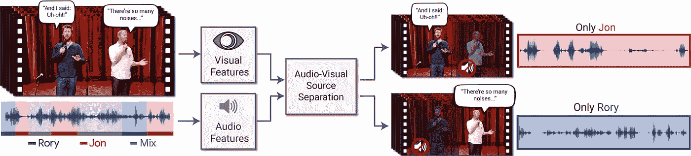

# twi GCP—“100%可再生能源、GCP 春云和 Kayenta”

> 原文：<https://medium.com/google-cloud/twigcp-100-renewable-energy-spring-cloud-gcp-and-kayenta-b765fab1afdd?source=collection_archive---------1----------------------->

" [*回到阿拉巴马*](http://goo.gl/8txLiJ) *"* (谷歌博客)如果我们不也这样做的话，我们在云上做的一切都是毫无意义的:" [*遇见我们的对手:购买 100%可再生能源*](http://goo.gl/gRK57h) "(谷歌博客)

与开发人员会面并建立强大的技术合作伙伴关系是谷歌云的关键战略:

*   【1.0.0 里程碑 3】[宣布 Spring Cloud GCP——将您最喜爱的 Java 框架与 Google Cloud 整合](http://goo.gl/KBhxZi) (Google 博客)
*   [介绍 Kayenta:一款由谷歌和网飞合作的开放式自动化金丝雀分析工具](http://goo.gl/aRs28t)(谷歌博客)
*   [探索容器安全性:挖掘 Grafeas 容器图像元数据](http://goo.gl/cjeP42)(谷歌博客)
*   [如何使用新的哈希公司保险库机密引擎动态生成 GCP IAM 凭证](http://goo.gl/d37shj)(谷歌博客)

如果你还没有时间去看 Kubeflow，这是一个简单、可移植和可扩展的 ML 工作流部署的开源项目，请看看“ [*用 Kubeflow*](http://goo.gl/cAio4w) 简化开放混合云上的机器学习”(谷歌博客)

来自“顾客对 GCP 的最佳(广泛)评价”部门:

*   [采用无服务器微服务的云原生架构——智能停车故事](http://goo.gl/h3vR6V)(第一部分)(谷歌博客)
*   [在无服务器上实现事件驱动架构——智能停车的故事](http://goo.gl/eW1o9t)(第二部分)(谷歌博客)
*   [我们从无服务器停车中学到了什么——智能停车的故事](http://goo.gl/iCZdrF)(第三部分)(谷歌博客)

来自“甜蜜而短暂的 ML 综述”部门:

*   [TensorFlow Extended(medium.com)是一个围绕 tensor flow 和 ApacheBeam 管道执行模型构建的端到端 ML 平台](http://goo.gl/hYPw8d)(TFX)
*   [望听:视听语音分离](http://goo.gl/KmMbp9)(谷歌博客)

来自“过去一周的一些测试版发布”部门:

*   [测试版] GCP 的分布式 API 网关有一个新的增量配置选项:“ [*云端点:引入一种新的方式来管理 API 配置推出*](http://goo.gl/YtUzvd) ”(谷歌博客)
*   [Beta] [使用 DML 语句更新分区表数据](http://goo.gl/jkEK5J) (Google Cloud 文档)
*   [Beta] [新的 IAM 角色，向组织外的用户授予实例访问权限](http://goo.gl/L9MtrM) (Google Cloud 文档)
*   [Beta] [模拟谷歌计算引擎虚拟机上的维护事件](http://goo.gl/WqRgNZ)(谷歌云文档)

来自“以防你错过(ICYMI)”部门:

*   [Jib](http://goo.gl/trskxm) ，一个 Maven 插件，无需运行 Docker 守护进程就可以逐步构建可复制的 Docker 和 OCI 映像
*   [谷歌提名 Forrester 公共云开发平台 Wave 的领导者，Q2 2018](http://goo.gl/iQmGy9) (谷歌博客)
*   [优雅地关闭 GRPC 服务](http://goo.gl/qBxM6n)(medium.com)
*   [超越 SQL 和 JS 的 BigQuery:大规模运行 C 和 Rust 代码](http://goo.gl/ktQDTq)(medium.com)
*   [自动对你上传到云存储的数据进行分类](http://goo.gl/D7MDzG)(谷歌博客)
*   白皮书:运行您的现代。Kubernetes (谷歌博客)上的. NET 应用
*   [保护谷歌云数据库的最佳实践](http://goo.gl/nveqEv)(谷歌博客)
*   为什么 AutoML 将成为人工智能的未来(forbes.com)
*   回顾我们十年的应用引擎之旅

来自“听和看”部门:

*   (gcppodcast.com)本周 GCP 播客#122 项目 Jupyter 有杰西卡·福德、Yuvi Panda 和 Chris Holdgraf
*   [与谷歌高级研究员杰夫·迪恩(youtube.com)讨论机器学习的广泛应用](http://goo.gl/LRvc7K)
*   来自 SpringOne 的视频会议—“[Google 云平台与 Spring Cloud GCP](http://goo.gl/z7KxBE)”(infoq.com)的力量

本周的图片摘自[谷歌关于深度学习视听模型的研究帖子，该模型用于从混合的声音中分离出单一的语音信号](http://goo.gl/KmMbp9)(也可以查看帖子中的视频！) :

这星期到此为止！
——亚历克西斯