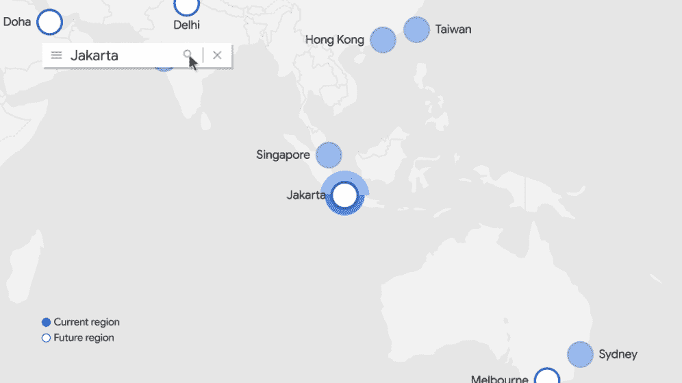

# TWiGCP“15k GKE 节点、雅加达、下一次 OnAir 计划和云 SQL 折扣”

> 原文：<https://medium.com/google-cloud/twigcp-15k-gke-nodes-jakarta-next-onair-schedule-and-cloud-sql-discounts-d095f5cac0de?source=collection_archive---------2----------------------->

以下是谷歌云视频系列 本周最新 [**的链接:**](http://gtech.run/ju4em)

*   [如何使用 Pub/Sub 作为云监控通知渠道](http://gtech.run/hm329)
*   [什么是计算引擎？](http://gtech.run/nprwu)
*   [为 30 年的家庭视频建立人工智能搜索档案](http://gtech.run/fn738)
*   [Google Cloud Next’20:on air sessions](http://gtech.run/4vvtg)

过去一周 GCP 的其他头条新闻包括:

*   [现已发布:下一次 on air 20 日程、会议、学习和资源](http://gtech.run/ypmn8)(谷歌博客)
*   [Google Kubernetes 引擎集群可以拥有多达 15，000 个节点](http://gtech.run/lhbfy) (Google 博客)
*   位于雅加达的新谷歌云区域现已开放
*   [云 SQL 承诺使用折扣带来更少的价值](http://gtech.run/qm6mz)(谷歌博客)
*   扩展我们的差异隐私库(谷歌开源博客)

来自“正确使用日志记录管道”部门:

*   [如何使用 Pub/Sub 作为云监控通知渠道](http://gtech.run/wt8p4)(谷歌博客)
*   [实时检测和响应云日志事件](http://gtech.run/tkt35)(谷歌博客)

来自“面向所有人的预测性维护”部门:

*   [使用 AutoML 表在工作负载故障发生之前预测它们](http://gtech.run/apcwa)(谷歌博客)

来自“#6 会让你兴奋”部门:

*   你可能不知道的 7 种云技巧(medium.com)

来自“网络更安全”部门:

*   [使用 reCAPTCHA Enterprise 减少网络抓取](http://gtech.run/t3hhy)(谷歌博客)
*   [具有共享 VPC 和私有服务访问的 Redis](http://gtech.run/kbuk5)(medium.com)
*   [GCP 上的零信任安全，支持上下文感知访问](http://gtech.run/v7cnc)(bravenewgeek.com)

来自“GitLab week”部门:

*   【medium.com】使用 GitLab CI 部署到云运行
*   【cloud.google.com，将 GitLab 部署到安索斯·GKE 本地，以配置和运行 CI/CD 管道

来自“计算机视觉”部门:

*   [🎞️视频对象跟踪服务](http://gtech.run/wvgtt)(medium.com)
*   [未来的汽车手册将在手机上](http://gtech.run/ewdpg)(techhq.com)

来自“流经系统的有效数据”部门:

*   [使用数据流构建生产就绪数据管道:概述](http://gtech.run/qfsmw)(cloud.google.com)
*   [带邮递员的 BigQuery 流 API](http://gtech.run/cbgls)(medium.com)

来自“数据库云运营”部门:

*   [数据库迁移:概念和原则](http://gtech.run/c9zy5)(cloud.google.com)
*   [使用 Striim 设计数据库迁移和复制](http://gtech.run/4a5n3)(cloud.google.com)
*   [通过双写进行在线数据库迁移:这并不适合所有人](http://gtech.run/825ea)(medium.com)
*   [DML 和突变——云扳手中两种数据更改技术的故事【medium.com ](http://gtech.run/ecsws)
*   [通过事务统计增加对云扳手性能的可见性](http://gtech.run/2uzhk) (Google 博客)

来自“无服务器、容器、功能和云”部门:

*   [谷歌计算引擎上基于容器的无服务器计划作业](http://gtech.run/yrxug)(jamesward.com)
*   [使用 Python 设置和调用云函数](http://gtech.run/nckyw)(medium.com)
*   将容器迁移到 Google Cloud:从 OpenShift 迁移到 Anthos(cloud.google.com)

来自我最喜欢的“客户和合作伙伴对 GCP 的最佳评价”部分:

*   [薛定谔如何利用谷歌云推进新冠肺炎的药物研发工作](http://gtech.run/xxzqt)(谷歌博客)

来自“**万物多媒体**部门:

*   【youtube.com 谷歌数据中心安全:6 层深
*   满怀信心地迁移到谷歌云(youtube.com)
*   [播客] Kubernetes 播客[第 109 集——Kubermatic，Sebastian Scheele](http://gtech.run/f2gsl)(kubernetespodcast.com)
*   [播客] GCP 播客[第 224 集 Grace Mollison 和 Ann Wallace 的解决方案工程](http://gtech.run/mtkqs)(gcppodcast.com)

**从 Beta，GA，还是什么？**“部门:

*   [GA] [云 SDK 298.0.0](http://gtech.run/wfg8w)
*   [GA] [内部数据传输服务](http://gtech.run/zemfu)
*   [GA] [Firestore 监控使用情况](http://gtech.run/rrebr)
*   [GA] [使用 REST API 配置数据存储索引](http://gtech.run/qdmha)
*   安索斯 GKE 内部版本 1.4
*   [GA] [计算引擎实例放置策略](http://gtech.run/rj6tf)
*   [GA] [独立租户节点—自带 Windows 许可证](http://gtech.run/bueza)
*   [GA] [大查询 SLA:现在为 99.99%](http://gtech.run/ernqh)
*   [1.0] [公开比赛](http://gtech.run/ebrjk)
*   【测试版】[云存储带宽监控](http://gtech.run/kbx9j)

本周的图片是位于雅加达的新印度尼西亚谷歌云数据中心

这就是本周的全部内容！亚历克西斯