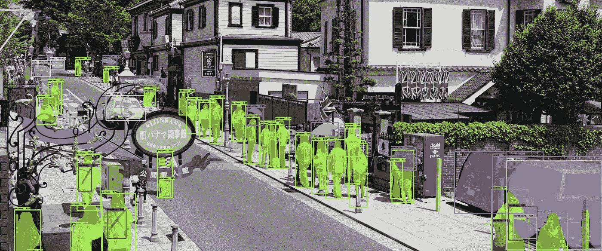

# TWiGCP —“云任务、ZetaSQL 和大量云运行”

> 原文：<https://medium.com/google-cloud/twigcp-173-bd014a5e97a7?source=collection_archive---------2----------------------->

如果你是本周从 [**来到谷歌云的视频系列**](http://gtech.run/ju4em) 的，以下是本周所涉及主题的链接:

*   [谷歌云任务](http://gtech.run/mp3uy)。构建优雅的云原生架构的又一工具。
*   [云 Dataproc 中的新开源工具在云规模上处理数据](http://gtech.run/kegru)
*   [如何使用 Stackdriver 监控导出进行长期指标分析](http://gtech.run/bfsts)
*   [Stackdriver 沙盒](http://gtech.run/2nv3g)，学习 Stackdriver 的一个很棒很安全的方法。

过去一周的其他 GCP 故事包括:

*   [Google 开源 ZetaSQL](http://gtech.run/gzfzl) —驱动 BigQuery、Spanner、DataflowSQL (soon)等的 ANSI 标准 SQL。解析器和分析器！(github.com)
*   [美国癌症协会使用谷歌云机器学习为癌症研究提供动力](http://gtech.run/8xk4m)(谷歌博客)

来自我最喜欢的“客户和合作伙伴对 GCP 的最佳评价”部分:

*   [云文件存储为 ClioSoft 的设计管理平台提供高性能存储](http://gtech.run/5lczg)(谷歌博客)
*   [Repl.it 案例研究](http://gtech.run/j77kg)(cloud.google.com)

来自“推动云跑的人们”部门:

*   [先看看谷歌云的运行【semaphoreci.com ](http://gtech.run/j29jy)
*   [使用服务帐户向云运行发出请求](http://gtech.run/brjfd)(medium.com)
*   [从 Travis CI 部署到 Google Cloud Run 的配置示例](http://gtech.run/gr4nf)(github.com)
*   [删除谷歌容器注册表中未标记的图片参考，作为一项服务](http://gtech.run/jdfld)(github.com)
*   [在 5 分钟内将一个 Swift HTTP 无服务器容器部署到 Google Cloud Run-Alfian Losari](http://gtech.run/numq9)(medium.com)

…这里有一个全面的(但在制品)[云运行常见问题解答](http://gtech.run/j7j6x)(github.com)

来自“将云人工智能投入使用”部门:

*   [在人工智能服务平台](http://gtech.run/h554f)(谷歌博客)上创建预处理-模型服务亲和度与定制在线预测
*   [图像中有什么:使用云 TPUs 进行快速、精确的图像分割](http://gtech.run/x56kz)(谷歌博客)
*   【github.com】文本分类模型可解释性演示

来自“实践学习”部门:

*   [在 Colab 笔记本中运行 Python Beam 代码(Java 也可以运行！)](http://gtech.run/ymwrz)(bean.apache.org)
*   [通过部署 Google Kubernetes 引擎集群了解 terra form](http://gtech.run/uajhk)(medium.com)

来自“超越你好世界”部门:

*   [数据存储中的实体组、祖先和索引—工作示例](http://gtech.run/v7hn5)(medium.com)
*   [在谷歌云功能中使用秘密](http://gtech.run/alqbf)(开发者至)

从“测试版，正式版，还是什么？”部门:

*   [GA] [云 SDK 243.0.0](http://gtech.run/wfg8w)
*   【GA】[谷歌云平台 C++客户端库](http://gtech.run/ew4kc)
*   【2 . 5 . 1】[谷歌云平台平台提供商](http://gtech.run/et5r4)
*   谷歌 Kubernetes 引擎插件

来自“所有多媒体”部门:

*   【软件工程每日播客】[云与 Eric Brewer](http://gtech.run/dnb2m) | [gVisor:安全容器沙箱与 Yoshi Tamura](http://gtech.run/kzrgw) | [无服务器运行时与 Steren Giannini](http://gtech.run/9gxt8)(softwareengineeringdaily.com)
*   [播客] Kubernetes 播客[第 50 集——Spotify，大卫·夏](http://gtech.run/k56kh)(kubernetespodcast.com)
*   [播客] GCP 播客[第 174 集——安·华莱士和迈克尔·沃曼的专业服务](http://gtech.run/stml5)(gcppodcast.com)

本周的图片来自“使用云 TPUs 的图像分割”帖子

这就是本周的全部内容！亚历克西斯