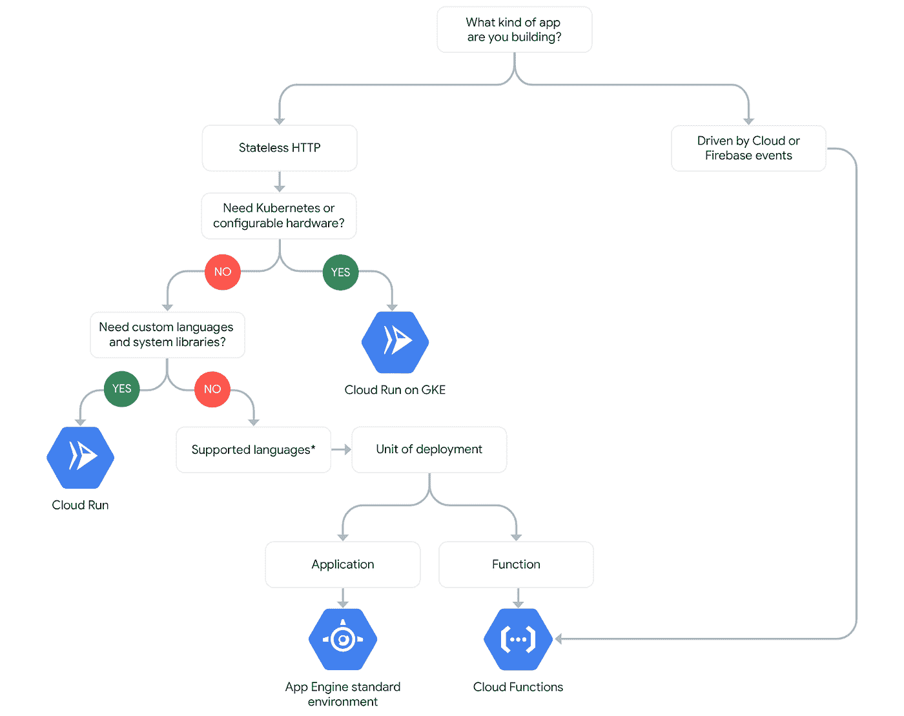

# TWiGCP—“GCP 的 UPS，更好的功能，和交通指挥”

> 原文：<https://medium.com/google-cloud/twigcp-174-3fccac29a9fc?source=collection_archive---------0----------------------->

如果你是本周从 [**来到谷歌云的视频系列**](http://gtech.run/ju4em) 的，以下是本周所涉及主题的链接:

*   “ [*你最喜欢的运行时，现在云上一般都有*](http://gtech.run/rqw44) ”(谷歌博客)。如今，云运行可能很有趣，但随着 Python 3.7、Go 1.11 和 Node 8 的普遍推出，云功能也越来越受欢迎。此外，Node 10 现在处于测试阶段，你可以注册私人 alphas 来测试 Go 1.12 和 Java 8。
*   “ [*谷歌云深度联网*](http://gtech.run/g8m8m) ”(谷歌博客)。关于交通总监的讨论，GCP 管理的交通控制平面将开发与运营分开。
*   [*Berglas*](http://gtech.run/8jqh7)*【github.com】一款全新的开源的 GCP 秘密管理工具和库(云运行、云函数、云构建、Kubernetes 等。)*
*   *[*【Qwiklabs*](http://gtech.run/3zzyd)*(Google . Qwiklabs . com)。一个单独的代码实验室或一个完整的任务，Qwiklabs 是一个从 GCP 开始并一次一个主题地提高你的技能的好方法。**

**过去一周的其他 GCP 故事包括:**

*   **[UPS 使用谷歌云构建未来的全球智能物流网络](http://gtech.run/9swal)(谷歌博客)**
*   **[选择无服务器选项](http://gtech.run/m52el)(cloud.google.com)**
*   **[在英伟达的 T4 GPU 上高效扩展 ML 和其他计算工作负载，现在已经正式上市](http://gtech.run/v33zd)(谷歌博客)**
*   **[宣布机密计算挑战赛的获胜者](http://gtech.run/acld8)(谷歌博客)**
*   **[云中数据治理的原则和最佳实践](http://gtech.run/yvn3a)(谷歌博客)**
*   **[从现有基础设施生成地形文件的 CLI 工具(反向地形)](http://gtech.run/yz54w)(github.com)**

**来自“酷炫云跑”部门:**

*   **[使用云运行服务作为异步工作器](http://gtech.run/9668y)(medium.com)**
*   **[向 README.md 添加云运行部署按钮的说明](http://gtech.run/ymgpz)(github.com)**
*   **【blogs.sap.com】发布 Google Next 9 好奇心——玩云运行和 SAP HANA**

**来自“托管网络功能”部门:**

*   **[用 VPC](http://gtech.run/4xee4) (谷歌博客)简化你的 VPC 之间的路由**
*   **[使用 VPC 服务控件和云存储传输服务将数据从 S3 转移到云存储](http://gtech.run/3kdak)(谷歌博客)**

**来自“持续云功能改进”部门:**

*   **[云功能的状态(19 年中期)](http://gtech.run/z8dd3)(medium.com)**
*   **[快速打字稿谷歌云功能开发](http://gtech.run/2246c)(github.com)**
*   **[使用 Google Cloud 功能将 cron 作业迁移到云中](http://gtech.run/cq2vb) (dev.to)**

**来自“现场报告”部门:**

*   **[将基于 Jersey 的微服务迁移到 Java 11 并部署到应用引擎](http://gtech.run/g6mdb)(medium.com)**
*   **使用谷歌计算引擎的私人虚拟专用网的填鸭式指南(medium.com)**
*   **[ska ffold](http://gtech.run/fmm22)(liatrio.com)交货管道的快速反馈**
*   **[medium.com GCP](http://gtech.run/fecjl)的云 CI/CD**

**来自“对于那些仍然对 Anthos 有点困惑的人”部门:**

*   **[Anthos 概述](http://gtech.run/4v3sy)(cloud.google.com)**

**来自“因为对认证的兴趣持续增长”部门:**

*   **“[我是如何通过谷歌云专业数据工程师认证考试](http://gtech.run/9vtbr)”(towardsdatascience.com)**
*   **“[关于谷歌专业云架构师考试——(medium.com GCP 2019)](http://gtech.run/5utd6)”**

**来自我最喜欢的“客户和合作伙伴对 GCP 的最佳评价”部分:**

*   **[Caravel] [在谷歌云功能上用机器学习赋予你的经过人工智能平台训练的无服务器终端以能力](http://gtech.run/f76h8)(谷歌博客)**
*   **[封存谷歌云案例研究](http://gtech.run/6tyqg)(cloud.google.com)**
*   **【cloud.google.com Twiggle 谷歌云案例研究**

**从“测试版，正式版，还是什么？”部门:**

*   **【GA】[云 SDK 244.0.0](http://gtech.run/wfg8w)**
*   **【GA】[谷歌云扳手监控 CPU 利用率](http://gtech.run/27me5)**
*   **英伟达 T4**
*   **[1.1.5] [宣布 Istio 1.1.5](http://gtech.run/pwzxe)**
*   **【Alpha】[云运行直接支持云 SQL](http://gtech.run/3p66p)**
*   **【Alpha】[谷歌云功能 Java](http://gtech.run/k886u)**
*   **【Alpha】[谷歌云功能 Go 1.12](http://gtech.run/67psy)**

**来自“所有多媒体”部门:**

*   **[视频] [使用 BigQuery 创建交互式成本和 KPI 仪表板](http://gtech.run/2a7lm)(youtube.com)**
*   **[视频] [数据税务—利用 Kubernetes 和 GCP 市场在混合云环境中管理数据【youtube.com ](http://gtech.run/sly8)**
*   **[播客] Kubernetes 播客[第 51 集——KeyBank，与 Gabe Jaynes](http://gtech.run/2uwpk)(kubernetespodcast.com)**
*   **gcppodcast.com，GCP 播客第 175 集**

**

本周的图片是最新的决策树，这次是无服务器选项** 

**这就是本周的全部内容！亚历克西斯**