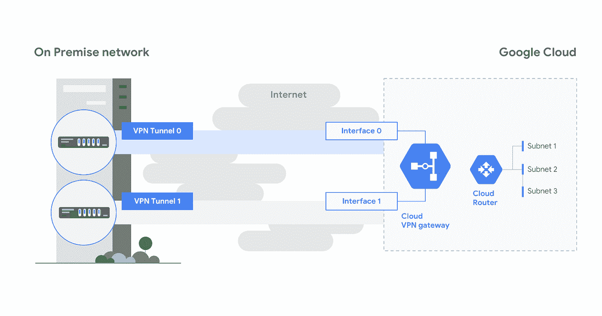

# twi GCP“GKE 市场、大阪、BigQuery GIS 和 Bigtable 全局复制”

> 原文：<https://medium.com/google-cloud/twigcp-176-d4edf26022cd?source=collection_archive---------2----------------------->

如果你是本周从 [**来到谷歌云的视频系列**](http://gtech.run/ju4em) 的，以下是本周所涉及主题的链接:

*   [在 GCP 市场推出 Kubernetes 应用程序，面向 GKE、安索斯和其他地区](http://gtech.run/c4w9e)。开源和商业 GKE 产品的市场。
*   [谷歌云推出新的大阪地区，以支持日本不断增长的客户群](http://gtech.run/x9rbb)
*   [用 BigQuery GIS 查询星星](http://gtech.run/qbsdc)。提醒您，如果您还没有看过 BigQuery GIS 的话。
*   [Kubernetes 播客](http://gtech.run/sybvl)。本周是 Kubecon 欧洲！

过去一周的其他 GCP 故事包括:

*   [全球扩展，利用新的云大表功能获得四个 9 的可用性](http://gtech.run/z8thj) (Google 博客)
*   [介绍 Translatotron:一个端到端的语音到语音的翻译模型](http://gtech.run/wwz5f)(ai.googleblog.com)
*   [通过高可用性 VPN 和 100 Gbps 专用互连实现更快、更可靠的连接](http://gtech.run/j3s7h)(谷歌博客)
*   [深入研究谷歌云网络:了解网络服务层](http://gtech.run/6h49g)(谷歌博客)

**云润**

*   [使用云发布/订阅与云运行教程](http://gtech.run/8y62s)(cloud.google.com)
*   [谷歌云平台中的持续交付——使用 Kubernetes 引擎的云运行](http://gtech.run/dhfgj)(medium.com)
*   [通过云运行构建和部署无服务器的 dockered API](http://gtech.run/az4g9)(medium.com)

**BigQuery**

*   可视化大查询(medium.com)
*   [big query 中的优步数据集:旧金山和你所在城市的驾驶时间](http://gtech.run/k4x2k)(towardsdatascience.com)
*   [使用 Informatica 智能云服务将数据迁移和集成到 big query](http://gtech.run/77syu)(cloud.google.com)

**云原生**

*   [GKE 沙盒:为你的豆荚带来深度防御](http://gtech.run/hrmnx)(谷歌博客)
*   [gVisor 性能指南](http://gtech.run/vbl44)。运行时成本包括额外的 CPU 周期和内存使用(gvisor.dev)
*   [Knative + Buildpacks:不带 Dockerfile 的容器映像的源代码](http://gtech.run/ufps2)(medium.com)
*   [使用 Istio 网格扩展支持您的迁移:教程](http://gtech.run/bk25z)(cloud.google.com)

**企业准备就绪**

*   [在混合环境中使用活动目录的模式](http://gtech.run/4kmds)(cloud.google.com)

**操作指南**

*   [数据管道——我的数据管道在处理事件吗？](http://gtech.run/jf6re)(medium.com)

**最佳实践**

*   API 设计:为什么你应该使用链接，而不是键来表示 API 中的关系(谷歌博客)
*   [API 改进建议](http://gtech.run/4azxu) (aip.dev)

来自我最喜欢的“**客户和合作伙伴**最佳谈论 GCP”部门:

*   [无法比较:MoneySuperMarket 如何使用谷歌云将他们的数据转化为竞争优势](http://gtech.run/qwc6h)(谷歌博客)
*   [Grasshopper 如何将 BigQuery 和云数据流用于他们的实时金融数据应用](http://gtech.run/tmrkk)(谷歌博客)
*   [阳光咒语:SunPower 如何通过人工智能平台将太阳能放在你的屋顶上](http://gtech.run/gesju)(谷歌博客)
*   [斯伦贝谢选择谷歌云作为首选云提供商](http://gtech.run/fzdpl)(slb.com)
*   [Etsy 利用谷歌云改善搜索，刺激销售](http://gtech.run/me6m6)(wsj.com)
*   [Deskforce 案例研究](http://gtech.run/eqvbp)(cloud.google.com)

**从 Beta，GA，还是什么？**“部门:

*   【GA】[云 SDK 246.0.0](http://gtech.run/wfg8w)
*   对 GKE 的大力支持
*   [GKE 1.13](http://gtech.run/5bcjn)
*   [GA] [云扳手延迟指标](http://gtech.run/yq7xx)
*   [Beta] [云运行连接到云 SQL 实例](http://gtech.run/hartq)
*   【测试版】 [VPC 服务控制对谷歌 Kubernetes 引擎 API 的支持](http://gtech.run/6x6j6)
*   【Beta】[HA 云 VPN](http://gtech.run/mn85q)
*   [1 . 10 . 2][Apache air flow Cloud Composer](http://gtech.run/9grr2)
*   [0.10.0] [Agones 虚幻、自我分配和性能改进](http://gtech.run/cr6kw)
*   [0.6.0] [发布 Knative Serving 版本 0.6.0](http://gtech.run/wpgas)

来自“**万物多媒体**”部门:

*   [视频] [使用 AutoML 表格转变您的业务【youtube.com ](http://gtech.run/3yflv)
*   技术探索者:凯尔西·海托华(youtube.com)
*   [播客] Kubernetes 播客[第 53 集——Optiva 和 Arctiq，丹·戴尔和凯尔·巴塞特](http://gtech.run/28htu)(kubernetespodcast.com)
*   gcppodcast.com，GCP 播客第 176 集——约翰·博汉南引子

本周的图片展示了新的 HA VPN 功能

这就是本周的全部内容！亚历克西斯