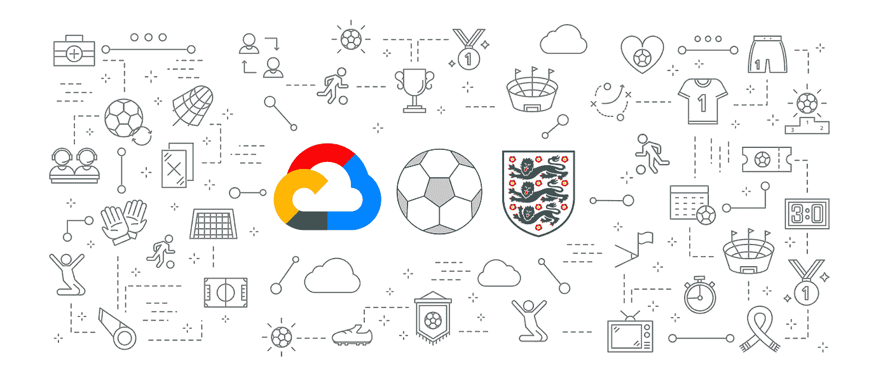

# TWiGCP — Kubernetes 操作符、GA 中的云调度器、BigQuery 中的 DLP 和 real football

> 原文：<https://medium.com/google-cloud/twigcp-178-2ad84c41a84b?source=collection_archive---------1----------------------->

如果你是本周从 [**来到谷歌云的视频系列**](http://gtech.run/ju4em) 的，以下是本周所涉及主题的链接:

*   "[GCP 市场上的 Kubernetes 运营商简化了应用管理](http://gtech.run/azf8r)"
*   "[在 Google Cloud 构建云原生的未来](http://gtech.run/n9qb6)"
*   "[将双层 web 应用程序迁移到 GCP](http://gtech.run/vk5qq) "
*   "[谷歌云联网深度:云负载平衡解构](http://gtech.run/yabr7)"

过去一周 GCP 的其他头条新闻包括:

*   [Cloud Scheduler，来自 Google Cloud 的完全托管的 cron 作业服务](http://gtech.run/ecsnk) (Google 博客)#GA
*   [使用云 DLP 扫描 BigQuery 中的敏感数据](http://gtech.run/sprwx)(谷歌博客)
*   英足总正在用谷歌云为足球创造更美好的未来
*   一年后(opensource.googleblog.com)

来自“GCP 光谱操作指南”部门:

*   [使用签名网址直接上传图片到云存储](http://gtech.run/v3psu)(谷歌博客)
*   [开发案例:部署到使用 Bitbucket 管道运行的 GCP 云](http://gtech.run/j8mxz)(medium.com)
*   [在 Kubernetes](http://gtech.run/3uack)(towardsdatascience.com)上使用 Istio 部署 TensorFlow 模型
*   [在 medium.com GCP 使用 scikit-learn 和云机器学习引擎的在线预测 API](http://gtech.run/86urs)
*   medium.com 的谷歌云 KMS
*   [使用云扳手构建你自己的基于事件的系统](http://gtech.run/pjtkq)(谷歌博客)
*   [BigQuery 加密功能—第一部分:使用加密粉碎的数据删除/保留](http://gtech.run/s5vqc)(medium.com)

来自“软件架构问题的优雅解决方案”部门:

*   [测试云发布/订阅客户端以最大化流媒体性能](http://gtech.run/7ab8x)(谷歌博客)
*   【medium.com】每个 HTTP 目标的云任务

来自我最喜欢的“客户和合作伙伴对 GCP 的最佳评价”部分:

*   【medium.com】GKE 大型集群升级
*   《路易莎》杂志:我们如何用 Apigee、Firebase 和 GCP 改变我们的电子商务平台
*   [Panorays 案例研究](http://gtech.run/b4dju)(cloud.google.com)# GKE # big query
*   [Screenz 案例研究](http://gtech.run/h5z73)(cloud.google.com)# GCE #负载平衡器#CDN

来自“无服务器 GCP 新闻”部门:

*   [云作为内部异步工作器运行](http://gtech.run/wsaf7)(medium.com)
*   [云功能标识—运行时服务账户](http://gtech.run/nnag7)(云文档)
*   [使用谷歌云运行的无服务器服务器端 Swift](http://gtech.run/dyjal)(medium.com)

**从 Beta，GA，还是什么？**“部门:

*   [GA] [云 SDK 248.0.0](http://gtech.run/wfg8w)
*   [GA] [云调度器](http://gtech.run/lr5fy)
*   [GA] [Kubernetes 引擎—优化 IP 地址分配](http://gtech.run/ujp5t)
*   [GA] [云 SQL —设置和查看自定义备份位置](http://gtech.run/ah4tg)
*   [GA] [在负载平衡中设置网络端点组](http://gtech.run/dlhpy)
*   [Beta] [计算引擎—从快照创建实例](http://gtech.run/3m32a)

来自“**万物多媒体**”部门:

*   [YouTube] [数据中心的 Kubernetes 不一定很难](http://gtech.run/45ggc)(youtube.com)
*   【YouTube】[本周在云端 2019 年 5 月 29 日](http://gtech.run/ycees)(youtube.com)
*   [播客] Kubernetes 播客[第 55 集——solo . io，艾迪·莱文](http://gtech.run/c74wk)(kubernetespodcast.com)
*   gcppodcast.com GCP 播客[第 178 集——与罗里·佩蒂一起驾驶](http://gtech.run/vwlv9)

本周的图片来自宣布英格兰足球协会和谷歌云合作的帖子

这就是本周的全部内容！
——亚历克西斯