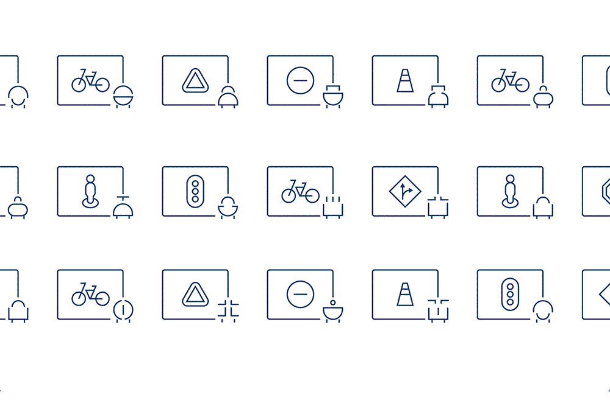

# TWiGCP—“80 亿美元，GCP 的大三角帆，以及更好驾驶的进化选择”

> 原文：<https://medium.com/google-cloud/twigcp-185-709ce8f4e9f6?source=collection_archive---------3----------------------->

首先，这里是谷歌云的视频系列 中本周最新 [**的链接:**](http://gtech.run/ju4em)

*   [介绍云人工智能平台模型的假设工具](http://gtech.run/xuma6)
*   [Codelab] [使用假设工具比较云人工智能平台模型](http://gtech.run/akrqq)
*   [面向希望学习 Keras 机器学习框架的软件工程师的手册和代码示例](http://gtech.run/2wqsk)
*   [保持冷静，询问:在 GCP 运行你的数据库](http://gtech.run/hp2xf)

过去一周 GCP 的其他头条新闻包括:

*   [谷歌云的运行费用现已超过 80 亿美元](http://gtech.run/5bqu6)(techcrunch.com)
*   [介绍用于谷歌云平台的 Spinnaker](http://gtech.run/6wjcp)(谷歌博客)
*   [DeepMind 和 Waymo:进化选择如何培养更有能力的自动驾驶汽车](http://gtech.run/98rht)(deepmind.com)
*   [改进联络中心的语音识别](http://gtech.run/g5yuu)(谷歌博客)

从“你是否充分发挥了 GCP 产品的潜力？”部门:

*   使用云即时消息的云功能的最低权限(谷歌博客)
*   [big query 中发生了什么:新的持久用户定义函数、增加的并发限制、GIS 和加密功能，以及更多功能](http://gtech.run/yttb6)(谷歌博客)
*   [Codelab] [使用假设分析工具比较云人工智能平台模型](http://gtech.run/akrqq)(g.co/codelabs)

来自“将 GCP 产品转化为解决方案”部门:

*   [连接 Firebase 和 Unity，在 mecha 仓鼠](http://gtech.run/9wpsz)(cloud.google.com)中创建游戏排行榜
*   [如何使用 BigQuery ML 进行异常检测](http://gtech.run/5unql)(谷歌博客)
*   [从 MySQL 迁移到云 SQL](http://gtech.run/qdyxg)(cloud.google.com)
*   [使用 VPC 服务控制和存储传输服务将数据从亚马逊 S3 传输到云存储](http://gtech.run/b7d9j)(cloud.google.com)

从“你肯定会从这些操作指南中学到一两件事”部分:

*   [GCP 开发者专业提示:如何在 GCP](http://gtech.run/447l7) (谷歌博客)上安排一个重复的 Python 脚本
*   [在 VS 代码中本地调试节点 Google Cloud 功能！](http://gtech.run/2uthu)(medium.com)
*   [如何在云构建步骤之间传递数据](http://gtech.run/2vtvk)(medium.com)
*   [在共享的 VPC 网络上使用 App Engine 灵活环境](http://gtech.run/r2npd)(cloud.google.com)
*   [对 Firebase 实时数据库规则的编程访问](http://gtech.run/7enuw)(firebase.google.com)

来自“本周无服务器，从容器到语言”部门:

*   [选择一个初始化进程来运行容器中的多个进程](http://gtech.run/khws9)(medium.com)
*   [云运行:容器中的多个进程(懒惰方式)](http://gtech.run/xnkcx) (ahmet.im)
*   [云运行符合十二因素应用方法论的十几个理由](http://gtech.run/xvgq6)(谷歌博客)
*   祝你生日快乐！庆祝便携式无服务器计算一周年
*   App Engine + Firestore 上的无服务器 PHP【medium.com 

来自“这些认证文章总是很受欢迎，所以这里还有一个”部门:

*   [我是如何成为谷歌云认证专家的](http://gtech.run/pc827) (techdox.nz)

**Beta，GA，还是什么？**“部门:

*   [GA] [云 SDK 255.0.0](http://gtech.run/wfg8w)
*   [GA] [共享 VPC 网络上的应用引擎灵活环境](http://gtech.run/ete5e)
*   [GA] [Dataproc 和云扳手访问透明](http://gtech.run/gjp62)
*   [Beta] [通过语音适应提高准确性](http://gtech.run/jsh5q)

来自“**多媒体**”部门:

*   谷歌云平台闪电演示(youtube.com)[Spinnaker](http://gtech.run/xxa89)
*   [视频] [扎克·阿基尔:更安全的骑行，TPU 在背后看着你| PyData 伦敦 2019](http://gtech.run/3y7tu)(youtube.com)
*   [播客] Kubernetes 播客[第 63 集——Kubernetes 经济学，Owen Rogers](http://gtech.run/yv6g7)(kubernetespodcast.com)
*   gcppodcast.com GCP 播客[第 187 集](http://gtech.run/feb7x)

本周的图片必须来自 DeepMind & Waymo 进化选择文章

这就是本周的全部内容！亚历克西斯