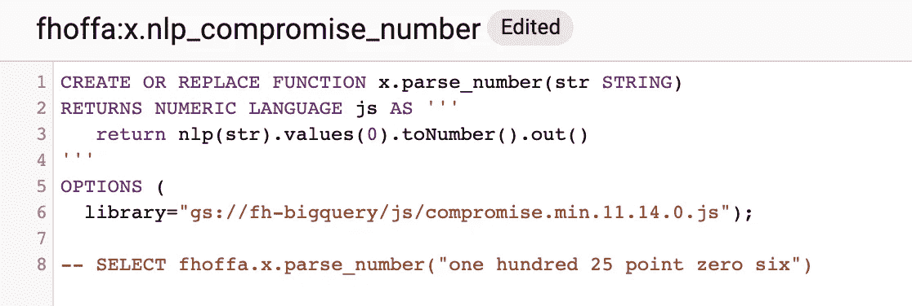

# TWiGCP #188

> 原文：<https://medium.com/google-cloud/twigcp-188-895fca2d2ba6?source=collection_archive---------1----------------------->

以下是谷歌云视频系列 本周最新 [**的链接:**](http://gtech.run/ju4em)

*   [将 Teradata 和其他数据仓库迁移到 BigQuery](http://gtech.run/aqk68)
*   [使用云函数将数据从云存储传输到 big query](http://gtech.run/tfl94)
*   [big query 中的新特性:持久 UDF](http://gtech.run/w2ayv)
*   [Coursera —使用 BigQuery 探索和准备您的数据](http://gtech.run/a9zx8)

BigQuery 持久性 UDF

常规 [TWiGCP 每周摘要](https://medium.com/google-cloud/weekly/home)将在月底回归！