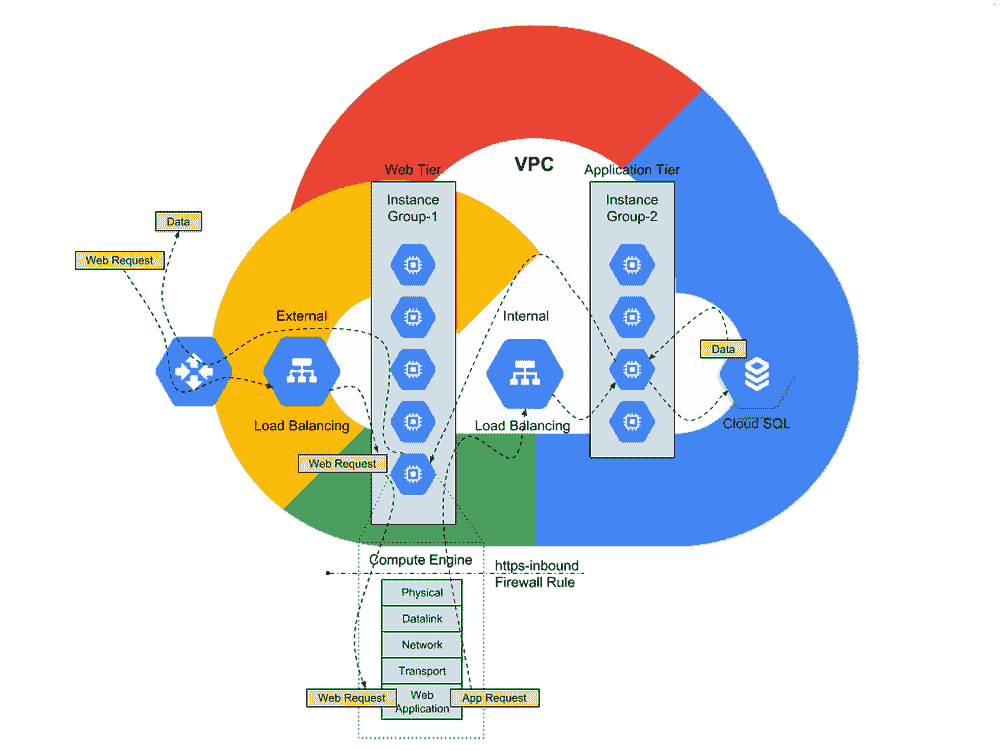

# TWiGCP —“文档 API、Jib 1.0.0 和装箱技能”

> 原文：<https://medium.com/google-cloud/twigcp-2019-week-7-800582196ac1?source=collection_archive---------2----------------------->

欢迎来到每周一期的谷歌云平台时事通讯，每周一从[medium.com/google-cloud/weekly](/google-cloud/weekly)开始发布！

以下是过去一周的主要新闻:

“ [*用新的谷歌文档 API*](http://gtech.run/uk9sa) ”(谷歌博客)快速处理文书工作。Google Docs 是一个协作的好地方，现在您可以使用 API 的灵活性做更多的事情！

GCP 网络层 (GCP 文档)。高级还是标准？如果您愿意，可以控制网络成本！

“ [*从 CCIE 到谷歌云网络工程师:思考四件事*](http://gtech.run/54ekg) ”(谷歌博客)。云时代的网络和关键的 GCP 最佳实践。

“ [*盒子技能如何借助云 AI*](http://gtech.run/2hd3j) ”(谷歌博客)。工作中的 Vision API 和云功能，全部提供代码。

“ [*用云 ML 引擎预测客户终身价值:简介*](http://gtech.run/k7tvp) ”(谷歌博客)。与任何 GCP 解决方案一样，这个解决方案带有代码和完整的细节。

" [*Jib 1.0.0 正式发布——构建 Java Docker 映像从未如此简单*](http://gtech.run/fdkbm) "(谷歌博客)。如何在不安装 docker 甚至不编写 docker 文件的情况下构建 docker 映像。

来自“迁移或云原生，总有一款解决方案适合您”部门:

*   [使用云功能将数据从云存储传输到 big query](http://gtech.run/sn6af)(cloud.google.com)
*   [IBM Db2 仓库在谷歌云平台上的部署策略](http://gtech.run/ly9hd)(cloud.google.com)
*   [用 ML 监控家用电器的功率读数](http://gtech.run/uvepj)(谷歌博客)

来自“参加考试者的证书”部门:

*   [谷歌专业云安全工程师认证](http://gtech.run/ck6g7)(jhanley.com)

来自“TPU 上的 MNIST 和云 ML 引擎服务”部门:

*   [谷歌实验室中的 TPU，现在具有更少的样板代码](http://gtech.run/7zdbq)(twitter.com)

来自“花点时间在一个(免费)高质量的代码实验室怎么样？”部门:

*   [Cloud Bigtable codelab 关于导入序列文件中的数据，查询数据，&模式设计的最佳实践](http://gtech.run/gw2h7)(g.co/codelabs/cloud)

来自我最喜欢的“客户和合作伙伴对 GCP 的最佳评价”部分:

*   【medium.com】开源协作工具 ProjectZen 如何使用 GCP
*   [一个谷歌云合作伙伴展示了他们如何只用 GCP 的产品和服务构建了一个定制的商业智能仪表板](http://gtech.run/9p5z6)(谷歌博客)

来自“计划自动化”部门:

*   [介绍计算引擎持久磁盘的计划快照](http://gtech.run/gne35)(谷歌博客)
*   [使用云调度器在计算引擎上可靠地运行 cron 作业](http://gtech.run/vckrq)(谷歌博客)

来自“本周无服务器”部门:

*   [无服务器:关于谷歌云功能你需要知道的一切](http://gtech.run/evyf4) (thenewstack.io)
*   [动手实践—第二部分](http://gtech.run/2r7mb)(medium.com)

从“测试版，正式版，还是什么？”部门:

*   [GA] [云 SDK 234.0.0](http://gtech.run/wfg8w)
*   [GA] [云 ML 引擎—使用 TPU 训练您的模型](http://gtech.run/h3bm9)
*   [GA] [托管实例组和自动修复](http://gtech.run/bnqts)
*   【测试版】 [C++云存储客户端库](http://gtech.run/sf4wn)
*   [2.10.0] [阿帕奇波束 2.10.0](http://gtech.run/g5vl2)

来自“所有多媒体”部门:

*   [播客] Kubernetes 播客第 40 集—[Madhu Yennamani](http://gtech.run/7kyjn)(kubernetespodcast.com)的 GKE 使用计量
*   [播客]gcppodcast.com GCP 播客第 162 集
*   [视频] [云构建—创建 CI/CD 渠道](http://gtech.run/faeqa)(youtube.com)
*   [视频][App Engine Python 入门](http://gtech.run/abpsz)(youtube.com)
*   [视频] [云控制台之旅](http://gtech.run/ssf3k)(youtube.com)GCP 精华

本周的图片是“ *CCIE 致谷歌云网络工程师*”帖子中几个简洁的图表之一

这就是本周的全部内容！
——亚历克西斯