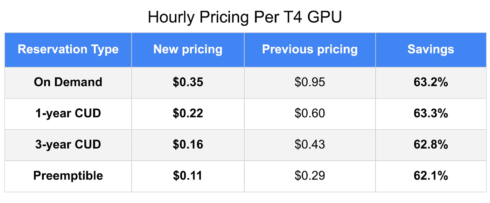

# TWiGCP — 2020 年第 4 周“秘密管理器、切割 GPU、Anthos ROI 和数据集搜索”

> 原文：<https://medium.com/google-cloud/twigcp-2020-week-4-secret-manager-cutting-gpus-anthos-roi-and-dataset-searching-65182f52183c?source=collection_archive---------3----------------------->

以下是谷歌云视频系列 本周最新 [**的链接:**](http://gtech.run/ju4em)

*   [用 AutoML 表格在你的 Jupyter 笔记本上自动建立一个模型](http://gtech.run/w5t2b)
*   [GKE CIS 基准提供安全最佳实践](http://gtech.run/5h6l9)
*   [针对关键任务工作的企业支持升级](http://gtech.run/6jmsm)
*   [通过这项新培训学习 Anthos](http://gtech.run/gehf9)

过去一周 GCP 的其他头条新闻包括:

*   [介绍谷歌云的秘密管理器](http://gtech.run/nqhj6)(谷歌博客)
*   [根据新的 Forrester Consulting 研究](http://gtech.run/fc2zh)(谷歌博客)，Anthos 向客户交付投资回报的 4 种方式
*   [英伟达 T4 GPU 降价带来更便宜的云人工智能部署](http://gtech.run/56hzh)(谷歌博客)

来自“GPU 很棒，但你应该得到你的 TPU”部门:

*   [Codelab] [Keras 和 modern convnets，关于 TPUs](http://gtech.run/2wxf9)(g.co/codelabs)

来自“TWiCloudRun”部门:

*   [Knative 和 Cloud Run，便携性在行动【medium.com ](http://gtech.run/pfhmc)
*   [使用 Terraform 在云上进行无服务器部署](http://gtech.run/5a8de)(medium.com)
*   [揭开云运行点击部署的魔力](http://gtech.run/6dada)(medium.com)

来自“Moar 大数据”部门:

*   [互动:2019 年维基百科页面排行榜](http://gtech.run/5kha2)(towardsdatascience.com)
*   在网络上发现数百万个数据集
*   [新的 GA Dataproc 特性扩展了数据科学和 ML 功能](http://gtech.run/7dqc3)(谷歌博客)
*   [如何从 Google BigQuery 向 Pub/Sub 回放时间序列数据](http://gtech.run/qnh4q)(medium.com)

来自“如果你喜欢 Reddit 对话”部门:

*   与 AWS、Azure 和其他云提供商相比，GCP 的功能优势是什么？:谷歌云(reddit.com)

来自“云原生开发”部门:

*   [Istio 故障注入](http://gtech.run/qrq89) (istiobyexample.dev)
*   [用谷歌的 Skaffold](http://gtech.run/9l6l7) (dev.to)持续部署 Ruby 应用到 Minikube

来自我最喜欢的“客户和合作伙伴对 GCP 的最佳评价”部分:

*   [谷歌云与汉莎航空集团达成协议](http://gtech.run/zfn68)(cloud.google.com)
*   [动视暴雪和谷歌达成多年战略合作关系，为新玩家体验提供动力](/google-cloud/gtech.run/ceftt)(prnewswire.com)
*   [作为一名独立开发人员，我使用了哪些技术来发布一款成功的产品](http://gtech.run/jb3ya)

**从 Beta，GA，还是什么？**“部门:

*   [GA] [云 SDK 277.0.0](http://gtech.run/wfg8w)
*   [GA] [日志路由器的云日志 CMEK](http://gtech.run/zjztk)
*   [GA] [关闭或限制受管实例组自动缩放器](http://gtech.run/x7a56)
*   [GA] [云 Dataproc 集群预定删除](http://gtech.run/dbd56)
*   GKE 配置连接器

来自“**万物多媒体**”部门:

*   故意打破东西
*   [播客] Kubernetes 播客[第 87 集——与 Karl Isenberg](http://gtech.run/k9pm7)(kubernetespodcast.com)在克鲁斯的多重租赁
*   [视频] [将一块巨石迁移到 GKE:决定先迁移什么](http://gtech.run/v58d9)(youtube.com)
*   [视频] [决策金字塔:选择正确的 ML 工具](http://gtech.run/6ng3e)(youtube.com)
*   [视频][youtube.com GCP vs Firebase——项目&存储](http://gtech.run/uyf4v)

本周图片摘自 GPU 价格公告

这就是本周的全部内容！亚历克西斯