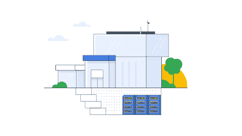

# TWiGCP —“介绍 E2 虚拟机、存储转移服务、K8S 1.17、数据包镜像和更多资产清单”

> 原文：<https://medium.com/google-cloud/twigcp-204-ef523385a389?source=collection_archive---------1----------------------->

以下是谷歌云视频系列 本周最新 [**的链接:**](http://gtech.run/ju4em)

*   [推出 E2，面向谷歌计算引擎的新型成本优化通用虚拟机](http://gtech.run/rvzy7)
*   [数据包镜像:可视化并保护您的云网络](http://gtech.run/xf95y)
*   [谷歌公共数据集中的新气候模型数据](http://gtech.run/gxe2m)
*   [学习和教学——服务水平目标的艺术](http://gtech.run/jyu96)

过去一周 GCP 的其他头条新闻包括:

*   [AutoML 自然语言普遍可用](http://gtech.run/2wu7m)(谷歌博客)
*   [引入本地数据存储转移服务](http://gtech.run/qpzcr)(谷歌博客)
*   Kubernetes 1.17(Kubernetes . io)
*   [更好地关注您的谷歌云环境(拥有云资产清单)](http://gtech.run/6wbnm)(谷歌博客)

来自“关于新 E2 虚拟机的更多技术细节”部门:

*   [了解 E2 虚拟机中的动态资源管理](http://gtech.run/tkh5g)(谷歌博客)

来自“GCP 云-本地和库伯内特”部门:

*   [对容器进行取证的最佳实践](http://gtech.run/kr6dm)(谷歌博客)
*   [Anthos GA 云运行的新特性](http://gtech.run/7yc7t)(谷歌博客)

来自“技巧、示例和最佳实践”部门:

*   使用 Stackdriver 在云上运行 Java 日志记录(medium.com)
*   [从 Go web 应用程序连接到云 SQL](http://gtech.run/4e9qw)(github.com)
*   [Beep boop:调度一个具有云功能和云 KMS 加密秘密的 twitter 机器人](http://gtech.run/zcv8h)
*   [与谷歌云平台](http://gtech.run/d5dmm)(github.com)接口的 GitHub 动作集合
*   [使用 DLP 代理查询包含敏感数据的数据库的示例架构](http://gtech.run/ysa2x)(cloud.google.com)
*   【cloud.google.com】使用分布式跟踪通过 OpenCensus 和 Stackdriver 跟踪观察微服务延迟
*   [云数据流支持 hyperlog log ++ for count-distinct](http://gtech.run/7qyfw)(谷歌博客)
*   [用 BigQuery 暴力法查询地理栅格数据](http://gtech.run/fy28g)(medium.com)
*   [生物信息学云原生 Hello World—Lynn Langit](/google-cloud/gtech.run/qj8l5)(medium.com)

来自“一切从数据集开始”部门:

*   [数据科学里的数据就是这么放的！(数据集搜索 FTW！)](http://gtech.run/wmv39)(towardsdatascience.com)
*   [新的气候模拟数据模型现已在谷歌云中可用](http://gtech.run/gxe2m)(谷歌博客)

来自“g delt——可能是谷歌云人工智能平台最迷人的展示之一”部门:

*   [看电视新闻的机器:2010-2019 年晚间新闻广播的视觉实体图](http://gtech.run/j2e2k)(blog.gdeltproject.org)
*   [通过电视新闻记录从机器“看新闻”中吸取的经验教训](http://gtech.run/5mtnm)(blog.gdeltproject.org)
*   [深度学习驱动的实体图超过电视新闻 2009–2019](http://gtech.run/kg5d2)(blog.gdeltproject.org)

来自“AutoML 比迁移学习更重要”部门:

*   谷歌的 AutoML 和 BigQuery ML:一键超大规模机器学习的兴起【forbes.com，

来自“经营你自己的 SLO 工作室”部门:

*   [学习如何为 SRE 或综合招聘考试设定 SLO](http://gtech.run/jyu96)(谷歌博客)

来自“100%可再生能源是所有云功能之母”部门:

*   亚马逊、谷歌、微软:看看谁拥有最环保的云(wired.com)

来自我最喜欢的“客户和合作伙伴对 GCP 的最佳评价”部分:

*   Kapten:推动扩展计划，用工具让开发团队处于控制中(cloud.google.com)
*   【businesswire.com】Cloud bees 宣布 CloudBees CI/CD 由 Jenkins X 提供支持，这是一个基于谷歌云平台的 SaaS 解决方案

从“**贝塔，嘎，还是什么？**"部门:

*   [GA] [云 SDK 273.0.0](http://gtech.run/wfg8w)
*   【GA】[AutoML 自然语言](http://gtech.run/t6zdg)
*   [GA] [内部 TCP/UDP 负载平衡器的下一跳](http://gtech.run/m6nwg)
*   [GA] [使用 GKE 节点自动配置](http://gtech.run/qpef4)
*   云存储的 BigQuery 数据传输服务
*   [GA] [配置无服务器 VPC 访问](http://gtech.run/y8ggu)(应用引擎，功能)
*   [GA] [内部 HTTP(S)负载平衡](http://gtech.run/fxcq3)(基于特使)
*   [GA] [云 SQL 连接组织策略](http://gtech.run/tp5a8)(限制对数据库实例的访问)
*   【GA】[云 Bigtable 表级 IAM](http://gtech.run/lttm)
*   【GA】[云 ML 视觉 OCR 多区域支持](http://gtech.run/upfwm)
*   【测试版】[云 IAM 条件](http://gtech.run/8sapq)
*   [Beta] [堆栈驱动程序监控 API v3](http://gtech.run/w2d6m)
*   [Beta][GCLB 托管 TLS 证书的多域支持](http://gtech.run/ffmja)
*   【测试版】[存储转移服务](http://gtech.run/bzzgv)

来自“**万物多媒体**”部门:

*   Kubernetes 播客[第 83 集——Kubernetes 1.17，桂妮维亚·桑格](http://gtech.run/3tzqz)(kubernetespodcast.com)
*   gcppodcast.com GCP 播客[第 207 集——年末回顾](http://gtech.run/wascc)

本周的图片来自针对本地数据的新存储转移服务的发布

这就是本周的全部内容！亚历克西斯