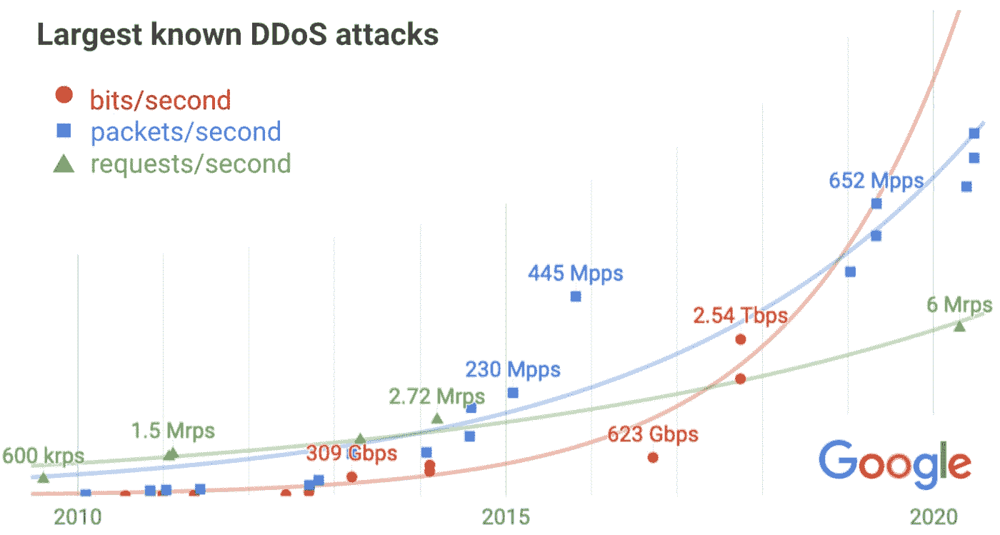

# TWiGCP #246

> 原文：<https://medium.com/google-cloud/twigcp-246-56c6087f99ae?source=collection_archive---------5----------------------->

以下是谷歌云视频系列 本周最新 [**的链接:**](http://gtech.run/ju4em)

*   [谷歌云宣布其 BeyondCorp 联盟的新合作伙伴](http://gtech.run/6fywy)
*   [推出更低、更简单的云 CDN 定价](http://gtech.run/gwwkp)
*   [面向所有技能水平的谷歌云数据分析培训](http://gtech.run/rlxa8)
*   [轻松迁移|谷歌云博客](http://gtech.run/ysvfc)

过去一周 GCP 的其他头条新闻包括:

*   [用 reCAPTCHA Enterprise 让你的新常态更安全](http://gtech.run/jezf9)(谷歌博客)
*   [缓存为王:宣布降低云 CDN 价格](http://gtech.run/g4az4)(谷歌博客)
*   [云代码扩展了对 Kubernetes CRDs 的支持](http://gtech.run/v87sg)(谷歌博客)
*   [云 SQL 的新维护拒绝周期](http://gtech.run/ultbv)(谷歌博客)
*   识别和防范最大的 DDoS 攻击(谷歌博客)

来自“现在要么是预览版，要么是正式版”部门:

*   [谷歌云进入简化产品发布阶段](http://gtech.run/pzdsh)(谷歌博客)

来自“本周 BigQuery & Analytics”部门:

*   [big query 中发生了什么:时间单位划分、表 ACL 等等](http://gtech.run/bsqtn)(谷歌博客)
*   BigQuery 中的新 SQL 功能
*   BigQuery 解释系列的所有文章
*   [面向所有技能水平的谷歌云数据分析培训](http://gtech.run/5mxzb)(谷歌博客)

来自“概括和展望一系列最新的云运行特性”部门:

*   [Google Cloud Run 优于传统 FaaS 产品的四大理由——Richard se roter 的架构思考](http://gtech.run/me9nt)(seroter.com)
*   [云运行静态出站 IP 地址](http://gtech.run/sz87y)(cloud.google.com)

来自“创建模型的简明图片”部门

*   [用 Scikit-Learn 制作模型卡](http://gtech.run/2ndsc)(谷歌博客)

来自“(谷歌)云中的 Spark 和 Hadoop 集群”部门:

*   [新的 Dataproc 可选组件支持 Apache Flink 和 Docker](http://gtech.run/vhzzg) (谷歌博客)

来自“选择合适的笔记本”部门:

*   [这么多笔记本，这么少时间…](http://gtech.run/9vp65) (mco.dev)

来自“把坏人拒之门外”部门:

*   [谷歌云宣布其 BeyondCorp 联盟的新伙伴](http://gtech.run/6dpdr)(谷歌博客)
*   [服务帐户凭证 API:不同问题的解决方案|作者 Guillaume blaquiere](http://gtech.run/4deyl)(medium.com)

来自“一个易于扩展，另一个也在 Google Cloud 上运行”部门:

*   [缩放云扳手实例|杨杰琳](http://gtech.run/c3xjw)(medium.com)
*   [生产就绪 Oracle 数据库在 GCP |作者 Daniel ville gas](http://gtech.run/qjv9x)(medium.com)

来自“基础架构代码和最佳实践”部门:

*   [谷歌云构建中的平台安全网|保罗·杜里瓦吉](http://gtech.run/rv6s5)(medium.com)
*   [通过 Terraform 使用云基础工具包](http://gtech.run/4mvxp)(谷歌博客)
*   [大规模清理计算引擎实例【cloud.google.com ](http://gtech.run/dqlpy)
*   [在谷歌云平台上使用 InSpec 进行持续合规性测试|作者:Svetlin Zamfirov](http://gtech.run/hp4lw)(medium.com)

来自“最大化编辑数据的模型有用性”部门:

*   [分享我们对人工智能时代的数据隐私承诺](http://gtech.run/rgn35)(谷歌博客)

来自“深入订购交付”部门:

*   [谷歌云发布/订阅订购交付](http://gtech.run/hvz9q)(medium.com)

来自“如果你和我一样，错过了发布会”部门:

*   [选择发布/订阅或发布/订阅精简版](http://gtech.run/lfm36)(cloud.google.com)

来自“客户和合作伙伴与 GCP 一起解决实际问题”部门:

*   [人头马君度为何将其 SAP 系统迁移至谷歌云](http://gtech.run/8r78k)(谷歌博客)
*   (siliconangle.com)诺基亚正在将其 IT 基础设施转移到谷歌云
*   [我们如何使用超级矩阵&在超级矩阵](http://gtech.run/xagyj)(supermetrics.com)使用谷歌大查询
*   [Redivis 使研究数据可访问，体验与 BigQuery 的协作](http://gtech.run/tceh2)(谷歌博客)
*   [Total，谷歌云合作开发太阳能绘图工具](http://gtech.run/e45gc)(solarindustrymag.com)

来自“**多媒体**”部门:

*   [视频][youtube.com GKE 服务的 SLO](http://gtech.run/4swhq)
*   Kubernetes 播客[第 125 集——ok teto，Ramiro Berrelleza](http://gtech.run/jjmt6)(kubernetespodcast.com)
*   gcppodcast.com,【播客】GCP 播客[第 240 集——凯莉·安德森的《夺回企业》](http://gtech.run/ces3u)

从 **Beta，GA，还是什么？**“部:

*   [GA] [云 SDK 314.0.0](http://gtech.run/wfg8w)
*   【GA】[云扳手 nam9 多区域](http://gtech.run/mxwsg)
*   [GA] [按信用类型划分的云计费预算](http://gtech.run/xhqwz)
*   [GA] [云计费子账户](http://gtech.run/4dgnz)
*   [Beta] [GKE 自动缩放器优化利用率配置文件](http://gtech.run/cma3b)
*   【测试版】 [GKE 使用计算引擎持久磁盘 CSI 驱动](http://gtech.run/md56g)

本周的图片来自 DDoS post——你不庆幸自己不用管这个吗？

这就是本周的全部内容！亚历克西斯