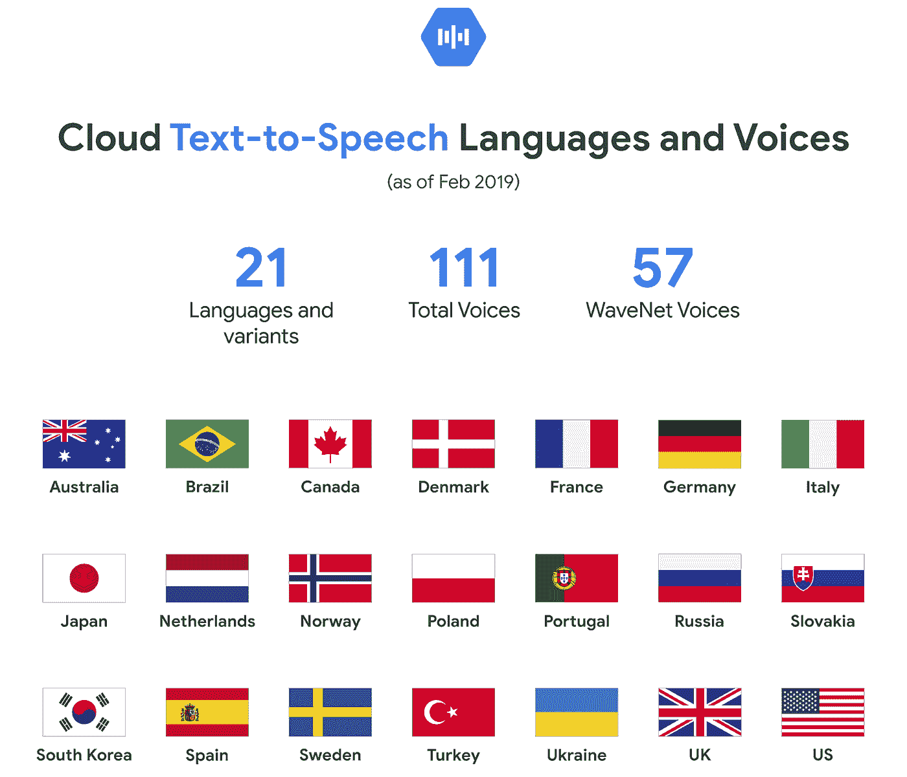

# TWiGCP —“云服务平台(CSP)测试版、面向所有人的 ML APIs 和 Alooma”

> 原文：<https://medium.com/google-cloud/twigcp-7f8e3b186c9a?source=collection_archive---------3----------------------->

2019 年 2 月 25 日

欢迎来到每周一期的谷歌云平台时事通讯，每周一从[medium.com/google-cloud/weekly](/google-cloud/weekly)开始发布！

以下是过去一周的主要新闻:

“ [*云服务平台——把混合云带给你*](http://gtech.run/pg28t) ”(谷歌博客)。CSP 现在对 beta 版的所有人开放。如果您目前正在使用 Kubernetes 或运行本地和云中的混合应用程序，那么您现在有了一个强大的工具，可以按照自己的节奏更新现有的应用程序。

" [*Jib 1.0.0 正式发布——构建 Java Docker 映像从未如此简单*](http://gtech.run/fdkbm) "(谷歌博客)。Jib 提供了构建 docker 映像的习惯性体验，无需安装 docker，甚至无需编写 docker 文件。

*[*谷歌宣布有意收购 Alooma 以简化云迁移*](http://gtech.run/8nhrg) (谷歌博客)。Alooma 是数据迁移和集成专家。向云迁移和构建数据管道时提供更多支持。*

*" [*谷歌云认证大挑战赛*](http://gtech.run/al4uw) " (qwiklabs.com)。在 3 月 31 日之前获得认证，并赢得一张 2019 年的免费门票*

*"[分析这个——用新的 Apigee 分析功能扩展 API 数据的能力](http://gtech.run/mnxnu)(谷歌博客)。哪些客户在使用我的 API？我如何对我的客户进行分类？我应该将我的 API 货币化吗？阿普吉有答案。*

*"[宣布 Knative v0.4 发布](http://gtech.run/9lq8l) " (medium.com)。现在有了额外的协议支持——HTTP 2 和 gRPC，以及为 WebSocket 升级入站 HTTP 连接的能力。*

*“ [*让人工智能驱动的语音变得更容易理解——现在有了更多的选择，更低的价格，以及新的语言和声音*](http://gtech.run/ktv8x) ”(谷歌博客)。多通道语音到文本识别，更多声音(大约翻了一番)，更多国家/地区的更多语言(增加 50%以上)，以及更低的价格(在某些情况下减少一半)。*

*来自“如果您经常阅读此简讯，您真的应该参加下一个‘19’部门:*

*   *" [Google Cloud Next '19 分组会议指南现已发布](http://gtech.run/f9ww6) " (Google 博客)*

*“有问题吗？BigQuery 的答案可能是“部门*

*   *"[寻找真正的栈顶溢出问题](http://gtech.run/spdc2)"(medium.com)*
*   *“【medium.com】[big query 的 HOFFA 索引，以及聚簇表的 ROI](http://gtech.run/zdwbb)*

*来自“云本地和 Knative”部门:*

*   *“【medium.com】谷歌云平台混合管理”*
*   *"[正确开发容器](http://gtech.run/fnlqe)"(medium.com)*
*   *Solo.io 的 Gloo 是 Istio on Knative(medium.com)的第一选择*
*   *“[动手实践—第三部分](http://gtech.run/xqknc)”(medium.com)*

*来自我最喜欢的“客户和合作伙伴对 GCP 的最佳评价”部分:*

*   *[“下一个极限”案例研究](http://gtech.run/pnpt9)(cloud.google.com)*
*   *" [Colopl 开源了一个用于 Laravel 框架的云扳手驱动](http://gtech.run/mj3ua)"(medium.com)*

*来自“从物联网到云，循序渐进”部门:*

*   *"[与 GCP 一起使用 Sigfox Sens 'it】"](http://gtech.run/v4ddp)*

*从“你检查过 Google Cloud 在 Medium 上的出版物吗？”部门:*

*   *“[如何在谷歌云平台上制作自毁虚拟机](http://gtech.run/75625)”(medium.com)*
*   *“[用云扳手不可能读写隔离现象【medium.com】](http://gtech.run/naag3)*
*   *“[谷歌云平台安全运营中心数据湖](http://gtech.run/nxt9z)”(medium.com)*

*从“测试版，正式版，还是什么？”部门:*

*   *[GA] [云 SDK 235.0.0](http://gtech.run/wfg8w)*
*   *[GA] [托管实例组自动修复程序](http://gtech.run/l2mln)*
*   *[GA] [每台虚拟机 128 个永久磁盘](http://gtech.run/3aeet)*
*   *【GA】[云物联网核心网关](http://gtech.run/puxsf)*
*   *[GA] [GKE 审计日志](http://gtech.run/ny9am)*
*   *【测试版】[仅云存储桶策略](http://gtech.run/9apcg)*
*   *[Beta] [为永久磁盘创建计划快照](http://gtech.run/twkex)*
*   *[Beta] [添加或调整永久磁盘大小— 16KB 块](http://gtech.run/6azdn)*

*来自“所有多媒体”部门:*

*   *[播客] Kubernetes 播客【kubernetespodcast.com 第 41 集 Amy Krishnamohan 的云 SQL*
*   *蒂姆·霍金(gcppodcast.com)【播客】GCP 播客[第 163 集——入口](http://gtech.run/s79ls)*
*   *[视频] [与 Kubernetes 的 Stack driver——Stack Doctor](http://gtech.run/kur27)(youtube.com)*
*   *[利用谷歌云功能开发事件驱动应用](http://gtech.run/4s7m7)(youtube.com)*
*   *[新的“GCP 端到端联网！”视频系列](http://gtech.run/m5v68)(youtube.com)*

*

本周的图片来自语音转文本和文本转语音更新的帖子* 

*这就是本周的全部内容！亚历克西斯*