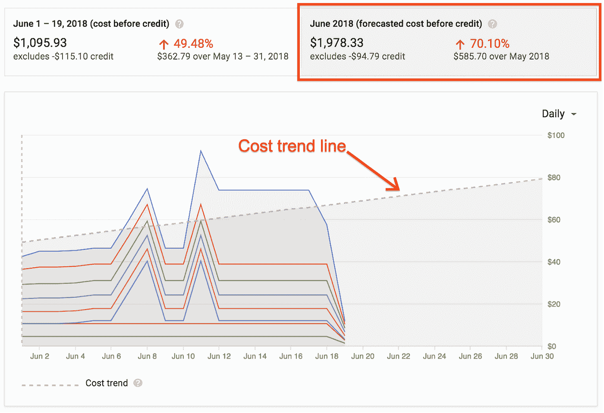

# TWiGCP —“关于成本和通往下一个‘18’的道路”

> 原文：<https://medium.com/google-cloud/twigcp-all-about-cost-and-the-road-to-next-18-e0dd6309fbde?source=collection_archive---------1----------------------->

我们对下一届云 2018([g.co/next18](http://g.co/next18))感到无比兴奋，这一届云 2018 距离现在只有一周的时间了！是吗？

对于新老云用户来说，成本控制仍然是重中之重。现在，您可以预测账单账户、项目甚至给定项目的单个产品的 GCP 成本—“[*使用谷歌云账单成本预测*](http://goo.gl/SXmDoh) ”(谷歌博客)预测您的未来成本

[*在 Cloud Dataproc 初始化动作中使用实例元数据*](http://goo.gl/vHEgbv)(Google 博客)。例如，在主实例和工作实例上执行不同的命令时，实例元数据非常有用。

[*引入新的 Apigee 功能，通过 API*](http://goo.gl/zkvoer)【谷歌博客】。强大的信息合作伙伴关系。

像往常一样，你可以在这些 Google [Cloud SDK 208.0.x 发行说明](http://goo.gl/UzL6N6) (Google 文档)中找到大量关于 10 个左右主要 GCP 产品最近更新的详细信息

来自“培训的时间和成本”部门:

*   GitHub 上记录的使用 TPUs、Cloud ML Engine 和 Kubeflow 的详细教程—“[*如何在 Cloud ML Engine 上的 TPUS 上从头开始训练 ResNet 图像分类器*](http://goo.gl/XmvQp6) ”(谷歌博客)
*   “ [*用 Tensorflow 对象检测 API*](http://goo.gl/M4y72j) 加速训练和推理”(谷歌 AI 博客)
*   “ [*使用云 TPUs*](http://goo.gl/mcWxq3) 【在 30 分钟内培训和服务一个实时移动物体探测器”(medium.com)
*   专利声明宽度与机器学习有什么关系，公共数据集和 GCP 如何帮助测量它？—“[*利用谷歌专利公开数据集*](http://goo.gl/HP7Gbx) ”测量专利权利要求广度(谷歌博客)

来自“SQL 数据库”部门:

*   " [*使用新的开源工具*](http://goo.gl/oJUfZP) 验证 PostgreSQL 备份变得更加容易"(谷歌博客)。需要在 PostgreSQL 数据库集群创建期间启用校验和。
*   [导入(云扳手)数据库](http://goo.gl/SeKaga)(谷歌文档)
*   [导出(云扳手)数据库](http://goo.gl/R2pxYL)(谷歌文档)

来自“所有虚拟容器”部门:

*   [介绍 Jib——更好地构建 Java Docker 映像](http://goo.gl/QiFAFj)(谷歌博客)
*   Kubernetes 的用户们，你们有没有浏览过这些“ [7 个构建容器的最佳实践](http://goo.gl/nhrV4d)”？(谷歌博客)
*   使用 VSTS 和 Kubernetes 引擎创建 CI/CD 管道(谷歌文档)
*   [Google Home 遇上了。NET 容器使用 Dialogflow](http://goo.gl/GL9RtB) (谷歌博客)

来自“我们爱所有 GCP 社区反馈”部门:

*   [谷歌云平台——好的、坏的、丑陋的(大部分是好的)](http://goo.gl/wbWrrV)(deps.co)
*   [按位置分解谷歌云成本(或其他任何东西！)](http://goo.gl/brcybL)(blog.doit-intl.com)
*   [Java、gRPC、Apache Kafka 和 TensorFlow 服务—流处理与模型服务的 RPC/REST](http://goo.gl/UxTSpQ)(kai-waehner . de)
*   [谷歌云引擎深度学习图片，权威指南](http://goo.gl/LLY3Ap)(blog.kovalevskyi.com)
*   [与 Krishnendu Chaudhury 一起揭开计算机视觉和深度学习的神秘面纱](http://goo.gl/t9GtNW)(factordaily.com)

从“测试版，正式版，还是什么？”部门:

*   n1-ultramem-160
*   [GA][HTTPS 负载平衡器中的 QUIC 支持](http://goo.gl/P4d4jq)
*   [GA] [使用已签名的 URL](http://goo.gl/GbbeLn)
*   [GA] [创建(计算引擎)实例模板](http://goo.gl/WMBmUH)
*   [GA] [为虚拟机实例应用规模调整建议](http://goo.gl/agAeJX)
*   使用 VPC 流量测井
*   【OSS】[堆栈驱动分析器 Java 代理](http://goo.gl/mx9oVH)
*   【OSS】[PostgreSQL 页面验证工具](http://goo.gl/2JCicd)
*   [Beta] [在带有入口的 HTTP(S)负载平衡中使用多个 SSL 证书](http://goo.gl/jkbSP1)
*   [英伟达特斯拉 P4](http://goo.gl/d2RxS4)
*   [云监控](http://goo.gl/A3JE6b)
*   【Beta】[使用(云函数)环境变量](http://goo.gl/kDGoMa)

来自“所有多媒体”部门:

*   [云原生 ML 与 Kubeflow](http://goo.gl/YaXAej) —大卫·阿龙奇克(youtube.com)
*   [云土生土长的方式](http://goo.gl/Mg2wTd) —伊霍尔·德沃列茨基—CNCF(youtube.com)
*   Emi Martínez 的 GCP 播客#135 [病毒总量](http://goo.gl/YNo8rB)(gcppodcast.com)
*   Kubernetes 播客#11 — [Helm，Vic Iglesias](http://goo.gl/7QR7MA)(kubernetespodcast.com)

本周图片来自“[预测你的 GCP 成本](http://goo.gl/SXmDoh)”帖子:

这就是本周的全部内容！