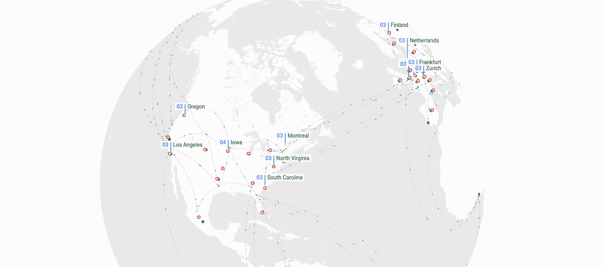

# TWiGCP —“当你不在的时候，所有谷歌云从业者制作的内容”

> 原文：<https://medium.com/google-cloud/twigcp-all-the-google-cloud-practitioner-content-produced-while-you-were-away-bcfa989d76a1?source=collection_archive---------4----------------------->

新年快乐

这是一个平静的时期，但仍然有很多谷歌云的内容，我希望你会感兴趣:

首先，如果你在假期错过了“[50 大 TWiGCP 链接](http://gtech.run/4nkcm)”的帖子，那就去看看吧。

来自“如果你正在寻找谷歌云视频播放列表”部门:

*   【youtube.com 在谷歌云上运行容器的三大方式
*   【youtube.com 用云注册扫描仪保护你的供应链
*   [自由！使用云运行](http://gtech.run/9fycb)(youtube.com)将定制的二进制文件带到无服务器环境
*   [科特林康夫 2019:科特林鲻鱼由詹姆斯·沃德&切特哈斯](http://gtech.run/yk6an)(youtube.com)
*   [批量数据库伯内斯与递归制药](http://gtech.run/2lrcp)(youtube.com)

来自“选择您的谷歌云数据库”部门:

*   [medium.com GCP 解决 MySQL HA 复制滞后](http://gtech.run/f38bl)
*   [为你的应用选择数据库时需要了解的关于 Firestore 的 10 件事](http://gtech.run/gxnqf)(medium.com)

摘自《自然》杂志报道的“谷歌支持的突破”:

*   人工智能正在学习阅读乳房 x 光片(nytimes.com)

来自“GDELT 项目数据洞察”部门:

*   [使用 BigQuery 分析 CNN，过去三年中 MSNBC 和福克斯新闻频道的三分之二，找出有争议的新闻日](http://gtech.run/9u2mf)(blog.gdeltproject.org)
*   从云视频和云推理 API 的角度看过去十年美国晚间电视新闻标签【blog.gdeltproject.org 
*   [相同的数据集，仅通过使用 big query](http://gtech.run/htqja)(blog.gdeltproject.org)的隐藏字幕上的云 NLP API 的感觉
*   [可视化来自云自然语言处理的文本实体和来自云视频的视觉实体](http://gtech.run/xzkuv)(blog.gdeltproject.org)
*   [使用推理 API 查看视频 API 标签之间的视觉相关性](http://gtech.run/qex6y)(blog.gdeltproject.org)
*   【blog.gdeltproject.org】用实体图+ BigQuery 检查十年的电视新闻来比较电视台的相似度或不同度

来自“林恩的生物信息学”部门:

*   【github.com big Query 生物信息学 SQL 查询课程
*   [面向生物信息学的云原生 Hello World](http://gtech.run/evwnc)(medium.com)

来自“无服务器综述”部门:

*   [在无服务器平台上的詹姆斯·沃德和曾雷](http://gtech.run/ytxs9)(infoq.com)
*   [选择 Google Cloud Run 上无服务器容器的 5 个令人信服的理由](http://gtech.run/e2usp)(geshan.com.np)
*   [两个 gRPC 云运行微服务的全面实施](http://gtech.run/7g557)(github.com)

来自“Kubernetes 综述”部门:

*   [kubectl 插件，以树状结构浏览 Kubernetes 对象层次结构🎄](http://gtech.run/ca7vu)(github.com)
*   [elastisys.com GKE 的成功案例:从手动管理的虚拟机到 Kubernetes](http://gtech.run/g497g)
*   [使用 Python Kubernetes API:在由 Google Kubernetes 引擎中的 Pod 生成的作业中运行任务](http://gtech.run/v5dpk)(medium.com)

来自“没有适当的安全性，一切都毫无意义”部门:

*   塞斯·瓦戈在贡献者播客上谈论伯格拉斯和秘密管理
*   [谷歌云平台(GCP)安全最佳实践](http://gtech.run/nvf3m) (assured.se)

来自“可视化谷歌云基础设施”部门:

*   [地区、区域、存在点和共同工作负荷](http://gtech.run/jjagh)(cloud.withgoogle.com)

来自“移动数据”部门:

*   [谷歌云数据流的专业技巧& BigQuery](http://gtech.run/x9llt) (polleyg.dev)
*   [Google Cloud 上的无服务器 ETL，案例研究:原始数据到 JSON 行](http://gtech.run/p4yx2)(medium.com)
*   [云——将您的 ETL 流程迁移到云运行的固有优势](http://gtech.run/9t38p)(medium.com)

本周的图片取自新的“谷歌云基础设施”登陆页面

这就是本周的全部内容！
——亚历克西斯