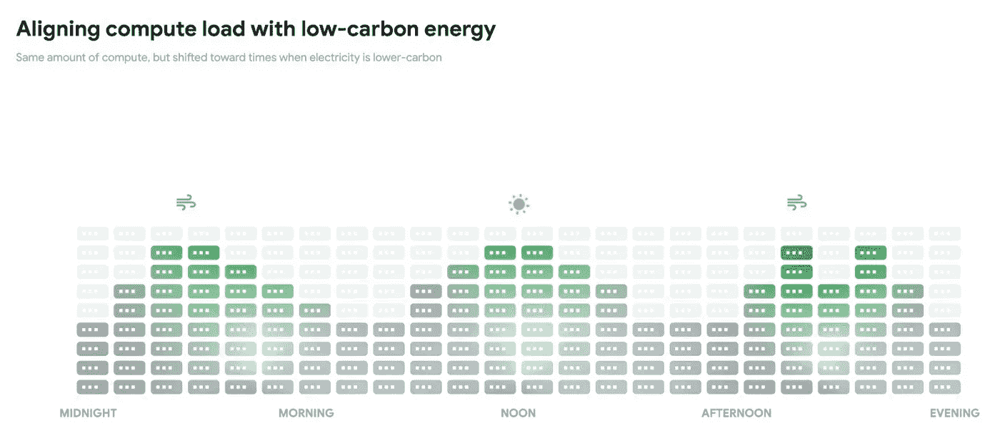

# TWiGCP —“其他云上的 Anthos、新扳手特性和 100 集 Kubernetes”

> 原文：<https://medium.com/google-cloud/twigcp-anthos-on-other-clouds-new-spanner-features-and-100-kubernetes-episodes-76a995c0faa4?source=collection_archive---------4----------------------->

以下是谷歌云视频系列 本周最新 [**的链接:**](http://gtech.run/ju4em)

*   [服务目录简化服务管理](http://gtech.run/9fymu)
*   [针对数据仓库安全性的更多访问控制](http://gtech.run/s9het)
*   [新冠肺炎 Verily Pathfinder 虚拟代理模板演示](http://gtech.run/phe2a)
*   [用谷歌的新书学习构建安全可靠的系统](http://gtech.run/99lqc)

过去一周 GCP 的其他头条新闻包括:

*   [Anthos 在更多的地方运行，管理更多的工作负载](http://gtech.run/w8xbt)(谷歌博客)
*   [为 Anthos 1.3 迁移加速现代化](http://gtech.run/qj3sc)(谷歌博客)
*   [医疗保健云支持&生命科学](http://gtech.run/tpmhh)(谷歌博客)
*   [借助思科 SD-WAN 和谷歌云实现企业网络现代化](http://gtech.run/nhxk5)(谷歌博客)
*   [按需备份，轻松模拟和开发——新扳手特性](http://gtech.run/h998r)(谷歌博客)
*   [优化云成本的最佳实践](http://gtech.run/3z6u7)(谷歌博客)

来自“如果你认为碳中和是最终目标”部门:

*   我们的数据中心现在在风和日丽的时候更加努力地工作

来自“GKE 多集群生命周期管理系列”部门:

*   [第一部分:对多集群的需求](http://gtech.run/7axzv)(medium.com)
*   [第二部分:多集群和分布式服务](http://gtech.run/e7nn7)(medium.com)
*   [第三部分:medium.com GKE 集群生命周期管理](http://gtech.run/ykpdf)
*   [第四部分:medium.com GKE 多集群生命周期管理](http://gtech.run/6tmwc)

来自“一切都是为了捕捉事件”部门:

*   [使用谷歌云平台的简单点击流追踪系统](http://gtech.run/ylbjv)(medium.com)
*   【medium.com】无服务器赛事:SinkBinding 101

来自“常见问题解决方案”部门:

*   【thagomizer.com】CatOps:功能框架、云任务、我的猫
*   在 Google Cloud 中用 webhook 执行 bash 脚本(medium.com)
*   [迁移 shell 脚本部署的云运行服务以使用 Terraform](http://gtech.run/fr5fp) (开发到)
*   [如何通过 gcloud 使用多个账户](http://gtech.run/vn6fw)(medium.com)

来自“第二天行动”部门:

*   [使用云调度程序调度云 SQL 数据库导出](http://gtech.run/wqw4c)(cloud.google.com)
*   [带负载平衡的容量管理](http://gtech.run/w7br3)(medium.com)
*   [将一个整体迁移到谷歌 Kubernetes 引擎(GKE)——数据迁移](http://gtech.run/ysxfc)(medium.com)

来自“没有 BigQuery 的一周是什么样的？”部门:

*   [使用 BigQuery 和 SQL UDF 将多个列拆分成整齐的对](http://gtech.run/s5b5w)(medium.com)

来自“**万物多媒体**部门:

*   【视频】[什么是 Anthos？—Anthos 101](http://gtech.run/u4mse)(youtube.com)
*   [视频] [用云代码开发 Kubernetes](http://gtech.run/dllu7)(youtube.com)
*   [播客] Kubernetes 播客[第 100 集——Kubernetes 社区重聚，帕丽斯·皮特曼](http://gtech.run/jxx6t)(kubernetespodcast.com)
*   [播客] GCP 播客[第 217 集——贾斯汀·勒玛和帕蒂克·夏尔马的成本优化](http://gtech.run/ypjnw)(gcppodcast.com)

**从 Beta，GA，还是什么？**“部门:

*   [GA] [云 SDK 290.0.0](http://gtech.run/wfg8w)
*   [GA] [限制资源位置组织策略](http://gtech.run/t7ph5)
*   【GA】[云甲整合进安全指挥中心](http://gtech.run/7lvda)
*   [GA] [第 4 层内部负载平衡故障转移组](http://gtech.run/nj9mj)
*   [GA] [云数据融合—场级传承](http://gtech.run/hkvjs)
*   [GA []从谷歌云市场部署安全软件代理](http://gtech.run/we893)
*   [GA]内部[负载平衡器故障转移组](http://gtech.run/bgqtc)
*   [GA] HTTP(S) [负载平衡器基于报头和基于参数的路由](http://gtech.run/uqrhr)
*   【测试版】[将 BigQuery ML 模型导出到云存储](http://gtech.run/l6dee)
*   [Beta] [使用数据流灵活模板](http://gtech.run/2lxrz)
*   Google Kubernetes 引擎上的[Beta][data proc](http://gtech.run/5fkp6)

本周的图片摘自“碳智能计算平台”的帖子

这就是本周的全部内容！亚历克西斯