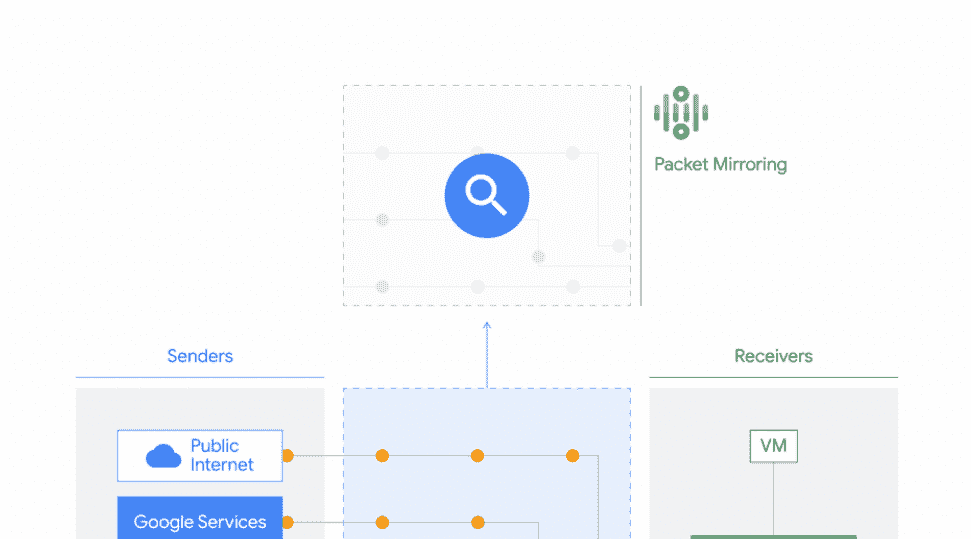

# TWiGCP —“用于特使服务、高性能文件存储、TLS 1.3 for all、数据包镜像等的 API！”

> 原文：<https://medium.com/google-cloud/twigcp-apis-for-envoy-services-high-performance-filestore-tls-1-3-a3c729e6fbf8?source=collection_archive---------0----------------------->

嘿谷歌云从业者！请务必注册参加由 DevRel 举办的周二[**24 小时谷歌云对话。**](http://gtech.run/lpsfj)

没错，就是 24 小时免费内容！查看议程并在此注册[。](http://gtech.run/lpsfj)

以下是谷歌云视频系列 本周最新 [**的链接:**](http://gtech.run/ju4em)

*   [推荐中心收集优化谷歌云环境的建议](http://gtech.run/ary9f)
*   [谷歌地图平台游戏解决方案现已面向所有人](http://gtech.run/72mlw)
*   [新的谷歌云技能徽章、学习路径和远程认证机会](http://gtech.run/bwub2)
*   [谷歌数据中心安全:6 层深度](http://gtech.run/m29ld)

过去一周 GCP 的其他头条新闻包括:

*   [宣布使用 Envoy 的服务的 API 管理](http://gtech.run/lmb6k)(谷歌博客)
*   [2020 年谷歌云与 SAP 合作的最新进展](http://gtech.run/eghgy)(谷歌博客)
*   谷歌云服务的 TLS 1.3 现在是默认开启的
*   数据包镜像实现了更好的网络监控和安全性
*   加速，扩展:文件存储现在支持高性能
*   [在 Dataproc image 版本上介绍 Spark 3 和 Hadoop 3](http://gtech.run/96wgn)(谷歌博客)

来自“动手 IAP”部门:

*   瓶子里的超越公司——开瓶！(medium.com)

来自“严肃问题漫画”部门:

*   我的数据在云中安全吗？(medium.com)

来自“保持无服务器更新”部门:

*   [将您的 Firebase 云功能迁移到 node . js 10](http://gtech.run/d9u84)(medium.com)
*   [从应用引擎迁移到云运行](http://gtech.run/varst) (labs.steren.fr)

来自“如何人工智能”部门:

*   [为 30 年的家庭视频建立人工智能搜索档案](http://gtech.run/reqdr)(谷歌博客)
*   【g.co/codelabs】为 Keras 和 Tensorflow 2.2 更新了“没有博士学位的 Tensorflow”教程

来自“基础知识”部门:

*   [如何在谷歌云平台上用 VPC 服务控件创建 DMZ](http://gtech.run/td39)(medium.com)
*   [使用 netperf 和 ping 测量网络延迟](http://gtech.run/5y9qd)(谷歌博客)
*   [在 medium.com GKE 使用 CoreDNS](http://gtech.run/8n9yq)

来自“无服务器操作指南”部门:

*   [教程:如何对谷歌云功能进行限速](http://gtech.run/ahkqs) (thenewstack.io)
*   [使用 Google Cloud Buildpacks 和这个六行文件](http://gtech.run/3v3ws)(seroter.com)构建和部署安全容器到无服务器运行时

来自“如何使用数据和无服务器”部门:

*   [将数据流与云任务和云功能解耦](http://gtech.run/w9mr)(medium.com)
*   [使用 Knative Eventing、BigQuery、Matplotlib 和 SendGrid 的每日新冠肺炎病例通知管道](http://gtech.run/cqqfh)(medium.com)

来自我最喜欢的“客户和合作伙伴对 GCP 的最佳评价”部分:

*   ShareChat 将 6000 万用户迁移到谷歌云【livemint.com 
*   [面向 ML 的云数据仓库，高级分析](http://gtech.run/dwf2k)(谷歌博客)
*   [我们如何将数据仓库从 Redshift 迁移到 big query](http://gtech.run/7gclb)(medium.com)
*   [利用数据分析和虚拟助手提高学生成绩](http://gtech.run/gzdg7)(谷歌博客)
*   Kaggle 数据科学家如何帮助冠状病毒

来自“**万物多媒体**”部门:

*   [视频] [如何免费获得谷歌云积分|面向学生开发者](http://gtech.run/glgr8)(youtube.com)
*   [播客] Kubernetes 播客[第 108 集——金融时报，莎拉·威尔斯和迪米塔尔·特尔兹耶夫](http://gtech.run/89rhg)(kubernetespodcast.com)
*   [播客] GCP 播客[第 225 集——艾米丽·谢伊和瑞安·希勒曼的语音编码](http://gtech.run/2tqrq)(gcppodcast.com)

**从 Beta，GA，还是什么？**“部门:

*   【GA】[云 SDK 297.0.0](http://gtech.run/wfg8w)
*   [GA] [发布/订阅重试策略](http://gtech.run/z85vv)
*   【GA】[VPC 私有 IP 地址](http://gtech.run/plzrm)
*   [GA] [使用 INFORMATION_SCHEMA 的 BigQuery 作业元数据](http://gtech.run/vuew2)
*   【GA】[云 DLP 处理区域](http://gtech.run/lx3d6)
*   [GA] [通过云 VPN 隧道限制对等 IP 地址](http://gtech.run/l4ns2)
*   【Beta】[VPC 网络直联与 AI 平台培训](http://gtech.run/6p78x)
*   [Beta] [新的单一租户节点类型](http://gtech.run/pjwdv)
*   【测试版】[商户中心出口到 BigQuery](http://gtech.run/5y6dx)
*   [Beta] [服务周界的 VPC 模拟运行模式](http://gtech.run/d8vjs)
*   [Beta] [用于训练 AutoML 表格模型的创建模型语句](http://gtech.run/qrzvw)
*   [Beta] [用于提升树模型的创建模型语句](http://gtech.run/maszf)
*   【测试版】[深度神经网络(DNN)模型的创建模型语句](http://gtech.run/za9yr)

本周的图片摘自 Packet Mirroring 博客帖子

这就是本周的全部内容！亚历克西斯