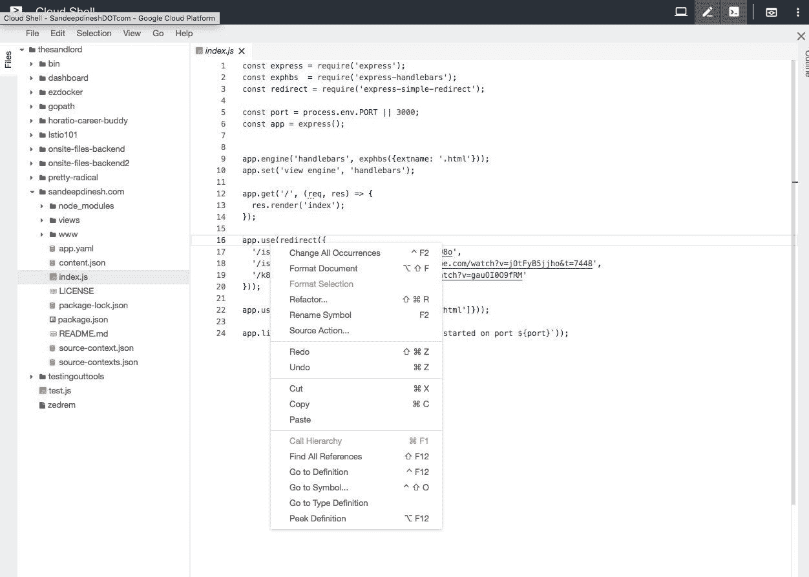

# TWiGCP —“应用引擎 Python 3.7 和新的 CloudShell 编辑器将于 2019 年启动”

> 原文：<https://medium.com/google-cloud/twigcp-app-engine-python-3-7-and-a-new-cloudshell-editor-to-kick-off-2019-2577b7332eb7?source=collection_archive---------2----------------------->

…我们回来了！

以下是过去一周的主要公告:

我们以一个全新的、惯用的应用引擎 GA 运行时开始了新的一年:

*   [Python 3.7 for App Engine 现已正式发布](http://goo.gl/PM7cYz)(谷歌博客)
*   【youtube.com】介绍 App Engine 的新 Python 3 运行时

..和一个【cloud.google.com】新的测试版云壳网页编辑器，这次是在忒伊亚

这些 GCE 和 Cloud Spanner 增强功能也在假期前发布:

*   " [*持久磁盘和计算引擎的新功能:控制您的磁盘快照的存储位置*](http://goo.gl/hE65Dr) "(谷歌博客)。做到言出必行，满足数据驻留和业务连续性要求。
*   " [*Cloud Spanner 增加了增强的查询内省、新的区域、新的多区域配置*](http://goo.gl/zbbpSw) " (Google 博客)。对查询统计和新区域配置的反思。

[朵拉加入谷歌云](http://goo.gl/p8JZTE) (devops-research.com)。
欢迎 Jez Humble 和团队！

我们正在接受更多的参与者让我们的 Alpha 在谷歌云功能基础设施(services.google.com)上运行任意的无状态容器

来自“弄湿你的脚，弄脏你的手”部门:

*   来自 kube con(g.co/codelabs)的 Ahmet Alp Balkan 的[“kna tive 简介”codelab](http://goo.gl/beAGxT)
*   [新的 Qwiklabs 任务可用:谷歌云上的物联网](http://goo.gl/jD5ota)(谷歌博客)

来自“媒介上的 GCP，开发者的开发者”部门:

*   [隐藏的超能力——伐木巨人](http://goo.gl/FNV1fL)(medium.com)
*   [使用 BigQuery ML 预测汽车共享可用性](http://goo.gl/E44nWj)(medium.com)
*   [SQL 还是 ML？同一个数据集，两种方式](http://goo.gl/EgwUDY)(medium.com)
*   [App 引擎标准在 Go:途中到 1.11](http://goo.gl/f54wp7)(medium.com)
*   [谷歌聊天机器人+围棋](http://goo.gl/kdni9j)(medium.com)
*   [使用谷歌云物联网核心、Firestore 和 MongooseOS 的 GPS/蜂窝资产跟踪](http://goo.gl/XKJVm2)(medium.com)
*   【medium.com】[使用 Google Cloud Build 和 Arduino](http://goo.gl/DwnYB8) 的无服务器持续集成和 OTA 更新流程
*   [Firebase:用 Python 和云 Firestore 开发应用引擎服务](http://goo.gl/FJbqNa)(medium.com)

来自“每天都有新人发现 GCP”部门:

*   [Google Cloud — Jumpstart，教程&社区！](http://goo.gl/WpSLt7)(linkedin.com)

来自“全方位最佳实践”部门:

*   [云函数 pro 提示:重试和等幂运算](http://goo.gl/ULtAet)(谷歌博客)
*   [企业组织的最佳实践](http://goo.gl/vsnhPG)(cloud.google.com)
*   [探索容器安全性:让 Google 用新的托管基础映像打补丁](http://goo.gl/cAi6w6) (Google 博客)
*   [成为谷歌云认证专业架构师的 5 个技巧](http://goo.gl/ku3chc) (thenewstack.io)

来自“瑞士军刀”部门:

*   [bloom RPC—gRPC 服务的 GUI 客户端](http://goo.gl/nnuuh7)(github.com)
*   [GitHub—alexvanboxel/Reactor](http://goo.gl/FpgEJm):Reactor 是一个微服务，旨在测试和实验微服务的可观测性(github.com)

从“测试版，正式版，还是什么？”部门:

*   【GA】[深度学习虚拟机](http://goo.gl/zs6n5x)
*   [Beta] [面向客户和合作伙伴的云身份](http://goo.gl/ZG892B) (CICP)
*   VPC 服务控制系统(VPC-SC)
*   [Beta] [每功能标识](http://goo.gl/2m4YPZ) -云功能文档
*   【Beta】(忒伊亚)[云壳编辑](http://goo.gl/o155xo)

来自“所有多媒体”部门:

*   建筑师秀 Ep。第 82 期:凯尔西·海托华(Kelsey Hightower)介绍如何跟上云计算的发展并帮助公司做出明智的选择(architechtshow.com)
*   [播客] [Kubernetes 播客第 34 集-Kubernetes CVE-2018–1002105，与乔丹·利吉特](http://goo.gl/uca8KH)(kubernetespodcast.com)
*   youtube.com，Knative，serverless，Kubernetes 和开发者大会——Burr Sutter 访谈
*   [视频] [使用 Python 3](http://goo.gl/mTg5Mw)(youtube.com)将内容管理系统部署到 App Engine
*   【采访】[阿帕娜·辛哈，谷歌云| kube con 2018](http://goo.gl/EZ7ZWG)(youtube.com)

本周图片是新的忒伊亚云壳编辑器的截图

这就是本周的全部内容！亚历克西斯