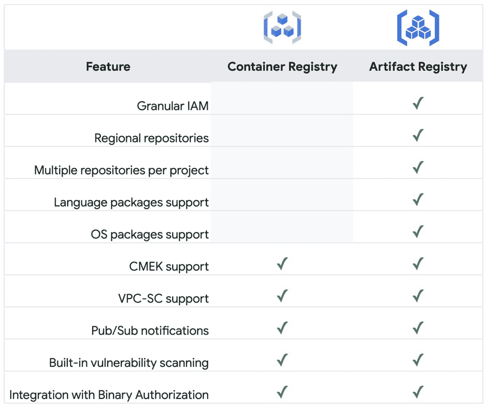

# TWiGCP —“工件注册表、凭证、代码转换器 API 和文件存储备份”

> 原文：<https://medium.com/google-cloud/twigcp-artifact-registry-voucher-transcoder-api-and-filestore-backups-a338cb8d01ca?source=collection_archive---------1----------------------->

过去一周的 GCP 要闻包括:

*   [用工件注册来加速你的软件供应链，现在正式发布](http://gtech.run/mquyn)(谷歌博客)
*   [预览版中的谷歌云代码转换器 API 帮助你创建消费者流媒体格式](http://gtech.run/mkxr4)(谷歌博客)
*   [推出代金券，一种帮助保护集装箱供应链的服务](http://gtech.run/wcsmx)(谷歌博客)
*   [文件存储备份简化了基于文件的应用向云的迁移](http://gtech.run/naeee)(谷歌博客)
*   [通过开放云为客户和生态系统提供支持](http://gtech.run/qdmbc)(谷歌博客)

来自“新人每天从 GCP 开始”部门:

*   [谷歌 Kubernetes 引擎或 GKE 的开发者指南](http://gtech.run/bw4wy)(谷歌博客)
*   [每年更新的“2020 年 GCP 要点”课程](http://gtech.run/xxjsq)(linkedin.com)

来自“现实世界用例的应用 ML”部门:

*   [使用自动化的 ML、流架构发现异常](http://gtech.run/cdkjr)(谷歌博客)
*   [人工智能如何改进专利分析](http://gtech.run/8vjl7)(谷歌博客)

来自“ICYM 这些最新的安全增强措施”部门:

*   [我们如何推进网络安全领域的智能自动化](http://gtech.run/5rxxd)(谷歌博客)

来自“这些机器最适合 HPC 的实际技术原因”部门:

*   对速度的需求:使用 C2 机器来处理你的高性能计算工作负载(谷歌博客)

来自“配置连接器案例”部门:

*   [将配置理解为 Kubernetes](http://gtech.run/bkn3w) (谷歌博客)中的数据

从”。净所有的东西”部门:

*   [。NET Core 3.1 来云功能](http://gtech.run/27g4p)(谷歌博客)
*   [。谷歌云上的. NET 5.0](http://gtech.run/vpedh)(谷歌博客)

来自“数据治理”部门:

*   Google 数据目录中的业务术语支持|作者 Ricardo Mendes(medium.com)
*   [谷歌云中的数据治理——安全访问和发现数据的新方法](http://gtech.run/785jg)(谷歌博客)

来自“本周监控”部门:

*   【Google Cloud Pub/Sub:如何监控您订阅的运行状况以获得最佳的端到端延迟】作者 Arif Kasim(medium.com)
*   [为乐趣和利润构建监控仪表板|作者尤里·格林斯泰恩](http://gtech.run/r4d8b)(medium.com)

来自“不是一个，而是三个技术解决方案”部门:

*   [带有 Anthos 的现代 CI/CD](http://gtech.run/4q9yh)

来自“BigQuery，动手”部门:

*   [缩放 Google BigQuery 分析函数|作者 Raz van Culea](http://gtech.run/u7q72)(medium.com)
*   [如何删除 BigQuery 表中的重复行| Samet Karadag](http://gtech.run/9lpn6)(medium.com)

来自“爪哇、春天和 GCP”部门:

*   [将文件上传到 GCS，使用 Spring Cloud 访问过期的 URL 作者:Anoop Hallimala](http://gtech.run/rk7j4)(medium.com)
*   [使用云扳手和 Java | Ash van der Spuy](http://gtech.run/hs2pr)(medium.com)
*   [使用 Google Cloud Spanner 模拟器测试 Spring Boot 应用程序|作者 Peter Runge](http://gtech.run/hx7um)(medium.com)

来自“客户和合作伙伴与 GCP 一起解决实际问题”部门:

*   刚果爱国者联盟波尔斯卡案例研究【cloud.google.com 
*   [使用云数据平台的流媒体视频](http://gtech.run/gzp8d)(谷歌博客)
*   [ZSL 如何使用 ML 声学分类器保护野生动物](http://gtech.run/qqefr)(谷歌博客)
*   谷歌和哈佛提高新冠肺炎预测

来自“**万物多媒体**”部门:

*   [视频] [裸机 Anthos 简介](http://gtech.run/uft7n)(youtube.com)
*   [视频][Istio 1.8 的新功能](http://gtech.run/fe2qe)(youtube.com)
*   [播客] Kubernetes 播客[第 130 集——kube con NA 2020，由 Stephen Augustus](http://gtech.run/g4mdp) 主演(kubernetespodcast.com)

来自“**的预告，嘎，还是什么？**"部门:

*   [GA] [云 SDK 319.0.0](http://gtech.run/wfg8w)
*   [GA] [GKE —海关入境健康检查](http://gtech.run/tkh9t)
*   [GA] [GKE — SSL 政策](http://gtech.run/e66fy)
*   [GA] [GKE —托管证书](http://gtech.run/j8xz7)
*   [GA] [BigQuery 列级安全性](http://gtech.run/t6pt3)
*   【GA】[App Engine 标准环境 Ruby 2.7 运行时](http://gtech.run/cp92u)
*   [GA] [发布/订阅消息过滤](http://gtech.run/8vzyc)
*   【GA】[云构建 BigQuery 通知器](http://gtech.run/dwcmw)
*   云可扩展服务代理(ESP) V2
*   [1.8] [宣布 Istio 1.8](http://gtech.run/gbbbx) (istio.io)
*   【预览】[云函数--。NET Core 3.1 运行时](http://gtech.run/gsxcu)
*   [预览] [GKE — HTTPS 外部入口重定向](http://gtech.run/gqn3d)
*   [预览] [GKE —独立 neg 的自定义命名](http://gtech.run/h94ah)
*   【预览】 [GKE —内部入口的静态 IP 寻址](http://gtech.run/64xpc)

本周的图片取自 Artifact Registry GA 公告帖子

这就是本周的全部内容！亚历克西斯