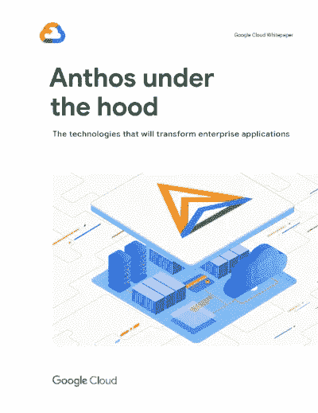

# TWiGCP —“自动化操作系统安全、GKE 浪涌升级和技术 Anthos 电子书”

> 原文：<https://medium.com/google-cloud/twigcp-automating-os-security-gke-surge-upgrades-and-a-technical-anthos-ebook-93ecf8024c4d?source=collection_archive---------2----------------------->

过去一周的 GCP 要闻包括:

*   [使用新的操作系统补丁管理服务](http://gtech.run/brmu3)保护您正在运行的虚拟机(谷歌博客)
*   [GKE 激增升级如何提高运营效率](http://gtech.run/q5k8p)(谷歌博客)
*   [gRPC，见见科特林](http://gtech.run/kjzk9)(谷歌博客)
*   谷歌云新冠肺炎支持政府(谷歌博客)
*   [我们如何帮助新冠肺炎学术研究](http://gtech.run/nwf2r)(谷歌博客)

来自“如果 4 个字或更少对你来说有点简洁”部分:

*   [谷歌云平台服务概要](http://gtech.run/u65fp)(cloud.google.com)

来自“亲身实践者的 Anthos”部门:

*   [《引擎盖下的安索斯》(一本针对从业者的电子书)](http://gtech.run/w9aem)(inthecloud.withgoogle.com)
*   [medium.com GKE 多集群 gRPC 架构](http://gtech.run/sw3un)
*   [工件注册入门:部署到 Google Kubernetes 引擎](http://gtech.run/rzghy)(medium.com)

来自“负载平衡器和基础设施”部门:

*   [在谷歌云中选择合适的负载均衡器](http://gtech.run/2pczv)(medium.com)
*   [通过全局负载平衡优化应用程序容量【medium.com ](http://gtech.run/sc5fh)
*   [发送谷歌云事件通知](http://gtech.run/jc2te)(cloud.google.com)
*   [谷歌云跨区域延迟和吞吐量](http://gtech.run/fw9pf)(cloud.google.com)
*   [使用 OpenCensus 的工具云扳手 Go 应用](http://gtech.run/evmj6)(medium.com)

来自“ML & Insights”部门:

*   [使用数据流模板连接到 Splunk](http://gtech.run/ldz9g)(谷歌博客)
*   [谷歌云上数据争论和机器学习的自动化](http://gtech.run/jclx3)(medium.com)
*   [如何使用 BigQuery GIS 找到美国各县的内部质心](http://gtech.run/pcqkn)(medium.com)
*   【towardsdatascience.com，用 Google BigQuery 和 PySpark 制作 ML 项目:预测酒店取消预订
*   [用 WaveNetEQ 提高 Duo 的音频质量](http://gtech.run/285ps)(谷歌人工智能博客)
*   [基于云运行和嵌入式 tf 的按需小批量预测](http://gtech.run/g78p7)(medium.com)
*   [云数据融合的 9 个常见错误](http://gtech.run/rwvt8)(medium.com)

来自“**万物多媒体**”部门:

*   [视频] [使用 Stackdriver 调试器进行生产调试—Stack Doctor](http://gtech.run/uqut3)(youtube.com)
*   [视频] [工件注册:Java 应用程序的容器化和部署](http://gtech.run/fzg6x)(youtube.com)
*   【沿视频编码】[学习节点中的 ES 模块与 Myles Borins](http://gtech.run/le9na)(youtube.com)
*   Kubernetes 播客[第 99 集— kpt，Morten Torkildsen](http://gtech.run/v8eh7)(kubernetespodcast.com)
*   [播客]gcppodcast.com GCP 播客[第 216 集——凯捷](http://gtech.run/d9cww)橄榄球和 ML
*   [播客]甲骨文突破者[播客#374: Kubernetes 及以后:采访凯尔西·海塔尔](http://gtech.run/uxbhc)(podbean.com)

**Beta，GA，还是什么？**“部门:

*   [GA] [云 SDK 289.0.0](http://gtech.run/wfg8w)
*   【GA】[数据流 SQL](http://gtech.run/ha98x)
*   【GA】[云扳手备份和恢复](http://gtech.run/qry34)
*   [GA] [操作系统补丁管理](http://gtech.run/cepgp)
*   [GA] [云外部密钥管理器](http://gtech.run/sfqlz)
*   【GA】[云 CDN 签名 cookie](http://gtech.run/bllzm)
*   GKE 入口
*   [GA] [大查询预约](http://gtech.run/23b8b)
*   [GA] [查看和应用空闲虚拟机建议](http://gtech.run/d84ch)
*   [GA] [外部负载平衡器 HTTP 重写&重定向](http://gtech.run/kve2r)
*   [GA] [事件线程检测](http://gtech.run/zn685)
*   【GA】[准入审批](http://gtech.run/wjggv)
*   [GA] [VPC 网络性能仪表板](http://gtech.run/l39m3)
*   [GA] [查看和下载谷歌云服务的价格](http://gtech.run/2w5zx)
*   文档 AI
*   [防火墙洞察](http://gtech.run/ulr6b)
*   VPC 无障碍服务
*   自动翻译-评估模型
*   [Beta] [跨项目承诺使用折扣](http://gtech.run/6uzyt)
*   [Beta] [分析云 IAM 策略](http://gtech.run/fm3my)
*   [Beta] [VPC 服务控制批量 API](http://gtech.run/x2nyq)

本周的图片是 Anthos 从业者的新电子书

这就是本周的全部内容！亚历克西斯