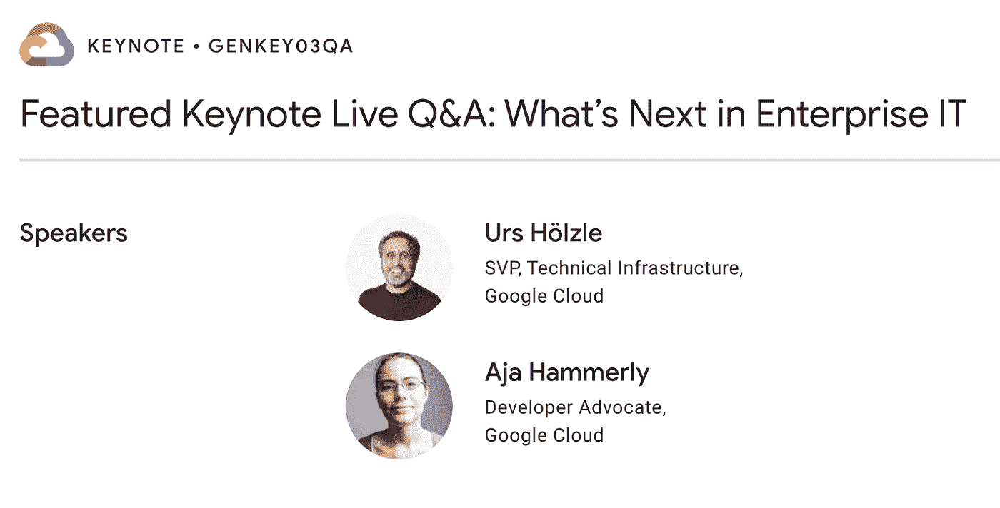

# TWiGCP —“从云人工智能周回来”

> 原文：<https://medium.com/google-cloud/twigcp-back-from-cloud-ai-week-efd748bee738?source=collection_archive---------2----------------------->

Cloud Next OnAir 现在已经结束了第 8 周(共 9 周):“ **Cloud AI** ”。

*   [人工智能金矿:Google Cloud Next’20 on air 发生了什么](http://gtech.run/bss7r)
*   给在场的从业者——[《谷歌云对话 DevRel》](http://gtech.run/q5uhz)
*   [接下来恰好是 OnAir:所有的公告都在一个地方](http://gtech.run/x385a)
*   [您的 Google Cloud Next’20:on air 备忘单](http://gtech.run/swr7a)

“Cloud Next on air 2020”**业务应用平台**的最后一周(#9)于今天(周二)以[的新主题演讲和几十场技术会议拉开帷幕。](http://gtech.run/x339g)

不出所料，云人工智能是本周的趋势:

*   [一个开发者的观点:充分利用下一次 OnAir 的云人工智能周](http://gtech.run/tft88)(谷歌博客)
*   [无痛机器学习初学者指南](http://gtech.run/kc3aw)(谷歌博客)
*   [对 MLOps 基金会的关键要求](http://gtech.run/zqv2f)(谷歌博客)
*   人工智能平台上的 TabNet:高性能、可解释的表格学习(谷歌博客)
*   在谷歌云高级解决方案实验室的帮助下，mixi 加速了人工智能的采用
*   [授权团队释放人工智能的价值](http://gtech.run/pzjvx)(谷歌博客)
*   对话式人工智能推动更好的客户体验
*   用负责任的人工智能处理业务

来自“控制您的 Kubernetes 集群”部门:

*   [使用 Anthos 附加集群管理所有 Kubernetes 集群](http://gtech.run/xfbzy)(谷歌博客)

来自“下周初体验云”部门:

*   [API-first 数字化转型](http://gtech.run/8y7tf)(谷歌博客)

来自“虚拟机是否适合您的抽象级别”部分:

*   [将您的 vSphere 虚拟机迁移到谷歌云 VMware 引擎](http://gtech.run/kq7jn)(谷歌博客)
*   【medium.com】王从希|让虚拟机重生，就像一个具有自动修复和自动更新功能的 RPG

来自“SLO 和 IaC，一起更好”部门:

*   [用地形创建 SLO。创建服务|作者尤里·格林斯泰恩](http://gtech.run/z768j)(medium.com)

来自“欢迎大家使用 BigQuery”部门:

*   新的博客系列——biqquery 解释:概述|作者 Rajesh Thallam(medium.com)
*   [Samet Karadag](http://gtech.run/x7swj)(medium.com)使用 Dataproc 和 Sqoop |将 Oracle 迁移到 BigQuery

来自我最喜欢的“客户用 GCP 解决现实世界的问题”部分:

*   [brand watch 如何通过 BigQuery 和 Fivetran 实现数据管道自动化](http://gtech.run/2xjh9)(谷歌博客)

来自“**多媒体**”部门:

*   [播客] Kubernetes 播客[第 119 集——凯普特，阿洛伊斯·雷特鲍尔](http://gtech.run/8wagx)(kubernetespodcast.com)
*   gcppodcast.com,【播客】GCP 播客[第 234 集——GKE 和阿莱克斯·扎科诺夫以及德鲁·布拉德斯托克五岁了](http://gtech.run/eb7k5)

**从 Beta，GA，还是什么？**“部门:

*   [GA] [云 SDK 308.0.0](http://gtech.run/wfg8w)
*   WebSocket 负载平衡
*   [GA] [面向 SAP HANA 的云存储备份代理](http://gtech.run/bzxqu)
*   【GA】[云存储对象生命周期条件](http://gtech.run/9abwu)
*   【GA】[计量数据防丢失再识别和泄露风险](http://gtech.run/np3ey)
*   [GA] [全局访问 GKE 主机的私有端点](http://gtech.run/zxlsw)
*   [GA] [防火墙规则记录](http://gtech.run/qrfv9)
*   [正式发布] [裸机解决方案的可用性](http://gtech.run/x5ahx)
*   [Beta] [使用生成的查询检索详细的 VPC 日志](http://gtech.run/2f9hu)
*   [Beta] [确保政府工作量](http://gtech.run/p4fkd)

本周的图片是对 Cloud Next OnAir 的最后一个主题演讲的描述，这是一个与始终富有洞察力的 Urs hlz le 进行现场问答的主题演讲

这就是本周的全部内容！
——亚历克西斯