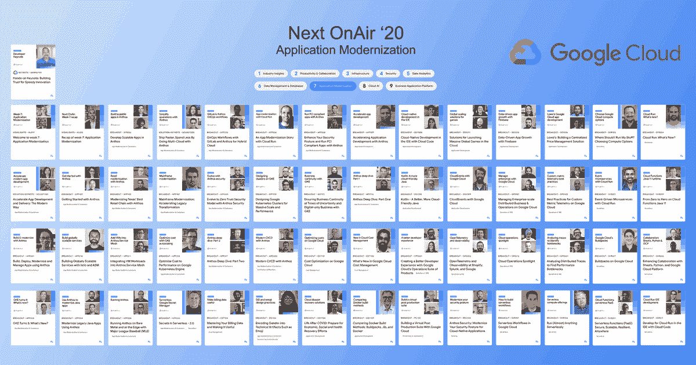

# TWiGCP —“从中断中回来，我错过了什么吗？#GoogleCloudNext "

> 原文：<https://medium.com/google-cloud/twigcp-back-from-hiatus-did-i-miss-anything-googlecloudnext-8c896fdebc36?source=collection_archive---------1----------------------->

TWiGCP 回来了！

与此同时，Cloud Next OnAir 现已结束第 7 周(共 9 周):“**应用程序现代化**”。

这些链接仍然相关:

*   [给在场的从业者——“谷歌云对话 DevRel”](http://gtech.run/q5uhz)
*   [接下来的 OnAir 正好是:所有的公告都在一个地方](http://gtech.run/x385a)
*   [你的 Google Cloud Next’20:on air 备忘单](http://gtech.run/swr7a)

…第八周["**"云人工智能** "](http://gtech.run/x339g) 将于明天星期二开幕，届时将有一场新的主题演讲和几十场技术会议在太平洋时间上午 9 点举行

过去几周 GCP 的其他头条新闻:

**应用程序现代化**

*   Anthos 最新版本增加了混合人工智能和其他功能
*   [谷歌营向你展示如何规模化经营](http://gtech.run/gs56f)(谷歌博客)
*   [Anthos 支持 NVIDIA GPU](http://gtech.run/y3c8n)(谷歌博客)
*   安托斯安全蓝图:限制交通【cloud.google.com 
*   [加速您的应用开发和交付](http://gtech.run/ep38k)(谷歌博客)
*   [使用 Anthos 配置管理进行安全部署](http://gtech.run/fxfvh)(cloud.google.com)
*   云发布/订阅:[过滤消息](http://gtech.run/8mmzy)和[订购消息](http://gtech.run/slg7q)(cloud.google.com)

无服务器、开发和 CI/CD

*   [云代码 VS 代码](http://gtech.run/hd6jk)(cloud.google.com)
*   [云智能代码](http://gtech.run/gxb54)(cloud.google.com)
*   [GitHub Actions Google Cloud 上的自托管跑步者](http://gtech.run/auy2f) (github.blog)
*   [使用 Jib 容器化 Java 应用](http://gtech.run/spg2l)(谷歌博客)
*   [在谷歌云上使用 Spinnaker 的连续交付工具链](http://gtech.run/j6un3)(cloud.google.com)
*   [云运行现在支持逐步推出和回滚](http://gtech.run/qa9vt)(谷歌博客)
*   【cloud.google.com】云控制台部署云功能(新流程)
*   Ruby 注册的谷歌云功能(docs.google.com)
*   [如何使用 GitHub Actions 部署您的云运行服务| feli PE Martinez](http://gtech.run/d88jp)(medium.com)
*   [云运行代码实验室的事件](http://gtech.run/qbznh)(codelabs.developers.google.com)

云运营

*   [云操作套件获得 21 项新功能](http://gtech.run/kcvdj)(谷歌博客)
*   [云监控中的高分辨率用户定义指标](http://gtech.run/vyxrj)(谷歌博客)
*   [自定义云监控指标的延长保留时间](http://gtech.run/hhq3p)(谷歌博客)
*   [云日志添加日志桶功能](http://gtech.run/4664k)(谷歌博客)
*   将云身份日志集中在单一平台之后(谷歌博客)
*   [云日志数据导出场景:Datadog](http://gtech.run/wwjxt)(cloud.google.com)

数据流和流

*   [用于构建云管道的多语言 SDK](http://gtech.run/hgkf2)(谷歌博客)
*   [用于分析的云批处理和流处理](http://gtech.run/8ecc2)(谷歌博客)
*   [数据流与其他流、批处理引擎](http://gtech.run/lda7l)(谷歌博客)
*   [如何通过谷歌云智能分析简化车队管理](http://gtech.run/de7ed)(谷歌博客)

数据库

*   世界是不可预测的，你的数据库不应该增加它
*   [适用于所有尺寸应用的扳手关系数据库——常见问题解答](http://gtech.run/lcfz3)(谷歌博客)
*   [将 Firestore 数据库用于网络或移动应用](http://gtech.run/bxc83)(谷歌博客)
*   [MySQL 8 已经为企业准备好了云 SQL](http://gtech.run/qvphx) (谷歌博客)
*   [为多区域灾难恢复部署 Microsoft SQL Server](http://gtech.run/pmv99)(cloud.google.com)
*   [计算引擎上 MySQL 集群的高可用性架构](http://gtech.run/vs7he)(cloud.google.com)
*   【MySQL 8.0 登陆谷歌云 SQL |加布里埃拉·Á·维拉·费拉拉(medium.com)
*   [BigTable——你需要知道的一切|作者 Amulya Rattan bhat ia](http://gtech.run/bcpfc)(medium.com)

基础设施

*   [面向单一租户节点的 CPU 过量使用现已正式发布](http://gtech.run/4bdml) (Google 博客)
*   [谷歌云 VMware 引擎联网功能](http://gtech.run/64czb)(谷歌博客)
*   [计算引擎许可解释](http://gtech.run/gcuc7)(谷歌博客)
*   计算引擎:防止妥协，更好地防御横向移动(谷歌博客)
*   了解如何使用计算引擎操作系统补丁管理服务(谷歌博客)
*   [云元数据管理标注技巧](http://gtech.run/z3as6)(谷歌博客)
*   如何在没有公共 IP 的情况下 ssh 到你的 GCE 机器

安全性

*   [介绍 ca:用私有 ca 和证书保护应用](http://gtech.run/d2rbe)(谷歌博客)
*   [在持续集成管道中根据公司政策验证您的应用](http://gtech.run/qe5zh)(cloud.google.com)

参考架构

*   [谷歌云的 13 种流行应用架构](http://gtech.run/mwq6a)(谷歌博客)
*   [GCP 素描笔记](http://gtech.run/a5vbm) (thecloudgirl.dev)

GKE

*   [确保 GKE 集群的可靠性和正常运行时间](http://gtech.run/cc6zk)(谷歌博客)
*   [GKE 的 IP 地址管理](http://gtech.run/qa5az)(谷歌博客)
*   新的 GKE 数据平面 V2 增加了集装箱的安全性和可见性
*   [为 cloud.google.com GKE 配置私有公共 IP](http://gtech.run/pk6b4)

分析/商务智能

*   [面向数据分析师、工程师、CDO 的 LookML BI](http://gtech.run/mg3fq)(谷歌博客)

BigQuery

*   [BigQuery 现在提供业界领先的 99.99%的正常运行时间 SLA](http://gtech.run/667zh)(谷歌博客)
*   [BigQuery 灵活定价，从 100 个位置开始](http://gtech.run/8qw65)(谷歌博客)

云人工智能

*   [使用流式分析进行异常检测&人工智能](http://gtech.run/dprxv)(谷歌博客)
*   [机器学习性能和成本优化最佳实践](http://gtech.run/kfrj7)(谷歌博客)

伊斯迪奥

*   宣布 Istio 1.7 (istio.io)
*   [跨 GKE 集群和计算引擎实例扩展您的 Istio 服务网](http://gtech.run/zzdqz)(cloud.google.com)
*   Istio 如何提高可靠性:采访谷歌项目经理丹·奇鲁利(youtube.com)

从“完全无关，还是他们？”部门:

*   [宣布谷歌云游戏服务器全面上市](http://gtech.run/vmcqz)(谷歌博客)
*   Alphabet 发行可持续债券来支持环境和社会倡议

来自我最喜欢的“客户和合作伙伴对 GCP 的最佳评价”部分:

*   [谷歌云人工智能和哈佛全球健康研究所合作开发新的新冠肺炎预测模型](http://gtech.run/af3fd)(谷歌博客)
*   [宝洁公司如何利用谷歌云改善消费者体验](http://gtech.run/d89vx)(谷歌博客)
*   [云中零售商 2020 年假期准备指南](http://gtech.run/d428b)(谷歌博客)
*   [用 BigQuery 和 Variant Transforms 加速梅奥诊所的数据平台](http://gtech.run/gwzlj)(谷歌博客)
*   更新孤立的数据库基础设施(谷歌博客)
*   从棒球场到云:MLB 如何使用 Anthos
*   [可视化投手群:下一次空中数字体验](http://gtech.run/k9acl)(medium.com)

来自“**多媒体**”部门:

*   [视频] [云未来实践主题演讲:为快速创新建立信任(又名开发者主题演讲)](http://gtech.run/2ak25)(youtube.com)
*   【截屏】[云运行的持续交付体验](http://gtech.run/wk7jz)(twitter.com)
*   Kubernetes 播客(kubernetespodcast.com)近期剧集
*   第 118 集— [库本内特 1.19，泰勒·多雷扎尔](http://gtech.run/27jmj)
*   第 117 集— [通信和 KubeCon，康斯坦斯·卡拉马诺利斯](http://gtech.run/uyqj9)
*   第 116 集— [独立开源，亚历克斯·埃利斯](http://gtech.run/lzn49)
*   第 115 集 [Minikube Redux，托马斯·斯特罗姆伯格](http://gtech.run/2ls6x)
*   (gcppodcast.com)GCP 播客最近几集
*   第 233 集—[James Harding 和 Gurmeet Goindi 的裸机解决方案](http://gtech.run/j3hxw)
*   第 232 集—[Simen Svale Skogsrud 和 Knut Melvæ参与的 Sanity.io】](http://gtech.run/29hfw)
*   第 231 集— [有帕布·帕拉尼萨米和贾勒特·加西亚的《春天和铁山》](http://gtech.run/4jcyy)
*   第 230 集—[Stewart Reichling 和 John Laham 的交通总监和微服务](http://gtech.run/hwrkm)

从" **Beta，GA，还是什么？**"部门:

*   【GA】[云 SDK 307.0.0](http://gtech.run/wfg8w)
*   【GA】[MySQL 8.0 的云 SQL](http://gtech.run/9kc6x)
*   【GA】[Java 11 云函数](http://gtech.run/cb78e)
*   [GA] [云使用云构建从 Git 运行连续部署](http://gtech.run/8am9a)
*   [GA] [云代码支持流行的 CRD](http://gtech.run/vl3ef)
*   【GA】[从云函数连接到云 SQL](http://gtech.run/grm6t)
*   [GA] [对 Redis 使用带有内存存储的 VPC 服务控件](http://gtech.run/zcjan)
*   [GA][VPC 子网的非 RFC1918 地址](http://gtech.run/c5vvd)
*   [GA] [通过 GKE 使用非 RFC 1918 私有 IP 地址范围](http://gtech.run/tpr7c)
*   [GA] [组织政策增强，限制虚拟机和 GKE 的公共 IP](http://gtech.run/h2cuz)
*   [GA] [使用共享 VPC 设置内部 HTTP(S)负载平衡](http://gtech.run/s7tmk)
*   [GA] [无代理 gRPC 服务的交通主管](http://gtech.run/cpkyd)
*   [GA] [gRPC 运行状况检查](http://gtech.run/nbywy)
*   [GA] [上传服务帐户的公钥](http://gtech.run/9c2za)
*   [GA] [创建短期服务帐户凭证](http://gtech.run/v9fgk)
*   [GA] [GCS 细粒度审计日志](http://gtech.run/ndqv7)
*   [GA] [GCS 存储转移服务— Azure blob 支持](http://gtech.run/ap84r)
*   【GA】[Firestore 批量写道](http://gtech.run/2p7ce)
*   [GA] [Anthos 附着簇](http://gtech.run/wmxjs)
*   【GA】[GKE 内部 TCP/UDP 负载均衡](http://gtech.run/44bg8)
*   [GKE 独资](http://gtech.run/tytzr)
*   【GA】[云扳手模拟器](http://gtech.run/adg8t)
*   【GA】[云扳手 nam10/nam11 多地区](http://gtech.run/5dk9l)
*   [GA] [本地语音转文本](http://gtech.run/xwgza)
*   [GA][dialog flow mega agents](http://gtech.run/fg3q)
*   [GA] [使用具有 BigQuery 数据传输服务的服务帐户](http://gtech.run/6mabb)
*   [GA] [BigQuery 100 插槽预留](http://gtech.run/gt8rg)
*   [GA] [使用 INFORMATION_SCHEMA 的大查询预订元数据](http://gtech.run/s2x8u)
*   [GA] [使用矩阵分解训练和预测 BigQuery ML 推荐模型](http://gtech.run/p8fqr)
*   【GA】[云 AI 基于 GKE 的区域端点上的预测后端](http://gtech.run/u3ftc)
*   在云 TPU 吊舱上训练 PyTorch 模型
*   [GA] [连接 TPU 与共享 VPC 网络](http://gtech.run/xy4xk)
*   [GA] [在单租户虚拟机上过量使用 CPU](http://gtech.run/zlsnx)
*   [GA] [受控 GCE 自动缩放策略](http://gtech.run/7dr2c)
*   [GA] [SSD 9 TB 最大容量](http://gtech.run/htl9s)
*   [GA] [从源磁盘创建永久磁盘克隆](http://gtech.run/j5pa9)
*   [GA] [为计算引擎 4.11 迁移](http://gtech.run/ga9w6)
*   【GA】[将云计费数据导出到 BigQuery](http://gtech.run/um5lq)
*   谷歌云游戏服务器
*   [GA][Anthos 1.4 的迁移](http://gtech.run/byylb)
*   【GA】[资产盘点通知条件](http://gtech.run/73f7m)
*   【测试版】[工作流程](http://gtech.run/nj92q)
*   [神器注册表](http://gtech.run/abxgj)
*   [Beta] [在成本细分和云计费报告中列出定价](http://gtech.run/b989t)
*   【测试版】[了解承诺建议](http://gtech.run/24etl)
*   【测试版】[自动就地升级 Windows Server 2008 R2](http://gtech.run/kxe45)
*   [Beta] [对话流区域化和数据驻留](http://gtech.run/hj425)
*   【测试版】[预配置云甲晶片规则](http://gtech.run/yybjg)
*   [Beta] [身份和访问管理服务帐户洞察](http://gtech.run/8hd6h)
*   [Beta] [监控服务帐户和密钥的使用情况](http://gtech.run/c4fjg)
*   [Beta] [使用 VPC 服务控件保护资源](http://gtech.run/qdqh8)
*   [Beta] [针对 SQL Server 和应用引擎大小的 Cloud Composer 配置](http://gtech.run/98ca4)
*   【Beta】[big query ML 时间序列](http://gtech.run/v5n5a)
*   [Beta] [Dataproc 个人集群认证](http://gtech.run/mjb6m)
*   [Beta] [Dataproc 增强灵活性模式](http://gtech.run/fy6v5)

本周的图片是过去一周的视觉备忘单，请在 Twitter 上关注 gregsramblings@了解本周的更新。

这就是本周的全部内容！

-亚历克西斯