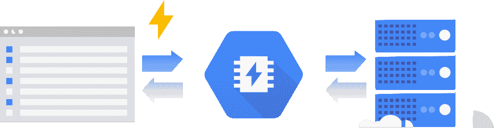

# TWiGCP —“从 2018 年 I/O 回来，一个新的 CH 区域、内存商店和 GDPR 就绪”

> 原文：<https://medium.com/google-cloud/twigcp-back-from-i-o-18-a-new-ch-region-memorystore-and-gdpr-readiness-501cc2c9bdf5?source=collection_archive---------1----------------------->

又是一周，又是一系列的公告，这一次是来自 2018 年谷歌的所有事情:“我们在 2018 年 T3 宣布的 100 件事情”。Google Assistant、ML Kit、第三代 TPU、Chromebooks 上的 Linux 应用等等。

已经有很多关于 Google Duplex 的报道，所以你可能想看看公告帖子和它背后的技术——“一个通过电话完成现实世界任务的人工智能系统*”*

*在公告中有些隐藏的是“ [*支持 Node.js 8.x*](http://goo.gl/P6kJ5B) ”的谷歌应用引擎*

*上面这个 Node.js 公告是在“ [*部署无服务器 Node.js 微服务*](http://goo.gl/rF1K16)”(youtube.com)中发布的，它本身是[“*Google Cloud at I/O 2018*”YouTube 播放列表](http://goo.gl/RfHWSy)，我将添加的 12 个视频“ [*TensorFlow 和深度强化学习，没有博士学位*](http://goo.gl/6JZUg5)”# flipping pancakes*

*I/O 与会者能够亲自完成代码实验室，您也可以通过前往[g.co/io/codelabs](http://g.co/io/codelabs)并点击“云”类别来访问 25+个更新的云代码实验室。免费云代码实验室的完整列表仍可从 g.co/codelabs/cloud 获得。*

*来自“方法和最佳实践”部门:*

*   *Kubernetes 最佳实践:资源请求和限制*
*   *[创建无服务器移动交付渠道](http://goo.gl/AFNniF)(谷歌文档)*

*来自“在 GCP 上使用你最喜欢的软件”部门:*

*   *[用**Neo4j**](http://goo.gl/CbuiGW)**(Google blog)将公开可用的 BigQuery 数据和 Stackdriver 日志转换成图形数据库***
*   ***[在谷歌计算引擎上使用 **Jenkins** 进行分布式构建](http://goo.gl/urhaCm)(谷歌博客)***

***来自“重要服务公告”部门:***

*   ***GCP 正在苏黎世建设一个地区***
*   ***[谷歌宣布有意收购 Velostrata](http://goo.gl/ptXXEj) (谷歌博客)***
*   ***[谷歌云:为 GDPR 做好准备](http://goo.gl/CRh4EN)(谷歌博客)***

***如果你之前错过了 Redis 发布的**云内存商店**，这里有一篇关于公测版的博文:“ [*介绍云内存商店:Redis*](http://goo.gl/4P5ifP) 的完全托管的内存数据存储服务”(谷歌博客)***

***来自我最喜欢的“顾客对 GCP 的最佳评价”部分:***

*   ***[StubHub 押注于 Pivotal 和谷歌云，因为它希望超越门票](http://goo.gl/d9PLZL)(techcrunch.com)***

***来自“TensorFlow 涂鸦和恐龙”部门:***

*   ***[快速绘制:世界上最大的涂鸦数据集](http://goo.gl/GuiUkM)(towardsdatascience.com)# MNIST++***
*   ***[TF-rex:用 TensorFlow 玩谷歌的 T-rex 游戏](http://goo.gl/4ciDFZ)(github.com)***

***来自“以防你错过(ICYMI)”部门:***

*   ***[Beta] [针对 BigQuery 分析引擎的额外诊断和性能工具](http://goo.gl/pMV1Ny)***
*   ***从 2018 年 5 月 15 日开始，compute.serviceAgent IAM 角色将被授予新的计算引擎系统服务帐户(service-[PROJECT _ NUMBER]@ Compute-System . IAM . gserviceaccount)。com)上所有已激活计算引擎 API 的项目。进一步详情[此处](http://goo.gl/vGwgnz)。***
*   ***【测试版】[谷歌云存储客户管理的加密密钥](http://goo.gl/ZSaefD)***
*   ***[Beta] [内存优化的机器类型](http://goo.gl/ZVuhus)# 160 vcpu # 375 TB***
*   ***[GA] [OS 登录跨组织虚拟机访问](http://goo.gl/W3Tmp6)***

***来自“所有播客”部门:***

*   ***GCP 播客第 126 集:[霍尔登·卡劳的光束和火花](http://goo.gl/G7Dz8i)***
*   ***来自谷歌的 Kubernetes 播客，第 00002 集: [Kubeflow，大卫·阿龙奇克](http://goo.gl/rtXGZW)***

***本周图为[Cloud memory store(Redis 的 beta 版)](http://goo.gl/4P5ifP):***

******

***这星期到此为止！亚历克西斯***