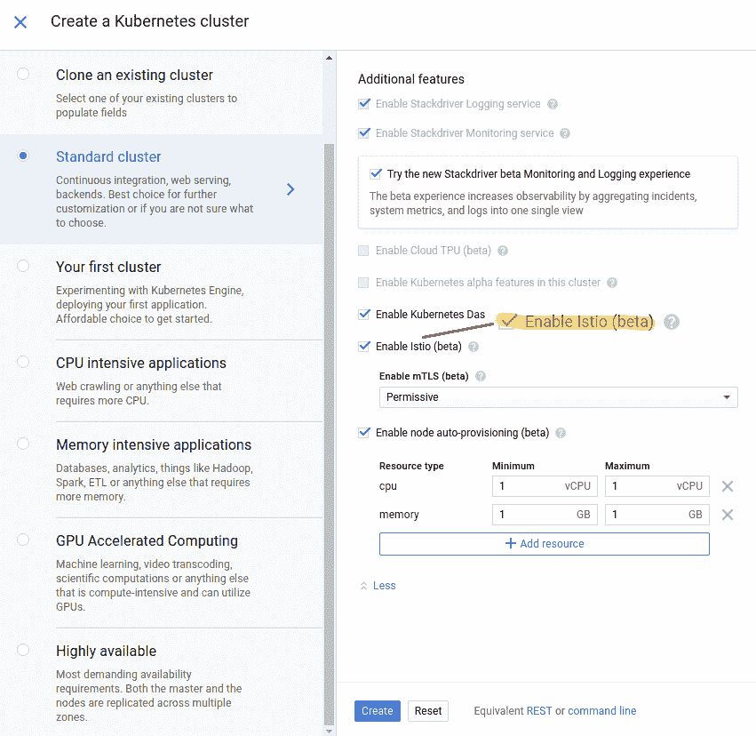

# TWiGCP —“从 kube con’18 NA 回来— Istio、Knative、gVisor，仅举几例”

> 原文：<https://medium.com/google-cloud/twigcp-back-from-kubecon-18-na-istio-knative-gvisor-just-to-name-a-few-87a720736c56?source=collection_archive---------1----------------------->

以下是过去一周的主要公告:

[标记你的日历:谷歌**Cloud Next 2019**](http://goo.gl/ZyE6oD)**(谷歌博客)2019 年 4 月 9 日-11 日在三藩市莫斯康中心。注册现已开始。不见不散！**

**鉴于这是 KubeCon 在西雅图举办的第 18 周，GCP 的大部分公告都与云相关:**

**" [*通过 GKE 的 Kubernetes 和 Istio 加速应用交付*](http://goo.gl/xVUzR3) "(谷歌博客)。Istio 首先考虑服务，并在 GKE 试用(mTLS)。**

**从“ **Knative** 短短几个月的势头”部门:**

*   **[Knative:将无服务器带到 Kubernetes everywhere](http://goo.gl/NiQpK1) (谷歌博客)**
*   **[强劲势头持续，达到另一个采用里程碑](http://goo.gl/AeeBHd)(opensource.googleblog.com)**

**为了说明上面列出的 Kubernetes 相关主题，请查看这个关于从零到 GKE + istio +无服务器附加组件的[短片。](http://goo.gl/xkBfUx)**

**从" **gVisor** 最近公告"部门:**

*   **gVisor 系统调用测试套件【github.com **
*   **[gVisor 支持作为最新 Minikube 0.31.0 版本的附加功能](http://goo.gl/CVEr1H)(github.com)**

**" [*宣布* ***云 DNS 转发*** *:统一混合云命名*](http://goo.gl/aa2oCP) "(谷歌博客)。云 DNS 的新转发功能可帮助您的资源通过 DNS 找到彼此，无论他们是在云中还是在本地。#混合**

**从" **ML 业绩**数字全线"部门:**

*   **“ [*MLPerf 基准测试确立了谷歌云为机器学习训练提供了最易接近的尺度*](http://goo.gl/tn5Gch) ”(谷歌博客)**
*   **“ [*现在你可以在云 TPU Pods*](http://goo.gl/h6YP37) ”(谷歌博客)上更快、更低成本地训练 TensorFlow 机器学习模型。这包括多达 512 个内核的 TPU pod。在 7.9 分钟内训练 ResNet，比云中最大的 8 GPU 装备快 27 倍，便宜 38%。**

**停留在机器学习上，这里是 GCP 的“ [*”深度强化学习:使用超参数和云 ML 引擎来最好地打开 AI 健身房游戏*](http://goo.gl/Z3JKU1) ”(谷歌博客)。使用 Cloud ML Engine 的超参数管理调优服务并行训练多个作业。**

**来自“Firebase 操作指南”部门:**

*   **[使用 Firebase 托管 REST API](http://goo.gl/Pvew4c) (Firebase 文档)部署到您的站点**
*   **[基于 Firebase 的无服务器应用](http://goo.gl/aemXJu)(infoq.com)**

**从“使用 GCP 有一个清单！”部门:**

*   **格蕾丝的 9 份 GCP 清单中的 8 份已经出来了；如果你对 medium.com 的 GCP 是认真的，就去看看吧**

**来自我最喜欢的“客户和合作伙伴对 GCP 的最佳评价”部分:**

*   **[谷歌云平台(liveramp.com)迁移| LiveRamp](http://goo.gl/Tv1BRf)(GCP)**
*   **[云函数+ BigQuery =数据馈送自动化](http://goo.gl/zxvCg5)(e-nor.com)**

**来自“角度服务器端渲染和虚拟工作站解决方案”部门:**

*   **[使用云构建执行角度服务器端(预)渲染](http://goo.gl/5ZHnUJ)(谷歌文档)#SEO #mobileperf**
*   **[创建虚拟 Linux 工作站](http://goo.gl/qXht2U)(谷歌文档)**
*   **[创建虚拟 Windows 工作站](http://goo.gl/mksE9f)(谷歌文档)**

**从“测试版，正式版，还是什么？”部门:**

*   **[GA] [云 SDK 228.0.0](http://goo.gl/QMtpTC)**
*   **[GA] [云视觉 API 检测手写(OCR)](http://goo.gl/QCihUu)**
*   **【GA】[将计费数据导出到 BigQuery](http://goo.gl/oqjd1q)**
*   **App 引擎标准上的【GA】[node . js 8](http://goo.gl/nB2eEH)**
*   **[Beta] [GCF 每函数身份](http://goo.gl/NqBk8n)**
*   **[Beta] [了解 GKE 集群资源使用情况](http://goo.gl/obsLvC)**
*   **[Beta] [修改云发布/订阅到期策略](http://goo.gl/nGpc82)**
*   **[Beta] [云物联网网关](http://goo.gl/Rjouqz)**
*   **阿帕奇光束 2 . 9 . 0(beam.apache.org**
*   **kube flow 0.4——发布更新&即将发布(medium.com)**

**来自“所有多媒体”部门:**

*   **[YouTube]观看"[西雅图 2018:kube con+CloudNativeCon](http://goo.gl/6jXRyn)(youtube.com)**
*   **[播客] [无服务器管理和 Knative——云端广播](http://goo.gl/rP266G)(thecloudcast.net)**
*   **【播客】[gcppodcast.com GCP 播客第 159 集——年终总结](http://goo.gl/4ps4jd)**
*   **[播客] [Kubernetes 播客第 33 集——特使，马特·克莱恩](http://goo.gl/3Q2oXq)(kubernetespodcast.com)**

**

本周的图片显示了一些最近添加到 GKE 的测试功能(Istio，节点自动配置等)** 

**这就是本周的全部内容！亚历克西斯**