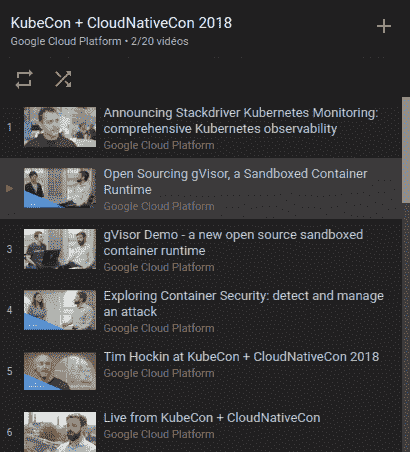

# TWiGCP —“从 KubeCon 回来，带着 gVisor，Asylo。GCP 的推特、云作曲家等等”

> 原文：<https://medium.com/google-cloud/twigcp-back-from-kubecon-with-gvisor-asylo-twitter-on-gcp-cloud-composer-more-a2c715bae503?source=collection_archive---------0----------------------->

参加人数最多的 KubeCon 于上周举行，是时候让谷歌推出几个关键的新项目和一个监控更新了:

*   开源的 **gVisor** ，一个沙盒容器运行时(谷歌博客)一个 OCI 运行时，具有类似虚拟机的隔离，15MB 的内存，150 毫秒的启动时间。
*   [介绍 **Asylo** :一个用于机密计算的开源框架](http://goo.gl/XsLQeq)(谷歌博客)
*   [全面的堆栈从一开始就驱动 Kubernetes 的可观察性](http://goo.gl/pvmei9)(谷歌博客)

来自“与 KubeCon 无关但仍有兴趣”部门:

*   [探索容器安全:使用云安全指挥中心(和五个合作伙伴工具)来检测和管理攻击](http://goo.gl/ygXHFz)(谷歌博客)
*   [Kubernetes 最佳实践:设置带有就绪性和活性探针的健康检查](http://goo.gl/jX4REX) (Google 博客)
*   [KubernetesStatus.com](http://KubernetesStatus.com)

在大数据方面，我们也发布了一些重要公告:

*   [Cloud Composer 现处于测试阶段:以最小的努力构建和运行实用的工作流](http://goo.gl/uVVjMJ)(谷歌博客)#ApacheAirflow
*   [云 Bigtable 的区域复制现处于测试阶段](http://goo.gl/93TUuK)(谷歌博客)

来自“机器学习数据集、性能和 GPU”部门:

*   [宣布开放图像 V4 和 ECCV 2018 开放图像挑战赛](http://goo.gl/rNGBuh)(谷歌博客)。“15.4 米的边界框，用于 1.9 米图像上的 600 个类别”
*   [MLPerf.org](http://mlperf.org)致力于测量从移动设备到云服务的训练和推理的系统性能
*   [借助 NVIDIA Tesla V100 扩展我们的 GPU 产品组合](http://goo.gl/uaTuWL)(谷歌博客)

来自“有些人就是有最好的工作”部门:

*   [动态音乐:一个 Firebase 和物联网的故事](http://goo.gl/o2emNL)(谷歌博客)

来自我最喜欢的“客户对谷歌云的最佳评价”部分:

*   推特英语博客:与谷歌云的新合作(blog.twitter.com)
*   【fastcompany.com】[为什么 Etsy 要将其数据中心迁移到云端](http://goo.gl/VDEqJJ)
*   [纽约时报科技股的演变](http://goo.gl/PJrMjy)
*   Fitbit 将使用谷歌云与医疗系统整合(fastcompany.com)# CloudHealthcareAPI
*   [Guesswork.co 的故事](http://goo.gl/BmEQg1)(谷歌博客)在 GCP 保持小规模的同时扩大规模

来自“听和看”部门:

*   [介绍来自谷歌的 Kubernetes 播客](http://goo.gl/sXbz7K)(谷歌博客)
*   [GCPPodcast #125 与 Sarah Novotny 合作在谷歌云平台上开源](http://goo.gl/DsEhhB)(gcppodcast.com)
*   [The Cloud cast:The Cloud cast # 345——了解谷歌云数据库](http://goo.gl/y2f2Gu)(thecloudcast.net)
*   [《kube con+CloudNativeCon 2018》播放列表](http://goo.gl/JVTrx7)(youtube.com)

来自“以防你错过(ICYMI)”部门:

*   [GA] [别名 IP 范围概述](http://goo.gl/rLzV35)
*   Kubernetes 发动机节点自动修复
*   [GA] [使用 SSL 策略](http://goo.gl/W8VGzM)
*   [GA] [从实例模板创建虚拟机实例](http://goo.gl/8k59CW)

本周图为 YouTube [KubeCon 2018 播放列表](http://goo.gl/JVTrx7)截图:

这星期到此为止！亚历克西斯