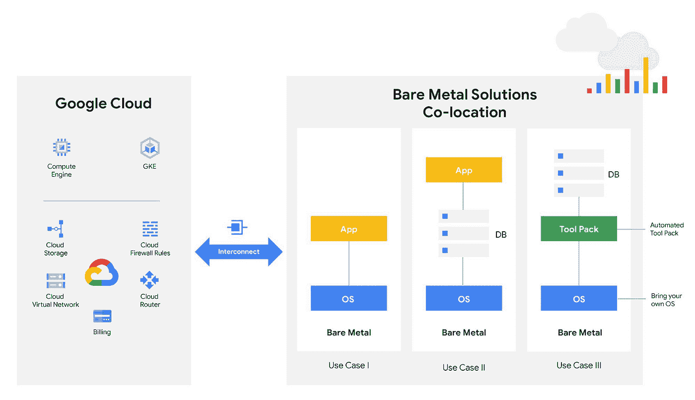

# TWiGCP —“裸机 SAP、9TB 固态硬盘、Sigfox 和 Python 承诺”

> 原文：<https://medium.com/google-cloud/twigcp-bare-metal-sap-9tb-ssd-sigfox-and-python-commitment-bbd551b4f113?source=collection_archive---------2----------------------->

以下是谷歌云视频系列 本周最新 [**的链接:**](http://gtech.run/ju4em)

*   [Apigee X:谷歌云更强大的 API 管理平台](http://gtech.run/25at8)
*   [谷歌的杜楠特海底电缆现已准备就绪](http://gtech.run/u3yfj)
*   [如何在共享 VPC 环境中使用云 DNS 对等](http://gtech.run/j7wz8)
*   [谷歌云人工智能领导者分享人工智能入门技巧](http://gtech.run/wmfu2)

过去一周 GCP 的其他头条新闻包括:

*   [在谷歌云裸机解决方案上运行您的 SAP 工作负载](http://gtech.run/g8yxe)(谷歌博客)
*   [N2 虚拟机使用 9TB 固态硬盘运行低延迟、I/O 密集型工作负载](http://gtech.run/wrbl4)(谷歌博客)
*   Sigfox 与谷歌云合作(cloud.google.com)
*   [重新致力于 Python 软件基金会](http://gtech.run/2ab77)(谷歌博客)

从“考虑迁移到区域后端服务”部门:

*   [为什么以及如何使用具有网络负载平衡的后端服务](http://gtech.run/6bzxl)(谷歌博客)
*   运行云 NAT 的最佳实践(谷歌博客)

来自“云扳手，第 2 天工具”部门:

*   [了解云原生数据库扳手的性能](http://gtech.run/l7dub)(谷歌博客)
*   [使用 Liquibase 管理 Cloud Spanner 上的模式变更](http://gtech.run/rlj2l)(谷歌博客)

从“OAuth 可能比你想象的还要多吗？”部门:

*   Gabe Weiss 为 GCP 认证 Google Workspace[(medium.com)](http://gtech.run/kdysw)
*   [谷歌 OAuth 认证:深入，艰难的道路|作者 Guillaume blaquiere](http://gtech.run/wwjf5)(medium.com)

来自“没有云就没有 TWiGCP”部门:

*   [云运行全球服务(Terraform 版)](http://gtech.run/wy4bb) (ahmet.im)
*   [如何在 BigQuery 事件上触发云运行操作](http://gtech.run/mu3ay)(谷歌博客)
*   【书评:用谷歌云运行构建无服务器应用(blog.javapapo.com)
*   【github.com】[GitHub——Google cloud platform/zone-printer:打印其运行的计算区域的小应用程序](http://gtech.run/y8k9k)

来自“通过 Anthos、工作流和安全图像实现应用现代化”部门:

*   [应用程序现代化并不容易。但是我们可以让它变得更容易](http://gtech.run/yenu5)
*   [用工作流程编排每日一图无服务器应用](http://gtech.run/3zk3v)(谷歌博客)
*   [在谷歌云上集中管理工件注册表容器镜像漏洞:第二部分|作者丹·皮奇](http://gtech.run/b2p5e)(medium.com)

来自“仅在您需要时登录”部门:

*   [安全密钥和零信任](http://gtech.run/5usnx)(谷歌博客)

来自“部署您自己的数据沿袭系统”部门:

*   [为 BigQuery 构建数据沿袭系统](http://gtech.run/pe9k5)(谷歌博客)

从“操作系统版本、已安装或缺失的软件包和修补程序的鸟瞰图”部门:

*   [查看虚拟机管理器数据](http://gtech.run/ttllg)(cloud.google.com)

从“控制支出的第一步”开始:

*   [用预算保护你的谷歌云支出](http://gtech.run/dv4w9)(谷歌博客)

来自“AIOT 是人工智能和物联网”部门:

*   [借助谷歌云和 Arm Mbed OS 加速物联网设备部署](http://gtech.run/wtd6p)(谷歌博客)

来自“4 小时课程，刚刚发布”部门:

*   [“企业就绪型 GCP”LinkedIn 课程](http://gtech.run/9qege)(linkedin.com)

来自“在云数据流中大规模处理地理空间数据”部门:

*   [谷歌云平台/数据流-地梁](http://gtech.run/h6wla)(github.com)

从“从一个多维键值存储到另一个多维键值存储”部门:

*   [针对 Cassandra 用户的云 Bigtable](http://gtech.run/98nby)(cloud.google.com)

来自“客户和合作伙伴与 GCP 一起解决实际问题”部门:

*   [基准云数据仓库 BigQuery 快速扩展](http://gtech.run/wbmm2)(谷歌博客)
*   [在 GCS 中上传文件后，轻松快速地自动执行 Google Cloud AutoML 视觉预测(用于制造质量检查)|作者 Manuel Rodriguez](http://gtech.run/6eks)(medium.com)
*   [用于环境探索的谷歌云上的 NOAA 数据集](http://gtech.run/pp9cv)(谷歌博客)

来自“**多媒体**”部门:

*   【视频】[使用云监控仪表盘编辑](http://gtech.run/u6vj7)(youtube.com)
*   [视频] [介绍 Anthos 的迁移](http://gtech.run/dulut)(youtube.com)
*   [播客] GCP 播客[第 246 集——马克·曼德尔的谷歌云游戏服务器](http://gtech.run/ecg89)(gcppodcast.com)
*   [播客] Kubernetes 播客[第 137 集——数据狗和集装箱报道，迈克尔·格斯滕哈伯](http://gtech.run/7mc6b)(kubernetespodcast.com)

从"**预告，GA，还是什么？**“部门:

*   [GA] [云 SDK 327.0.0](http://gtech.run/wfg8w)
*   [GA] [云扳手存储警报](http://gtech.run/trjr6)
*   [云 Firestore C++ SDK](http://gtech.run/zwvus)
*   [2.4] [云 AI 平台](http://gtech.run/dvhws)
*   [1.9] [宣布 Istio 1.9](http://gtech.run/febd9)
*   【预览】 [BigQuery 管理资源图表](http://gtech.run/4nxpm)
*   【预览】[资源管理器标签](http://gtech.run/kxldy)
*   【预览】[云构建 webhook 触发器](http://gtech.run/35kss)
*   【预览】[bit bucket 服务器的云构建支持](http://gtech.run/bd5vz)

本周的图片列出了新发布的 SAP 裸机产品的各种使用案例

这就是本周的全部内容！亚历克西斯