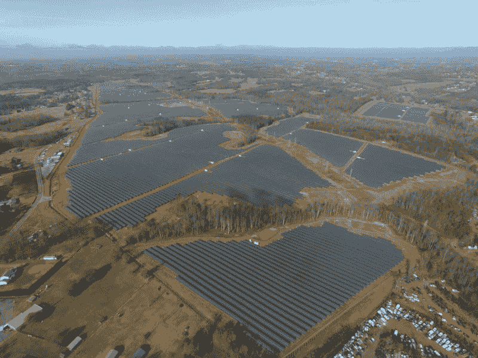

# TWiGCP —“更好的春天 GCP、云 IAP 和 OpenCue”

> 原文：<https://medium.com/google-cloud/twigcp-better-spring-gcp-cloud-iap-and-opencue-bec1d20f75d3?source=collection_archive---------1----------------------->

以下是过去一周的主要新闻:

" [*宣布* ***春云 GCP 1.1*** *:深化与 Pivotal 的 Spring 框架*](http://gtech.run/xqu7c) "(谷歌博客)。Spring Data 现在集成了 Cloud Spanner 和 Cloud Datastore(这只是新的漂亮特性之一)。

" [*使用* ***云 IAP*** *上下文感知访问控制*](http://gtech.run/hbxp7) "保护您的云虚拟机(Google 博客)。粒度是这个安全游戏的名字，这次增加了对 TCP 服务的支持，比如 SSH 和 RDP。

“ [*谷歌云推出新的* ***认证*** *和培训以解决云技能危机*](http://gtech.run/br6hf) ”(谷歌博客)。与该受众最相关的新认证是网络工程师和安全工程师(均处于测试阶段)以及云开发人员(GA)。

" [*介绍****OpenCue****，一个面向媒体和娱乐的开源渲染管理器*](http://gtech.run/8nkh8) "(谷歌博客)。这是索尼电影公司 Imageworks 的 Cue 3 的未来，现在是在 Apache 2 许可下与谷歌在 GitHub 上合作开发的。

[*你们有* ***SRE 团队*** *没有？如何开始并评估你的旅程*](http://gtech.run/sxktj) ”(谷歌博客)。网站可靠性工作手册现已推出 HTML 版本！

其他消息，在 2019 年 Gartner 分析数据管理解决方案魔力象限(cloud.google.com)中，谷歌被评为[领导者](http://gtech.run/pwymw)

…谷歌[购买了几个新太阳能发电厂的输出——总共 160 万块太阳能电池板——以支持田纳西州和阿拉巴马州的数据中心运营](http://gtech.run/bdjbl) (blog.google)

来自“常见用例解决方案”部门:

*   [联合谷歌云平台和活动目录](http://gtech.run/j3fkb)(cloud.google.com)
*   [在计算引擎上设置 Chrome 远程桌面](http://gtech.run/fjw3s)(cloud.google.com)

来自“技术幕后”部门:

*   [Istio 路由基础知识](http://gtech.run/vnjvz)(medium.com)
*   [应用引擎标准(第二代)Docker 映像和应用构建器](http://gtech.run/q2dzh) (gcr.io)

来自我最喜欢的“客户和合作伙伴对 GCP 的最佳评价”部分:

*   【cloud.google.com】Twitter 将数据迁移到谷歌云，让全世界都能发微博
*   [BigCommerce 使用谷歌云平台](http://gtech.run/68d3r)(谷歌博客)为 60，000 多家商户改变了零售体验
*   Otto Group CLASH:一个直接在 GCP 上运行 bash 脚本的开源工具
*   用 Chatbase 建立一个人工智能驱动的客户服务虚拟代理

来自“跟进 Go for Cloud Functions 测试版”部门:

*   [带云功能的跳舞地鼠](http://gtech.run/mcuq9)(medium.com)
*   [Go 中的云功能](http://gtech.run/anzjx)(medium.com)

来自“自动化所有事情”部门:

*   [自动化谷歌电子表格 CSV 导入的云功能](http://gtech.run/rvjzr)(medium.com)

来自“适合 ML 工作的合适工具”部门:

*   [medium.com，GCP 机器学习对抗赛:张量流中的 BigQuery ML -vs- Custom 估计器](http://gtech.run/rq5zy)
*   [将深度学习环境与 Terraform、Google cloud、Gitlab 和 Docker【towardsdatascience.com 无缝集成](http://gtech.run/xk4as)

从“测试版，正式版，还是什么？”部门:

*   [GA] [云 SDK 231.0.0](http://gtech.run/wfg8w)
*   [GA] [使用自定义主机名创建虚拟机实例](http://gtech.run/a2wfn)
*   [GA] [伦敦和悉尼的云扳手区域实例](http://gtech.run/vbrs4)
*   [1.13.0-rc0] [张量流 1.13.0-rc0](http://gtech.run/yf6ex)

来自“所有多媒体”部门:

*   [播客] Kubernetes 播客[第 37 集，普罗米修斯和 OpenMetrics，理查德·哈特曼](http://gtech.run/su5kn)

本周的图片摘自“160 万块太阳能电池板”的博文

这就是本周的全部内容！亚历克西斯