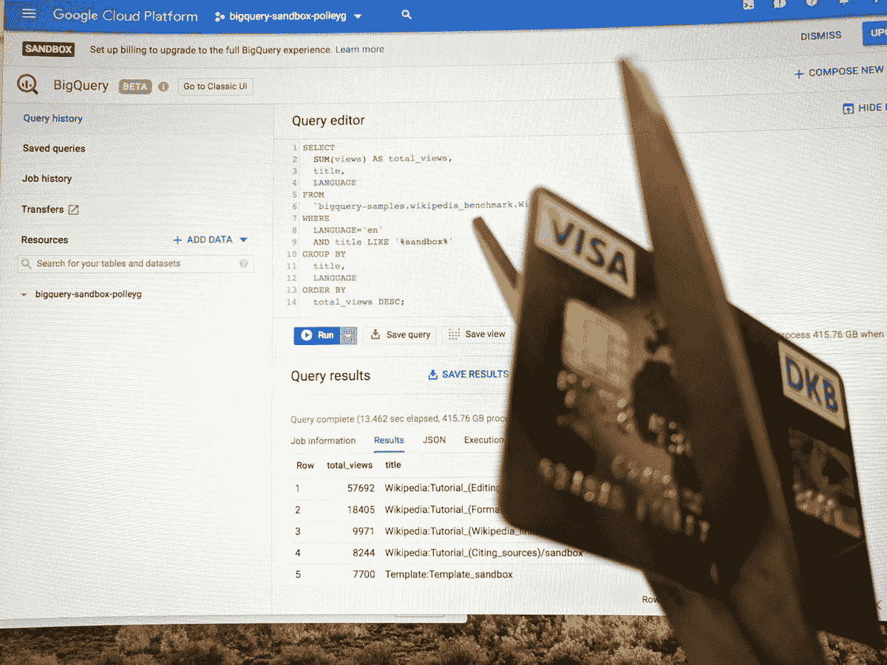

# TWiGCP—“big query 沙箱、profiler hits beta 和 WebSockets”

> 原文：<https://medium.com/google-cloud/twigcp-bigquery-sandbox-profiler-hits-beta-and-websockets-e183edb6aded?source=collection_archive---------2----------------------->

以下是过去一周的主要新闻:

[无信用卡查询:引入 BigQuery 沙箱](http://gtech.run/euxx2)(谷歌博客)。免费试用很棒，但这更棒！每月 1TB 的查询和 10GB 的存储。没有信用卡问！

[Stackdriver Profiler 增加了更多的语言和新的分析功能](http://gtech.run/usyd5)(谷歌博客)。公开测试版，所有人的火焰图！AppEngine Standard 上的 Java 听起来特别容易设置。

[介绍 WebSockets 对应用引擎灵活环境的支持](http://gtech.run/ht9vq)(谷歌博客)。测试版。没有设置。Python | Java | Node.js .试试吧！

来自“云原生的美丽新世界”部门:

*   利用 Kaniko 的云构建技术更快地构建容器
*   实现 DevOps 的七个步骤
*   [探索容器安全:用云 KMS 加密 Kubernetes 的秘密](http://gtech.run/rdx29)(谷歌博客)
*   [Bootstrap Kubernetes 在谷歌云平台上的艰难之路。没有脚本](http://gtech.run/8773p)(github.com)
*   普罗米修斯和斯塔克德瑞(medium.com)
*   [动手实践—第一部分](http://gtech.run/fl54m)(medium.com)

来自“美丽新世界”部门:

*   [服务网格时代:GKE Istio 的高级应用部署和流量管理](http://gtech.run/kzd8c)(谷歌博客)
*   将认证和授权委托给 blog.stack-labs.com 的⛵️研究所
*   [生产中的 Istio 和 Kubernetes。第二部分。追踪](http://gtech.run/5erz1)(medium.com)

来自“机密计算的下一步走向”部门:

*   [用 Asylo 推进机密计算和机密计算挑战](http://gtech.run/lj8nt)(谷歌博客)

来自“如果你正在寻找迷人的数据集”部门:

*   [在 BigQuery 公共数据集中介绍六种新的加密货币——以及如何分析它们](http://gtech.run/4cpvj)(谷歌博客)

来自“因为迭代是 ML 游戏的名字”部门:

*   制造机器:机器学习生命周期(谷歌博客)

来自“其他人已经绘制了区域图，因此您不必这样做”部门:

*   在 GCP 部署吉拉(cloud.google.com)
*   [Stackdriver 使用和成本:理解和优化支出指南](http://gtech.run/ykfjh)(谷歌博客)

来自“GCP 媒体出版物和更多社区内容”部门:

*   更多 GCP 流程图(medium.com)
*   [medium.com，CNCF 构建包:逃离码头文件的复制游戏](http://gtech.run/hv7zw)
*   [使用 Docker 和谷歌云平台部署 React 应用](http://gtech.run/rqu8n)(hackernoon.com)

来自“简洁技巧”部门:

*   使用[自定义构建步骤](http://gtech.run/kenwa)将您的 TypeScript 应用程序部署到 App Engine(Google 文档)
*   [gcloud alpha interactive](http://gtech.run/crdd7) (谷歌文档)
*   [gcloud alpha 云壳](http://gtech.run/svztl)(谷歌文档)

来自“一些参考客户比其他客户更令人兴奋”部门:

*   [勇士和大通中心宣布与谷歌云合作](http://gtech.run/3bmda)(nba.com)
*   英国《每日电讯报》:在谷歌云的帮助下重新想象媒体

来自“本周人工智能/人工智能进展”部门:

*   [多巴胺 2.0:在强化学习研究中提供更大的灵活性](http://gtech.run/3qr5r)(opensource.googleblog.com)
*   世界上最快的超级计算机打破人工智能记录(wired.com)
*   [使用 Colourise.sg 让黑白照片栩栩如生](http://gtech.run/2dzlc)(blog.data.gov.sg)
*   [实时连续转录与现场转录](http://gtech.run/3yhp5)(ai.googleblog.com)

来自“如果云扳手适合您，那么这些解决方案文件就是金牌”部门:

*   [从 PostgreSQL 迁移到云扳手](http://gtech.run/sfnyh)
*   [从 MySQL 迁移到 Cloud Spanner](http://gtech.run/9vl6u)
*   [从 Oracle OLTP 系统迁移到 Cloud Spanner](http://gtech.run/brh7z)

来自“与 C/C++开发人员分享爱”部门:

*   开源集群模糊(opensource.googleblog.com)

来自“所有多媒体”部门:

*   [播客] Kubernetes 播客[第 39 集——Minikube，丹·洛伦克](http://gtech.run/b9hqx)(kubernetespodcast.com)
*   [播客] GCP 播客[第 161 集——与 Stewart Reichling 和 Tyler Bui-Palsulich 一起使用云功能](http://gtech.run/3gm6e)(gcppodcast.com)
*   【视频】 [GCP 必备品，入门系列](http://bit.ly/GCP-essentials)

本周的图片是格雷厄姆·波利庆祝 BigQuery 沙盒

这就是本周的全部内容！亚历克西斯