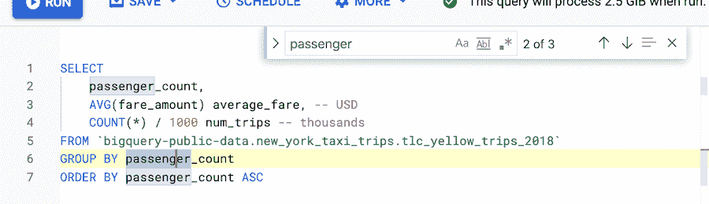

# TWiGCP—“big query UI 更新、云运行 WebSockets 和动手操作 Anthos 裸机”

> 原文：<https://medium.com/google-cloud/twigcp-bigquery-ui-updates-cloud-run-websockets-and-hands-on-anthos-bare-metal-ce92a366aee1?source=collection_archive---------4----------------------->

过去一周的 GCP 要闻包括:

*   在 BigQuery UI 中以极快的速度工作
*   [云运行获得 WebSockets，HTTP-2 和 gRPC 双向流](http://gtech.run/nrpmb)(谷歌博客)
*   [在裸机上动手操作 Anthos](http://gtech.run/498j8)(谷歌博客)
*   在 Google Cloud 上以云本地的方式设计你的数据安全程序

来自“从无服务器事件理论到 Google 云实现”部门:

*   [无服务器事件—事件图|作者杰森·史密斯](http://gtech.run/qutmg)(medium.com)
*   [无服务器事件:谷歌事件介绍|作者杰森·史密斯](http://gtech.run/elz2u)(medium.com)

来自“ASM for every one and managed control plane”部门:

*   [Anthos 服务网格更新](http://gtech.run/5xqx5)(twitter.com)

来自“良好的云卫生原则”部门:

*   [如何建立可持续的灾难恢复策略](/google-cloud/gtech.run/fe46k)(谷歌博客)
*   [使用 IAM 推荐器批量应用最小特权原则](http://gtech.run/zqkjd)(谷歌博客)

从“网络是电脑，还是反过来？”部门:

*   通过 VPC 对等访问 memory store Redis | Neil Kolban(medium.com)
*   [多网络接口概述和示例| cloud.google.com VPC](http://gtech.run/mdsvn)

来自“让您的移动应用更智能”部门:

*   [设备上的机器学习:在你的 Flutter 应用中训练和运行 TensorFlow Lite 模型](http://gtech.run/lugqn) |作者 Yashwardhan Deshmukh(medium.com)

来自“应用于区块链的安全飞地硬件”部门:

*   [Asylo 及其在区块链旁边的位置|作者:张泰阳](http://gtech.run/p8zxl)(medium.com)

来自“SRE 需要练习，以下是如何不使用签子”部分:

*   [在通往 SRE 的道路上使用云操作沙盒](http://gtech.run/6643x)(谷歌博客)

来自“如果您使用生产，从日志开始”部门:

*   Ludovico magno cavallo(medium.com)撰写的《GKE 日志快速入门》

来自“如果由于某种原因，CloudSQL 不适合您”部门:

*   【cloud.google.com】计算引擎上 PostgreSQL 集群高可用性架构

来自“云构建的强大力量的一个很好的提醒”部分:

*   安托万·卡斯特(medium.com)云构建无处不在

来自“客户和合作伙伴与 GCP 一起解决实际问题”部门:

*   [采用托管云数据库服务和方便的 GKE](http://gtech.run/we48x)(谷歌博客)
*   [bench sci 为何在谷歌云上建立健康技术平台](http://gtech.run/32vqm)(谷歌博客)

来自“**万物多媒体**”部门:

*   [视频]介绍谷歌云工作流程—[gtech.run/hx8jy](https://gtech.run/hx8jy)(youtube.com)
*   [视频]gtech.run/8uvrd[GKE](https://gtech.run/8uvrd)(youtube.com)故障排除服务
*   [视频]使用无服务器调度 dbt 作业—[gtech.run/qub56](https://gtech.run/qub56)(youtube.com)
*   [视频]如何按计划触发云运行—[gtech.run/65rjk](https://gtech.run/65rjk)(youtube.com)
*   [播客] Kubernetes 播客[第 134 集——CNCF 和 Linux 基金会，克里斯·安尼斯克](http://gtech.run/bsq3k)(kubernetespodcast.com)

从“**预告，GA，还是什么？**“部门:

*   [GA] [云 SDK 324.0.0](http://gtech.run/wfg8w)
*   谷歌云服务发现
*   [GA] [文件存储对非 RFC 1918 子网范围的支持](http://gtech.run/zzr2y)
*   [GA] [云文本到语音转换新语言和语音](http://gtech.run/usgek)
*   [GA] [Cloud Composer 新的每节点最大数量参数和维护配置](http://gtech.run/5kmpg)
*   [GA] [使用定制服务帐户的云 AI 平台培训](http://gtech.run/968rq)
*   【预览】[云运行双向 gRPC 流](http://gtech.run/mw83v)
*   【预览】[云运行使用 HTTP/2](http://gtech.run/wvk3p)
*   【预览】[云运行 WebSockets 支持](http://gtech.run/927r9)
*   【预览】 [BigQuery 云控制台 UI 更新](http://gtech.run/rwwn3)
*   [预览][IAM 条件角色绑定疑难解答](http://gtech.run/8jdjf)
*   [预览] [GKE 配置多维 Pod 自动缩放](http://gtech.run/kzc3q)
*   【预览】 [VPC SC 与网络情报中心集成](http://gtech.run/pv7bb)
*   【预告】 [VPC SC 与 AI 平台整合预测](http://gtech.run/d95fe)

本周图片是新的 BigQuery SQL 编辑器的截图

这就是本周的全部内容！亚历克西斯