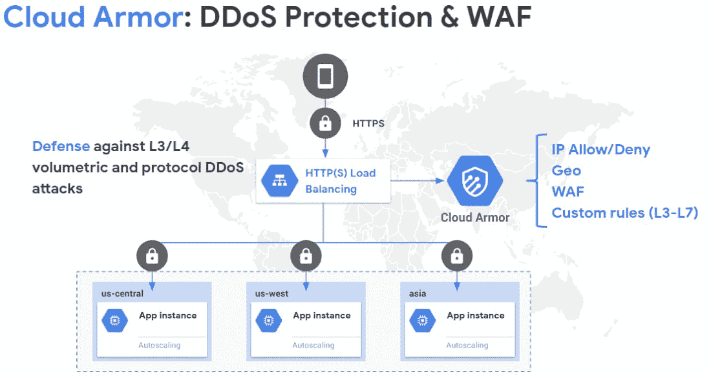

# TWiGCP—“Cassandra、VMware、WAF 和 Ampere 都来到了谷歌云”

> 原文：<https://medium.com/google-cloud/twigcp-cassandra-vmware-waf-and-ampere-all-come-to-google-cloud-600ec0d87d07?source=collection_archive---------2----------------------->

以下是谷歌云视频系列 本周最新 [**的链接:**](http://gtech.run/ju4em)

*   [通过新的架构框架指南了解谷歌云](http://gtech.run/wvn28)
*   [使用 SQL、实时人工智能等轻松访问流分析](http://gtech.run/gcuh8)
*   [云船上 5 月 19 日和 20 日](http://gtech.run/d9c92)
*   [一名谷歌云支持工程师解决了一个棘手的 DNS 案例](http://gtech.run/gpcbg)

过去一周 GCP 的其他头条新闻包括:

*   [DataStax 将 Apache Cassandra 作为服务引入谷歌云](http://gtech.run/t3lzh)(谷歌博客)
*   [谷歌云 VMware 引擎现已正式发布](http://gtech.run/2ex3k)(谷歌博客)
*   [谷歌云和英伟达增强的合作伙伴关系加速了计算工作负载(安培架构和 A100 张量核心 GPU)](http://gtech.run/gv86t) (谷歌博客)
*   [云装甲中针对本地和云工作负载的新 WAF 功能](http://gtech.run/s93am)(谷歌博客)

来自“第二天实践”部门:

*   通过新的架构框架指南了解谷歌云(谷歌博客)
*   [了解如何登录谷歌 Kubernetes 引擎](http://gtech.run/qunrj)(谷歌博客)
*   [在 medium.com 的 GCP 上实际操作 VPC 对等配置](http://gtech.run/jpx4w)
*   [Google Kubernetes 引擎上的容器负载平衡(medium.com GKE)](http://gtech.run/n9bpl)
*   [在计算引擎上执行 PostgreSQL 数据库的 PITR](http://gtech.run/rns3z)(cloud.google.com)
*   [使用云扳手](http://gtech.run/w5lf)(cloud.google.com)的提交时间戳功能创建 JDBC 的更改日志
*   [从文本中获取音频数据(文本到语音)并在浏览器中播放。(第四部分)](http://gtech.run/b3gj8)(medium.com)
*   [云成本优化的原则](http://gtech.run/xg2l5)(谷歌博客)

来自“BigQuery for fun and profit”部门:

*   【medium.com 使用 BigQuery Flex Slots 更高效地运行机器学习工作负载
*   【medium.com】big query:deltas to latest(ARRAY _ AGG)

来自“云数据目录现已正式发布”部门:

*   [Google 云数据目录—集成您的本地 RDBMS 元数据](http://gtech.run/dn3nz)(medium.com)
*   [Google 云数据目录(现已正式发布)和 Tableau 集成(使用自定义类型)](http://gtech.run/z6hqa)(medium.com)

来自“使用 YouTube-8M 数据集跑步”部门:

*   [YouTube-8M 数据集](http://gtech.run/tp9rf)(medium.com)
*   [人工智能平台上的 YouTube-8M](http://gtech.run/fwnta)(medium.com)

来自“云计算宣传和遗产”部门:

*   [德诺上云运行](http://gtech.run/ksdtl)(medium.com)
*   [从 VPC 网络云上私接 Kubernetes](http://gtech.run/6tw3h)(Ahmet . im)

来自“管理风险和利用云”部门:

*   [规划成功的云迁移](http://gtech.run/uvb84)(谷歌博客)
*   用 Anthos 实现 Java 应用程序现代化(谷歌博客)
*   [混合部署的谷歌云装甲](http://gtech.run/6vbtl)(cloud.google.com)

来自“为战斗而来，为真知灼见而留”部门:

*   [为什么我认为 GCP 比 AWS 好——费尔南多·维拉巴](http://gtech.run/arllj)(medium.com)

来自“火焰图”部门:

*   [围棋程序的连续分析](http://gtech.run/elfx9)(medium.com)

来自我最喜欢的“客户和合作伙伴对 GCP 的最佳评价”部分:

*   [可汗学院如何在一周内成功处理 2.5 倍流量](http://gtech.run/rrad4)(engineering.khanacademy.org)
*   一名谷歌云支持工程师解决了一个棘手的 DNS 案例
*   [Multipharma 在谷歌云](http://gtech.run/xc6us)(谷歌博客)上运行面向零售的 SAP S/4HANA
*   [弗里奇蒂如何使用谷歌地图平台](http://gtech.run/48lf3)(谷歌博客)

来自“**万物多媒体**部门:

*   5 月 20 日是一个非常特殊的大查询日(数据显示，youtube.com，国玉峰)
*   【视频】[(艾历险记)](http://gtech.run/72w8h)(youtube.com)JAX 简介
*   [播客] Kubernetes 播客[第 103 集——犯罪现场调查:存储，与萨德·阿里](http://gtech.run/v88tl)(kubernetespodcast.com)
*   [播客]gcppodcast.com GCP 播客[第 220 集](http://gtech.run/car5a)

**从 Beta，GA，还是什么？**“部门:

*   [GA] [云 SDK 292.0.0](http://gtech.run/wfg8w)
*   [GA] [怠速 PD 建议](http://gtech.run/tq2n8)
*   【GA】[云扳手查询统计表](http://gtech.run/z3t2h)
*   [GA] [GCE 单租户自动缩放器](http://gtech.run/h9pwp)
*   【GA】[监控云 Bigtable 实例](http://gtech.run/87bme)
*   [GA] [8 个新的云 SQL Postgresql 扩展](http://gtech.run/mmgta)
*   【1 . 3 . 0】[云代码对 VS 代码](http://gtech.run/u6y32)
*   【测试版】[云跑连接 VPC](http://gtech.run/xshhq)
*   【测试版】[安全指挥中心](http://gtech.run/ehmwp)
*   【测试版】[集装箱威胁检测](http://gtech.run/hxytj)
*   【贝塔】[汇率](http://gtech.run/kspsb)
*   【测试版】[监控查询语言](http://gtech.run/mga6w)

本周图片摘自关于最新云甲特性的帖子

这就是本周的全部内容！