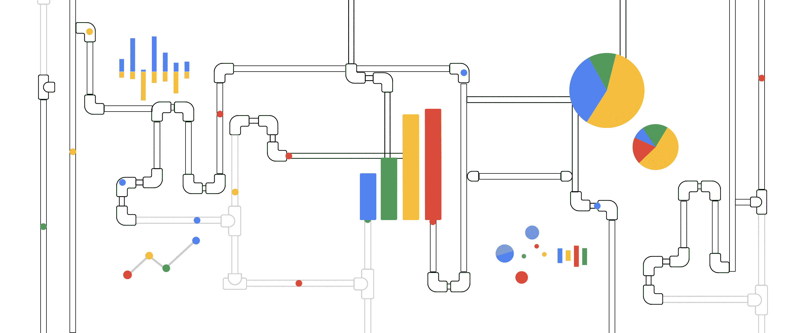

# TWiGCP —“云 EKM、BeyondProd 白皮书、NetApp 云卷和云 SQL 维护警报”

> 原文：<https://medium.com/google-cloud/twigcp-cloud-ekm-beyondprod-whitepaper-netapp-cloud-volumes-and-cloud-sql-maintenance-alerts-c979cbc833c3?source=collection_archive---------0----------------------->

以下是谷歌云视频系列 本周最新 [**的链接:**](http://gtech.run/ju4em)

*   [轻松将内部数据传输至云端](http://gtech.run/flf5l)
*   [Anthos GA 云运行中的新特性](http://gtech.run/kxkvc)

过去一周 GCP 的其他头条新闻包括:

*   [NetApp Cloud Volumes 简化了文件存储，现已正式发布](http://gtech.run/e42xc) (Google 博客)
*   [为云 SQL 引入更多维护控制](http://gtech.run/tm6dv)(谷歌博客)
*   [BeyondProd 白皮书讨论谷歌的云原生安全性](http://gtech.run/ulv8r)(谷歌博客)
*   [云外部密钥管理器(EKM)现处于测试阶段](http://gtech.run/shyns)(谷歌博客)

来自“更多谷歌云安全新闻”部门:

*   [通过谷歌云合作伙伴让您的云更加安全](http://gtech.run/djelx)(谷歌博客)
*   [投资于我们 API 生态系统的安全:安全评估的更新](http://gtech.run/9x62a)(谷歌博客)
*   博格的二进制授权:谷歌如何验证代码来源和实现代码身份【cloud.google.com，

来自“因为这是一年中的这个时候”部门:

*   [云数据分析 2019 年回顾](http://gtech.run/r7hpk)(谷歌博客)
*   [Kubernetes 播客 2019 年最热门剧集](http://gtech.run/2kuuw)(谷歌博客)
*   [2019 云技术年回顾](http://gtech.run/rhzxj)(谷歌博客)

来自“每周云运行回顾”部门:

*   [云——将您的 ETL 流程迁移到云上的固有优势](http://gtech.run/euasa)(medium.com)
*   [对比:AWS Fargate vs . Google Cloud Run vs . Azure 容器实例](http://gtech.run/a6qcz) (thenewstack.io)
*   [使用 Terraform 配置云运行](http://gtech.run/jwda9)(sethvargo.com)

来自“自动化、优化和恢复”部门:

*   [用于 Terraform 和部署管理器的谷歌云模板现已推出](http://gtech.run/9y6jw)(谷歌博客)
*   [如何在谷歌计算引擎上省钱](http://gtech.run/stl43)(谷歌博客)
*   【medium.com】谷歌云中应用的温灾恢复

来自“每周 BigQuery 评论”部门:

*   云数据仓库的变更管理
*   [使用 BigQuery](http://gtech.run/eh373) 对任何字段进行分区(medium.com)

来自“合规与信托”部门:

*   [加州消费者隐私法案(CCPA)和你:谷歌云的承诺](http://gtech.run/7jsm2)(谷歌博客)

来自“假期玩的东西”部门:

*   [来自 NOAA 的天气、气候大数据现在在云中](http://gtech.run/hkvew)(谷歌博客)
*   [Google Cloud Spanner Dialect for Hibernate 发布](http://gtech.run/huk6s) (in.relation.to)
*   [blog.tensorflow.org 高通 Hexagon DSPs 上的 TensorFlow Lite 加速](http://gtech.run/uyzyu)
*   [L4 内部负载平衡器的新特性](http://gtech.run/tez22)(谷歌博客)

来自“云原生”部门:

*   [可扩展和弹性应用的模式【cloud.google.com ](http://gtech.run/qd3vk)
*   [Istio 安全入口](http://gtech.run/j5ryg) (istiobyexample.dev)

来自我最喜欢的“客户和合作伙伴对 GCP 的最佳评价”部分:

*   [Spotify 机器学习平台铺好路](http://gtech.run/sbakc)(labs.spotify.com)
*   [批量数据库伯内斯乔布斯用递归制药——栈聊](http://gtech.run/q49jd)(youtube.com)

**Beta，GA，还是什么？**“部门:

*   [GA] [云 SDK 274.0.0](http://gtech.run/wfg8w)
*   [GA] [发布/订阅不再要求推送订阅 URL 域的所有权证明](http://gtech.run/bmgh3)
*   [GA] [计算引擎自定义图像存储位置](http://gtech.run/4cn5h)
*   [GA] [BigQuery ML 预处理](http://gtech.run/upqtn)
*   【GA】[云扳手单区—法兰克福](http://gtech.run/wxfxe)
*   [GA] [云 IAM 疑难解答](http://gtech.run/3r9na)
*   [GA] [GKE 1.15 正式适用于新集群](http://gtech.run/uthde)
*   [GA] [GKE 维护窗口和排除项](http://gtech.run/c8yrs)
*   [GA] [GKE 本地版本 1.2.0-gke.6](http://gtech.run/ba284)
*   【测试版】[可扩展服务代理 V2 测试版，作为云功能和云运行的端点 API 网关](http://gtech.run/qnx2k)

来自“**万物多媒体**”部门:

*   【YouTube】宇峰的 AI 奇遇记:[使用 AutoML 自然语言进行自定义文本分类](http://gtech.run/qqlwn) | [自然语言处理入门:单词袋](http://gtech.run/nzug2)
*   【YouTube】马丁和布雷特的无服务器工具箱:[冷启动:如何**在你的云跑 app 中找到**它们](http://gtech.run/p2ml5) | [冷启动:如何**在你的云跑 app 中修复**它们](http://gtech.run/k7akl)
*   [播客] Kubernetes 播客[第 84 集监测、指标和 M3，由马丁·毛和罗布·斯基林顿](https://gtech.run/38yhd)(kubernetespodcast.com)主持

这个星期的图片只是一个漂亮的动画…

这就是本周的全部内容！亚历克西斯