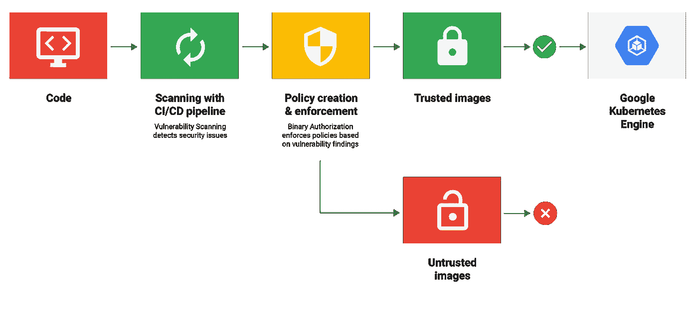

# TWiGCP —“云推理 API 和 GA 发布的负载”

> 原文：<https://medium.com/google-cloud/twigcp-cloud-inference-api-and-loads-of-ga-releases-26765e125914?source=collection_archive---------2----------------------->

随着 Cloud Next 即将登陆东京，上周我们迎来了许多正式发布和其他重要公告:

*   [引入**云推理 API** :从大规模、类型化的时间序列数据中揭示洞见](http://goo.gl/1FpMm9) (谷歌博客)。参见[这篇文章](http://goo.gl/6zYjJz)关于 GDELT 使用这个新的 API(forbes.com)
*   [宣布面向 Redis](http://goo.gl/rzGF1G)**云存储的全面上市(谷歌博客)**
*   [轻松开启洞见: **Data Studio** 和 **Cloud Dataprep** 现已全面上市](http://goo.gl/vKxTZB)(谷歌博客)
*   [通过容器注册表漏洞扫描来防范软件供应链中的安全漏洞](http://goo.gl/LXBkZd)(谷歌博客)
*   [引入新的云资源仓库](http://goo.gl/yrXKFe)(谷歌博客)
*   [全新的 TensorFlow Hub Web 体验](http://goo.gl/1xq189)(medium.com)
*   [与 NEC 合作更好地为日本企业服务](http://goo.gl/z3hK55)(谷歌博客)

来自“学习数据科学”部门:

*   [在谷歌云平台上使用 TensorFlow 的高级机器学习现在可以在 Coursera](http://goo.gl/xzPvu8) (谷歌博客)上使用
*   [新的 Qwiklabs 探索可用:谷歌云平台上的数据科学](http://goo.gl/uzqaJP)(谷歌博客)

来自“如何开发 GCP”部门:

*   [Kubernetes 引擎——使用容器本地负载平衡](https://cloud.google.com/kubernetes-engine/docs/how-to/container-native-load-balancing) (Google 文档)
*   [使用打包器创建云构建映像工厂](http://goo.gl/Usu1WW)(谷歌云社区教程)
*   [基础设施即代码研讨会，包括 Terraform、Google 云源代码库和云](http://goo.gl/PQZHF7)(github.com)
*   [混合和多云模式和实践](http://goo.gl/vZUaZ8) (Google 文档)
*   [作为 GCP 代码的基础设施](http://goo.gl/DJ7SWe)(谷歌文档)# deployment manager # Terraform # Packer # Chef # Puppet # ansi ble

来自我最喜欢的“顾客对 GCP 的最佳评价”部分:

*   【blog.etsy.com】我们在(谷歌)九霄云外
*   [Ibis 和 BigQuery(在两个适马):使用 Python 的可伸缩分析](http://goo.gl/LQogos)(谷歌博客)

从“测试版，正式版，还是什么？”部门:

*   [GA] [云 SDK 217.0.0](http://goo.gl/QMtpTC)
*   [GA] [将键值标签分配给发布/订阅资源](http://goo.gl/vwv1X2)
*   【GA】[从谷歌云存储中加载 ORC 数据](http://goo.gl/3A8QDz)
*   [GA] [用于 Redis 的云存储](http://goo.gl/rzGF1G)
*   [GA] [云数据准备](http://goo.gl/vKxTZB)
*   张量流枢纽
*   [Beta] [容器注册表漏洞扫描](http://goo.gl/LXBkZd)

来自“所有多媒体”部门:

*   [视频] [骆驼，代码&实验室外套:人工智能如何推进科学和医学【youtube.com ](http://goo.gl/TxpMh2)
*   凯尔西·海托华和克里斯·高恩谈无服务器和 Kubernetes(oreilly.com)
*   [视频][tensor flow . js 入门](http://goo.gl/sSrAKm)(youtube.com)
*   【视频】[云功能上的木偶师](http://goo.gl/gqTD99)(youtube.com)
*   [视频] [TensorFlow 2.0 变化](http://goo.gl/PSjrQX)(youtube.com)
*   [播客] [Kubernetes SIG-PM，与 Ihor Dvoretskyi](http://goo.gl/rPQJSN)(kubernetespodcast.com)
*   【播客】 [DL Indaba:人工智能在非洲的投资](http://goo.gl/XJC558)(gcppodcast.com)

本周图片摘自[容器注册表漏洞扫描贴](http://goo.gl/LXBkZd):

这就是本周的全部内容！亚历克西斯