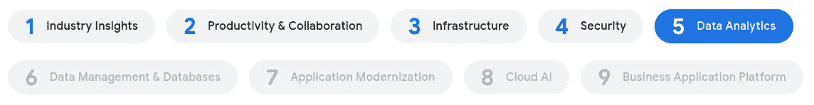

# TWiGCP —“云下一个 20 OnAir —数据管理和数据库！"

> 原文：<https://medium.com/google-cloud/twigcp-cloud-next-20-onair-on-to-data-management-databases-8fc473577295?source=collection_archive---------1----------------------->

常规的 TWiGCP 正在放暑假，并将在八月底回来。

与此同时，Cloud Next OnAir 现已结束第 5 周(共 9 周):“**数据分析**”。

以下是一些相关链接:

*   对于房间里的从业者来说——“[谷歌云对话，作者 DevRel](http://gtech.run/q5uhz) ”
*   接下来是一个巧合:[所有的公告都在一个地方](http://gtech.run/x385a)
*   你的谷歌云[Next 20:on air 备忘单](http://gtech.run/swr7a)

[第 6 周"**数据管理和数据库** "](http://gtech.run/x339g) 将于明天星期二开幕，届时将有一场新的主题演讲，并在太平洋时间上午 9 点举行几十场技术会议