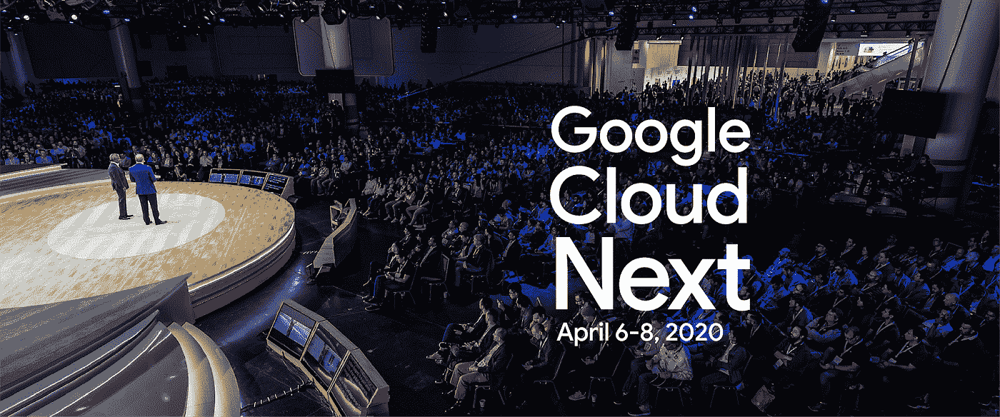

# TWiGCP —“面向 AppEngine 的云计算下一个 2020、冷冻存储和 Redis”

> 原文：<https://medium.com/google-cloud/twigcp-cloud-next-2020-frozen-storage-and-redis-for-appengine-38114282654b?source=collection_archive---------2----------------------->

以下是本周谷歌云视频系列的最新链接:

*   【2020 年云技术解决方案
*   [2019 云技术年回顾](http://gtech.run/wm6ke)
*   [无服务器 VPC 访问允许您从应用引擎](http://gtech.run/4dq87)访问托管的 Redis
*   [在谷歌云上运行容器的三大方法](http://gtech.run/v6qch)

过去一周 GCP 的其他头条新闻包括:

*   [Google Cloud 现已开放注册，注册时间:2020 年 4 月 6 日至 8 日](http://gtech.run/95tw9) (Google 博客)
*   [最冷数据的归档存储类别现已推出](http://gtech.run/u7ft2)(谷歌博客)
*   [无服务器 VPC 访问让你从应用引擎](http://gtech.run/89vqf)访问托管的 Redis(谷歌博客)
*   [FDA MyStudies 来到谷歌云](http://gtech.run/3ee6q)(谷歌博客)

来自“最受欢迎的 GKE 帖子和最新发布”部门:

*   你的 Kubernetes 最佳实践指南(谷歌博客)
*   [Kubernetes 1.15 安全变更](http://gtech.run/nkkgv)(谷歌博客)

来自“帮助您为机器学习准备数据的工具”部分:

*   [用 EDA(探索性数据分析)建立 ML 模型，特征选择](http://gtech.run/582h2)(谷歌博客)

来自“云时代的数据湖场景”部门:

*   [数据湖现代化](http://gtech.run/rpwsa)(cloud.google.com)

来自“BigQuery 新特性和海量数据集”部门:

*   [BigQuery 整数分区正在测试中](http://gtech.run/ahr98)(medium.com)
*   [BigQuery:通过 API](http://gtech.run/u8248)(medium.com)设置限额和自定义配额

来自“海量数据集和一个 SQL 查询”部门:

*   [宣布 WEB-PARTOFSPEECH 数据集:使用谷歌的 NLP API 对 1010 亿个词的词性进行标记并解析依存关系树](http://gtech.run/vak32)(blog.gdeltproject.org)
*   在一行 SQL 语句中规划 122 年的书籍(blog.gdeltproject.org)

来自“Google Cloud 上的 MLOps”部门:

*   【cloud.google.com】使用 TFX、Kubeflow 管道和云构建的 MLOps 架构
*   【cloud.google.com】MLOps:机器学习中的连续交付和自动化管道

来自“本周在谷歌云无服务器”部门:

*   [Knative:开发者手册](http://gtech.run/bkqvg) (knative.tips)
*   [谷歌营销平台的无服务器集成解决方案](http://gtech.run/xg6yn)(cloud.google.com)
*   [使用 Python 函数框架的可移植云函数](http://gtech.run/s7sy7)(开发到)
*   [使用 Cloud Run 和 Firestore 的 Twitter 每日关注者直方图](http://gtech.run/2qr6s)(github.com)
*   [在云上构建无服务器应用的开发人员指南——第 1 部分(部署)](http://gtech.run/79qta)(fullstackgcp.com)
*   [新的云运行登录页面(您能看出不同之处吗？)](http://gtech.run/ry58e)(cloud.google.com)

来自我最喜欢的“客户和合作伙伴对 GCP 的最佳评价”部分:

*   [试试云的规模:URBN 的 Nuuly 使用谷歌云从零开始构建](http://gtech.run/b9lkj)(谷歌博客)
*   远离家乡的家:Wayfair 通过 100 Gbps 专用互联接入谷歌云(谷歌博客)

**Beta，GA，还是什么？**“部门:

*   [GA] [云 SDK 275.0.0](http://gtech.run/wfg8w)
*   [GA] [用于 Redis 导入和导出的存储库](http://gtech.run/4l89f)
*   [GA] [对等网络的专用 DNS](http://gtech.run/ybhws)
*   [GA] [GCS 归档存储类](http://gtech.run/ym46g)
*   [Beta] [GKE CMEK 保护的启动盘](http://gtech.run/4ekl3)
*   【Beta】[云 AI 笔记本 API](http://gtech.run/ascj2)

来自“**多媒体**”部门:

*   [播客] Kubernetes 播客[第 85 集——open shift 和 Kubernetes，与 Clayton Coleman](http://gtech.run/6xewl)(kubernetespodcast.com)
*   [视频]【youtube.com】不要让用户等待:云运行和云任务的异步队列
*   [视频] [将一块巨石迁移到 GKE:迁移过程](http://gtech.run/7h9yt)(youtube.com)

本周图为报名 Cloud Next 2020 的邀请(带优惠码！).在那里见？

这就是本周的全部内容！
——亚历克西斯