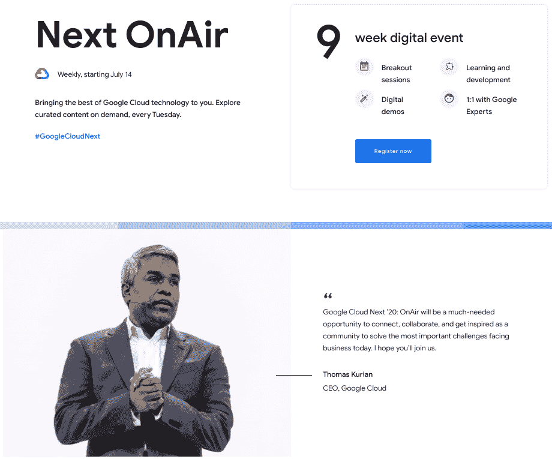

# TWiGCP—“Cloud Next on air 来了！此外，A100 GPU、主动辅助、数据 QnA 和绿湖”

> 原文：<https://medium.com/google-cloud/twigcp-cloud-next-onair-is-here-also-a100-gpu-active-assist-data-qna-and-greenlake-a4ddbd7be57?source=collection_archive---------4----------------------->

Google Cloud Next '20: OnAir 将于本周二(7 月 14 日)开始，托马斯·库里安将于太平洋时间上午 9 点发表主题演讲。一定要收听！

过去一周 GCP 的其他头条新闻包括:

*   [宣布基于 NVIDIA A100 GPU 的谷歌云 A2 虚拟机家族](http://gtech.run/pkfvh)(谷歌博客)
*   [引入主动协助:降低复杂性，最大化您的云投资回报率](http://gtech.run/rxbjr)(谷歌博客)
*   [向 BigQuery 提问，通过 Data QnA](http://gtech.run/nr5ru) (谷歌博客)获得即时答案
*   [惠普企业 GreenLake for Anthos 现已正式推出](http://gtech.run/fhsdt)(谷歌博客)
*   [在谷歌云上加强多云端数据治理——colli bra](http://gtech.run/ymxbq)(谷歌博客)
*   [我们在人工智能和负责任的创新方面的工作进展](http://gtech.run/kd78b) (blog.google)

来自“第 300 个 SDK，该是我们拿到备忘单的时候了”部门:

*   [您的 gcloud 命令行问题在可打印的备忘单中得到解答](http://gtech.run/egqmn)(谷歌博客)

来自“培训和认证—现在正是时候”部门:

*   [关于谷歌云认证如何改变职业和商业的新研究](http://gtech.run/mwnwh)(谷歌博客)
*   [在下一个 20 OnAir 建立你的云技能:免费培训机会](http://gtech.run/zw2u3)(谷歌博客)

从“谷歌云新手或老用户，有东西要学”部分:

*   计算引擎解释:选择正确的机器家族和类型(谷歌博客)

来自“Google 云安全，从基础到细节”部门:

*   [谷歌云如何帮助您的应用安全？](http://gtech.run/n3tgv) |普里扬卡·韦尔加迪亚(medium.com)
*   你的 Firebase 项目的 Firestore 安全规则列表(medium.com)

来自“简讯越多越好”部门:

*   《GCP 文摘》——手工制作的双周刊时事通讯，介绍谷歌云中的亮点。不是一堆链接(gcpdigest.com)

来自“常见客户问题解决方案”部门:

*   【cloud.google.com 无服务器网络端点组概述|负载平衡
*   【cloud.google.com】使用 VMs 和自动化特使部署的交通主管设置
*   [使用云调度器为 Redis 数据库导出调度内存存储](http://gtech.run/uyhha)(cloud.google.com)
*   Rafael Alvarez(medium.com)的作品
*   [分解非常大的 BigQuery 作业](http://gtech.run/q69ky)| medium.com 邓梓峰著

来自“数据结构化就是一切”部门:

*   [Apache Atlas 和 Google 数据目录对比](http://gtech.run/8nsgg)(medium.com)

来自“SAP 动手实践者”部门:

*   [SAP on Google Cloud:当 SAP 开发者加入云端(pt。1)](http://gtech.run/f6p9s) |作者:露西娅·苏巴廷(medium.com)

来自我最喜欢的“客户和合作伙伴对 GCP 的最佳评价”部分:

*   [API 驱动的数字生态系统如何推动创新和效率](http://gtech.run/dgbqs)(谷歌博客)

来自“**万物多媒体**”部门:

*   [播客] vSpeaking 播客 [Ep 162:谷歌云 VMware 引擎【blogs.vmware.com ](http://gtech.run/6vsu7)
*   [播客] Kubernetes 播客[第 111 集—可扩展性，Wojciech Tyczynski](http://gtech.run/96wzm)(kubernetespodcast.com)
*   [播客] GCP 播客[第 226 集——与里奥娜·麦克纳马拉](http://gtech.run/lsz37)(gcppodcast.com)一起记录开发者实践

**Beta，GA，还是什么？**“部门:

*   [GA] [云 SDK 300.0.0](http://gtech.run/wfg8w)
*   [GA] [Dataproc 组件网关](http://gtech.run/gakn2)
*   [SLO 监控](http://gtech.run/ujeph)
*   [GA] [GCE 从源磁盘创建永久磁盘克隆](http://gtech.run/mq43s)
*   【GA】[云 SQL PostgreSQL 时间点恢复](http://gtech.run/hcuyw)
*   [大查询断言](http://gtech.run/663k8)
*   【GA】[监控查询语言](http://gtech.run/4uds2)
*   [Beta] [用于无服务器计算的谷歌云负载平衡器](http://gtech.run/ntwhs)
*   【测试版】 [App Engine Go 1.14](http://gtech.run/wxxjz)
*   [Alpha][Cloud data proc Metastore](http://gtech.run/26ay4)

本周的图片提醒我们，我们将于本周开始播出《云下一个 20:20》。不要错过第一场主题演讲！

这就是本周的全部内容！亚历克西斯