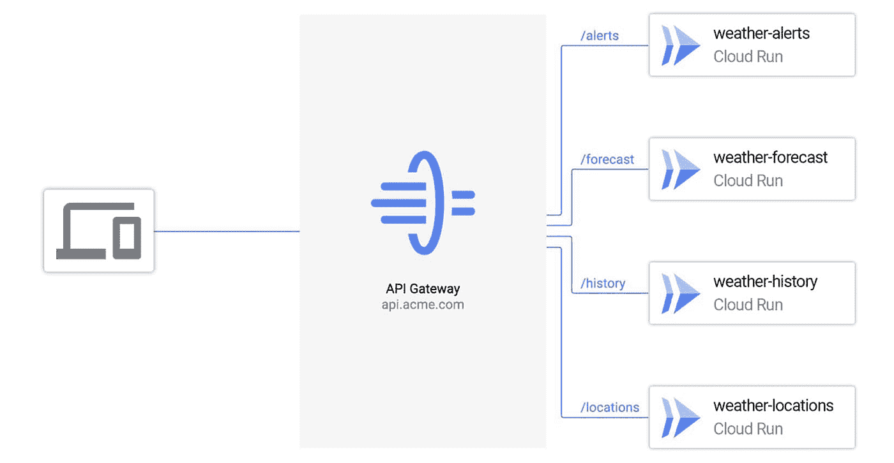

# TWiGCP—“Cloud Next on air—结束了，看看你错过了什么！”

> 原文：<https://medium.com/google-cloud/twigcp-cloud-next-onair-its-a-wrap-see-what-you-ve-missed-8914733e5750?source=collection_archive---------1----------------------->

Cloud Next OnAir 现已结束！在这里，你可以每周在一个地方找到所有的公告。

来自“等等，还有更多”部门:

*   加入我们 9 月 29 日至 10 月 27 日的[谷歌云下一季**EMEA**——(谷歌博客)](http://gtech.run/hgnlz)

来自“API land 最新消息”部门:

*   使用 API 网关管理无服务器 API
*   [借助 API 管理加速数字化转型](http://gtech.run/m3l32)(谷歌博客)

来自“机密和安全计算”部门:

*   [机密计算产品组合中的机密 GKE 节点现已可用](http://gtech.run/y7rkn)(谷歌博客)
*   [政府保证工作量现已正式发布，新增功能](http://gtech.run/2xmxt)(谷歌博客)
*   [加密和密钥管理如何实现真正的安全](http://gtech.run/kjsp4)(谷歌博客)
*   [授权终端用户使用 Pomerium 运行云](http://gtech.run/y8pj5)(cloud.google.com)
*   [谷歌如何提供深度防御？|作者普里扬卡·韦尔加迪亚](http://gtech.run/9k5px)(medium.com)

来自“无代码更新及其在 Google Cloud 中的位置”部分:

*   利用 AppSheet 的无代码平台进行应用开发和自动化(谷歌博客)
*   [谷歌云 API、无代码和业务流程自动化新闻](http://gtech.run/hwyfw)(谷歌博客)
*   [用 G Suite 和 AppSheet 应用模板构建无代码应用](http://gtech.run/9j3dq)(谷歌博客)

来自“最近分析师报告”部门:

*   [谷歌领先于高德纳公司的 CIPS MQ](http://gtech.run/388f6) (谷歌博客)
*   [2020 年第三季度，谷歌云被任命为 Forrester Wave 公共云开发和基础设施平台第一次 ANZ 迭代的领导者](http://gtech.run/gqwca)(谷歌博客)

来自“全球推广 VMWare Engine”部门:

*   [谷歌云 VMware 引擎现在在伦敦、法兰克福和东京运行](http://gtech.run/xbszu)(谷歌博客)

来自“解决方案和实践”部门:

*   【cloud.google.com】自动启动数据包镜像进行应用监控
*   【cloud.google.com Oracle 到 BigQuery 迁移指南
*   [使用云调度器](http://gtech.run/47p38)(cloud.google.com)调度数据流批处理作业
*   [工作流无服务器流程编排初探| Mete Atamel](http://gtech.run/5hpgt)(medium.com)

来自“带互动样本的更好文档”部门:

*   [查看谷歌云文档中的交互式代码示例](http://gtech.run/jvlrk)(谷歌博客)

来自“**多媒体**”部门:

*   [播客] Kubernetes 播客[第 120 集——Airbnb，Melanie Cebula](http://gtech.run/vhcnl)(kubernetespodcast.com)
*   [播客] GCP 播客[第 235 集——积极协助克里斯·劳+玛丽雅迪·斯基 SQL 与罗伯特·赫奇佩思](http://gtech.run/jv2ac)(gcppodcast.com)

**从 Beta，GA，还是什么？**“部门:

*   [GA] [云 SDK 309.0.0](http://gtech.run/wfg8w)
*   [GA] [使用 Apigee 和 AppSheet 开发基于 API 的应用程序](http://gtech.run/3ndrw)
*   [GA] [云医疗 API 访问控制](http://gtech.run/ekt43)
*   [安全指挥中心](http://gtech.run/ejd97)
*   【GA】[云扳手最旧的主动查询](http://gtech.run/gakk7)
*   [Beta] [接收 GKE 集群升级通知](http://gtech.run/pr45u)

本周的图片是新发布的 API Gateway，现在处于测试阶段。

这就是本周的全部内容！

-亚历克西斯