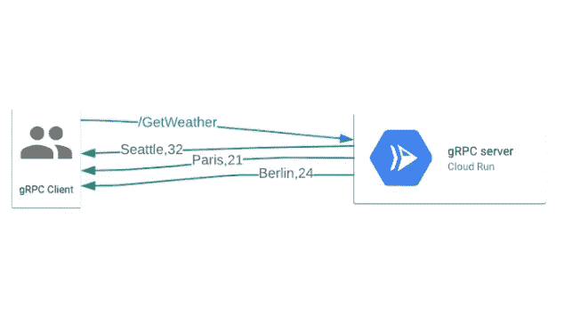

# TWiGCP —“云运行事件、流、多 CPU 和长请求”

> 原文：<https://medium.com/google-cloud/twigcp-cloud-run-events-streaming-multi-cpu-and-long-requests-20498345a1d1?source=collection_archive---------3----------------------->

以下是谷歌云视频系列 本周最新 [**的链接:**](http://gtech.run/ju4em)

*   [Google Workspace(原 G Suite):商务协作工具](http://gtech.run/cckgz)
*   [云功能增强综述](http://gtech.run/nu9ka)
*   [利用谷歌地图平台零售解决方案推动转化](http://gtech.run/b4d6f)
*   [如何迁移到微服务&瞄准无状态](http://gtech.run/rvgg3)

过去一周的 GCP 要闻包括:

*   [谷歌云现在支持构建包](http://gtech.run/qmr9c)(谷歌博客)
*   [云运行现在支持 HTTP/gRPC 服务器流](http://gtech.run/e3fln)(谷歌博客)
*   [云功能增强综述](http://gtech.run/vzlnv)(谷歌博客)
*   [有史以来最大的 Firebase 托管更新？预览频道、GitHub 动作等等！](http://gtech.run/xnpe6)(firebase.googleblog.com)

来自“通过云运行推动无服务器的极限”部门:

*   (medium.com)云运行的事件
*   [多 CPU 云运行性能| Guillaume blaquiere](http://gtech.run/zgs25)(medium.com)

来自“如果你能拼写 gnomAD，这是一件大事”部门:

*   谷歌云和布罗德研究所正在提供对基因组聚合数据库的免费访问

来自“如果您错过了 BigQuery galaxy 的这个新特性”部分:

*   大查询数据 QnA |作者 Artem Nikulchenko(medium.com)

来自“带您了解为什么和如何”部分:

*   [应用级加密:Redis 的存储库](http://gtech.run/s2hll)(cloud.google.com)
*   [使用云监控 API 自动管理云监控仪表板](http://gtech.run/aqch6)(cloud.google.com)

来自“**多媒体**”部门:

*   [播客] Kubernetes 播客[第 124 集——kube cost，Webb Brown](http://gtech.run/ml5j7)(kubernetespodcast.com)
*   [播客]gcppodcast.com GCP 播客[第 239 集——云学习服务](http://gtech.run/2jbqc)

**从 Beta，GA，还是什么？**“部门:

*   【GA】[云 SDK 313.0.1](http://gtech.run/wfg8w)
*   [GA] [大查询表 ACL](http://gtech.run/5l5ba)
*   [GA] [BigQuery 立即执行](http://gtech.run/w8pyz)
*   【GA】[云壳 API](http://gtech.run/gjwb8)
*   [GA] [对无服务器的 HTTP(S)负载平衡器支持](/google-cloud/gtech.run/qgeyp)
*   AWS 1.5.0 上的安索斯·GKE
*   [Beta] [文件存储备份/恢复](http://gtech.run/a43v7)
*   [云运行长期运行请求](http://gtech.run/rnn4g)
*   [GKE 机密节点](http://gtech.run/nmngy)
*   [Beta] [云内存的 Redis 授权存储 Redis](http://gtech.run/ebsrt)

本周的图片来自“HTTP/gRPC 服务器云运行流”公告

这就是本周的全部内容！亚历克西斯