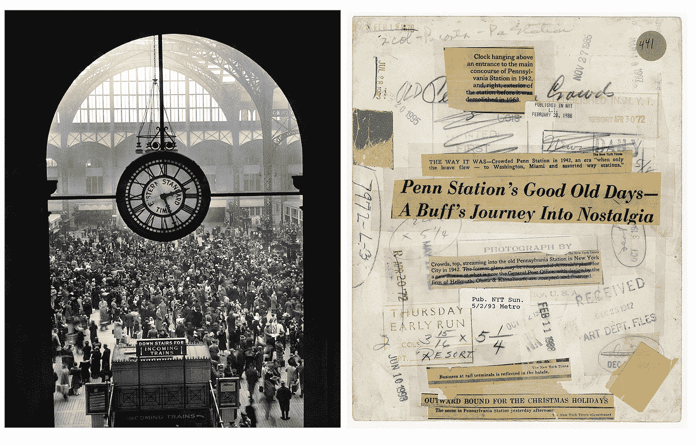

# TWiGCP —“云调度程序、GKE 的 Containerd、人工智能中心和纽约时报未披露的故事”

> 原文：<https://medium.com/google-cloud/twigcp-cloud-scheduler-containerd-in-gke-ai-hub-and-ny-times-untold-stories-93e01b4e54c9?source=collection_archive---------1----------------------->

提醒一下，Google Cloud**Next’19**定于 2019 年 4 月 9 日至 11 日在旧金山举行。其[征文](http://goo.gl/uYZpPp)现已公开，截止日期为 2018 年 12 月 7 日(cloud.withgoogle.com)

以下是上周引起我注意的其他主要公告:

“ [*为人工智能*](http://goo.gl/Vgm8X2) 掌舵”(谷歌博客)

" [*宣布* ***云调度器*** *:一个现代化的、可管理的 cron 服务，用于自动化批处理作业*](http://goo.gl/oZ2JmC) (谷歌博客)。可靠且容错的 Cron 即服务。

"[***Containerd****可在谷歌 Kubernetes 引擎*](http://goo.gl/ZkDXq1) (谷歌博客)进行 beta 测试。在 GKE 1.11 的容器优化操作系统测试版中。在 GKE，取代容器优化操作系统和 Ubuntu 映像中 Docker 集成的第一步。

" [*介绍****AI Hub****和 Kubeflow 管道:让 AI 对商家更简单、更快速、更有用*](http://goo.gl/WXegdY) "(谷歌博客)。此外，云智能视频 API 增强和云 TPU 定价。

“ [*描绘云能做什么:《纽约时报》如何使用谷歌云在数百万张存档照片中寻找不为人知的故事*](http://goo.gl/N6QjD8) ”(谷歌博客)

"[*data proc 的客户管理加密密钥(CMEK)现已普遍提供*](http://goo.gl/UwgZfV) "(谷歌博客)。客户*管理的*加密密钥！=客户*提供的*加密密钥

来自“深入 GCP”部门:

*   [深入探讨 HTTP(S)负载平衡器的托管 TLS 证书](http://goo.gl/du682i)(谷歌博客)
*   [HDFS vs .云存储:利弊和迁移技巧](http://goo.gl/JvPiJH)(谷歌博客)

来自我最喜欢的“顾客对 GCP 的最佳评价”部分:

*   [是什么推动了云数据仓库的爆炸](http://goo.gl/9W9Xdj)(datanami.com)
*   在 Shopify 的 Kubernetes 上运行 Apache Kafka(engineering.shopify.com)
*   [发现卡:我们如何设计实验来评估对话体验平台](http://goo.gl/znEjkK)(谷歌博客)

来自“了解无服务器、功能等”部分:

*   【rominirani.com】谷歌云功能教程:使用云调度器触发你的功能
*   [从零开始的无服务器:用数据库连接云功能(第 3 部分)](http://goo.gl/rYmkiC)(谷歌博客)
*   [使用谷歌云调度程序的无服务器每日报告通知服务&云功能](http://goo.gl/yys5Ed)(medium.com)

从“你最近查过 GCP 媒体出版物吗？”部门:

*   [免费获得三倍于您的 Kubernetes 集群的容量！好得难以置信？](http://goo.gl/Zb52xD)(medium.com)
*   [什么时候应该使用机器学习？—第一部分](http://goo.gl/g8Ao4s)(medium.com)
*   [Kubernetes 无泪上的 gRPC 负载均衡](http://goo.gl/j34jNp) (kubernetes.io)

从“测试版，正式版，还是什么？”部门:

*   [GA] [云 SDK 224.0.0](http://goo.gl/QMtpTC)
*   [GA] [Kubernetes 引擎—使用共享 VPC 设置集群](http://goo.gl/K1TVC3)
*   GKE:使用节点自动配置
*   [Beta] [使用自定义主机名创建虚拟机实例](http://goo.gl/eXdKTg)
*   【测试版】[云调度器](http://goo.gl/gAMunX)

来自“所有多媒体”部门:

*   《GCP 播客》第 154 集——乔安娜·史密斯和艾丽西娅·威廉姆斯的 G 组曲(gcppodcast.com)
*   [播客] Kubernetes 播客第 28 集- [TriggerMesh，Sebastien goas guen](http://goo.gl/NHbca8)(kubernetespodcast.com)
*   【视频】[Geotab——采用 GCP 技术的数据管理平台](http://goo.gl/9qm9U9)(youtube.com)
*   [视频][tensor flow . js 入门](http://goo.gl/aEuQpK)(youtube.com)

本周的图片是《纽约时报》大约一百万张照片中的一张的正面和背面扫描图

这就是本周的全部内容！
——亚历克西斯